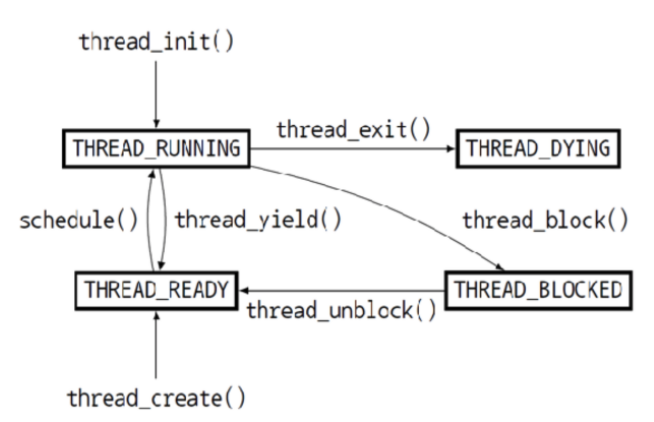

# Project 1 - Design Report (Team 28)
## Project Description
Project 1은 크게 3가지를 구현해야 한다.
1. Alarm Clock
2. Priority Scheduler
3. Advanced Scheduler

### Alarm Clock
devices/timer.c 에 위치한 timer_sleep 함수를 다시 구현하는 것이 핵심 사항이다. 기존에 구현된 timer_sleep은 함수가 계속 실행되면서 while loop 내에서 tick이 넘을 때까지 확인하게 되는데, 이는 CPU를 계속해서 점유하게 되므로 busy waiting 을 하게 된다. 따라서 새롭게 해당 함수를 구현하여 thread_block 을 통해 thread를 실행되지 않도록 바꿔주도록 새롭게 Alarm Clock을 구현해야 한다.

### Priority Scheduler
현재 구현된 Scheduler 같은 경우에는 Round-Robin으로 구성되어 있어 Time Slice에 따라 균일하게 thread를 나누게 된다. 하지만 이는 priority에 따라서 중요한 thread를 우선적으로 실행할 수 없게 된다. 따라서 Scheduler 를 새롭게 구현하여 priority를 기반의 priority scheduler를 구현해야 한다. highest priority 인 thread를 우선적으로 실행될 수 있도록 하며, 새로운 thread가 생기거나 기존 thread의 priority가 바뀌게 된다면 마찬가지고 가장 높은 priority 를 가진 thread를 실행하도록 한다.

### Advanced Scheduler
priority scheduler의 경우 기존에 결정된 priority를 기반으로 가장 높은 priority의 thread만 실행시키게 된다. Advanced Scheduler의 경우 4.4BSD의 MLFQS를 구현하는 것으로 MLFQS가 자동으로 nice 값과, recent_cpu 값 등등을 기반으로 priority 값을 조절하여 이를 기반으로 가장 높은 priority를 실행하게 된다.

## Code Analysis
### Thread - thread.h / thread.c
Thread는 아래의 이미지와 같은 cycle을 갖고 있다. 우선 `thread_init()`을 통해서 생성되고, 초기에 생성된 첫 thread는 THREAD_RUNNING 상태로 실행되는 상태이다. 하지만, 이후 time_slice가 넘어가거나 혹은 등등의 이유로 인해 `thread_yield()`가 실행되면 ready_list에 추가되며, THREAD_READY 상태로 전환된다. 혹은 실행 중이었던 thread가 lock, semaphore 등등으로 인해 block되는 경우에는 `thread_block()`함수로 인해 실행이 중지가 되고, waiting_list에 추가되게 된다. 만약 block 당하게 되었던 lock이 해제가 되거나 혹은 semaphore가 up되는 등등의 이유로 인해 다시 자원을 점유할 수 있는 상황이 된다면, `thread_unblock()`를 통해 다시 THREAD_READY 상태로 돌아가며(혹은 `thread_create()` 통해 새롭게 생성된 thread도 마찬가지로 THREAD_READY 상태) 이러한 상태의 thread들은 `schedule()` 함수를 통해서 다시금 THREAD_RUNNING 상태로 CPU를 점유하게 된다. 이렇게 실행되던 THREAD_RUNNING 상태의 thread는 실행이 완료되면 상태를 THREAD_DYING으로 변화하게 되고, 이후 이 상태인 thread들은 `schedule()`함수 내에서 할당받은 메모리와 스텍을 모두 해제하고 삭제되며 종료하게 된다. 


__global variables__
```C
static struct list ready_list;
static struct list all_list;
static struct thread *idle_thread;
static struct thread *initial_thread;
static struct lock tid_lock;
```
ready_list는 THREAD_READY 인 상태의 thread를 모두 저장하고 있는 리스트로, `schedule()`에서 해당 리스트에서 thread를 찾아서 실행하게 된다. all_list는 모든 thread를 저장하고 있는 리스트로 생성된 모든 thread(종료되기 전)를 저장한다. idle_thread는 실행될 thread가 없을 경우 CPU 점유를 위한 idle_thread를 저장하는 포인터이며, initial_thread의 경우 threading을 지원하기 위해 생성되는 thread로 가장 초기에 생성된 initial thread를 담고 있게 된다. tid_lock의 경우 thread를 생성하고 생성된 thread에 id를 할당할 때 사용되는 lock으로 해당 lock을 acquire 한 상태에서만 tid를 생성하여 전달하게 될 때 사용된다.


```C
struct thread
  {
    tid_t tid;                          
    enum thread_status status;          
    char name[16];                   
    uint8_t *stack;              
    int priority;                
    struct list_elem allelem;   
    struct list_elem elem;    
#ifdef USERPROG
    uint32_t *pagedir;           
#endif
    unsigned magic;       
  };
```
Thread의 정의를 살펴보면 Process 내에서 기존에 정의된 할일을 수행하게 되는 주체를 의미하는 것으로 thread 각각은 고유한 stack과 실행을 갖게 된다. 구현된 struct thread를 살펴보면, 고유하게 갖는 tid와 상태를 저장하는 status, 이름을 저장하는 name, 그리고 고유한 stack을 가리키는 포인터로 이뤄져 있다. 이외에도 우선순위를 위한 priority와 모든 thread를 저장하는 list를 위한 list_elem인 allelem, 그리고 synchronization 을 위해 사용되는 list_elem 인 elem, 그리고 USERPORG시 사용될 page의 위치를 가르킬 pagedir과 stack overflow를 감지하기 위한 magic 으로 구성되어 있다.

__enum thread_status__
```C
enum thread_status
  {
    THREAD_RUNNING,     
    THREAD_READY,    
    THREAD_BLOCKED,     
    THREAD_DYING      
  };
```
thread의 상태를 저장하기 위한 enum으로 현재 실행 중인 상태를 가르키는 THREAD_RUNNING, 그리고 실행될 준비가 되었지만 기다리는 상황인 THREAD_READY, 그리고 실행되는 중간에 중단된 상태인 THREAD_BLOCKED, 마지막으로 실행이 완료되어 종료를 기다리는 THREAD_DYING으로 구성되어 있다.

__thread_init__
```C
void
thread_init (void) 
{
  ASSERT (intr_get_level () == INTR_OFF);

  lock_init (&tid_lock);
  list_init (&ready_list);
  list_init (&all_list);

  initial_thread = running_thread ();
  init_thread (initial_thread, "main", PRI_DEFAULT);
  initial_thread->status = THREAD_RUNNING;
  initial_thread->tid = allocate_tid ();
}
```
thread를 처음 실행할 때 최초로 실행되는 함수로 lock과 ready 된 thread를 저장하는 ready_list, 그리고 모든 thread를 저장하는 all_list 각각의 list를 초기화하는 것으로 시작한다. 이후 현재 running 중인 thread(최초로 실행 중인 부팅 프로세스의 메인 쓰레드)를 받아서 init_thread 를 통해 초기화를 해준 뒤에, 상태와 tid를 할당하여 최초의 thread를 지정해주는 함수이다.

__thread_start__
```C
void
thread_start (void) 
{
  struct semaphore idle_started;
  sema_init (&idle_started, 0);
  thread_create ("idle", PRI_MIN, idle, &idle_started);
  intr_enable ();
  sema_down (&idle_started);
}
```
초기 thread 를 지원하기 위해 실행되는 함수 중 하나로 우선 함수의 실행 중 문제를 막기 위해 sema를 생성하며 시작된다. idle_thread를 생성하여 이후 cpu를 적절히 배분할 수 있도록 사용되며, interrupt를 enable 하고, 이후 sema_down을 통해 다시 해제하고 함수의 실행이 완료된다.

__thread_tick__
```C
void
thread_tick (void) 
{
  struct thread *t = thread_current ();

  if (t == idle_thread)
    idle_ticks++;
#ifdef USERPROG
  else if (t->pagedir != NULL)
    user_ticks++;
#endif
  else
    kernel_ticks++;

  if (++thread_ticks >= TIME_SLICE)
    intr_yield_on_return ();
}
```
thread가 얼마나 tick을 소모했는지 확인하는 함수로 idle thread와 userprog, 그리고 kernel thread를 나눠서 확인하는 방식으로 구성되어 있다. 이외에도 thread_tick 이 TIME_SLICE를 넘기게 될 경우 intr_yield_on_return을 실행하여 다른 thread 가 실행될 수 있도록 한다.

__thread_create__
```C
tid_t
thread_create (const char *name, int priority,
               thread_func *function, void *aux) 
{
  struct thread *t;
  struct kernel_thread_frame *kf;
  struct switch_entry_frame *ef;
  struct switch_threads_frame *sf;
  tid_t tid;

  ASSERT (function != NULL);

  t = palloc_get_page (PAL_ZERO);
  if (t == NULL)
    return TID_ERROR;

  init_thread (t, name, priority);
  tid = t->tid = allocate_tid ();
  kf = alloc_frame (t, sizeof *kf);
  kf->eip = NULL;
  kf->function = function;
  kf->aux = aux;
  ef = alloc_frame (t, sizeof *ef);
  ef->eip = (void (*) (void)) kernel_thread;
  sf = alloc_frame (t, sizeof *sf);
  sf->eip = switch_entry;
  sf->ebp = 0;

  thread_unblock (t);

  return tid;
}
```
새로운 thread를 생성할 때 쓰이는 함수로 kernel, switch 등을 위해서 frmae을 할당하며 init_thread 함수를 통해서 새로운 thread를 생성한다. 각 설정을 마무리한 뒤 thread_unblock을 통해서 thread를 ready 상태로 바꾸고 ready_list 에 넣은 뒤 tid를 반환한다.

__thread_block__
```C
void
thread_block (void) 
{
  ASSERT (!intr_context ());
  ASSERT (intr_get_level () == INTR_OFF);

  thread_current ()->status = THREAD_BLOCKED;
  schedule ();
}
```
thread를 block하는 함수로 현재 실행되고 있는 thread를 blocked 상태로 바꾸고 schedule() 함수를 통해 현재 상태를 기반으로 새로운 thread 를 실행하도록 thread가 switch 된다.

__thread_unblock__
```C
void
thread_unblock (struct thread *t) 
{
  enum intr_level old_level;

  ASSERT (is_thread (t));

  old_level = intr_disable ();
  ASSERT (t->status == THREAD_BLOCKED);
  list_push_back (&ready_list, &t->elem);
  t->status = THREAD_READY;
  intr_set_level (old_level);
}
```
blocked 된 상태의 thread t 를 입력을 받으면, 우선 interrupt 를 disable 한 뒤에 t 의 상태를 ready로 바꾸고 ready_list에 넣어준다. 이후 interrupt를 다시 설정하고 반환된다.

__thread_current__
```C
struct thread *
thread_current (void) 
{
  struct thread *t = running_thread ();
  
  ASSERT (is_thread (t));
  ASSERT (t->status == THREAD_RUNNING);

  return t;
}
```
현재 실행 중인 thread를 반환하는 함수로, running_thread 를 통해서 thread를 받아와서 t가 thread인지 여부와 running 중인지 여부를 확인한 뒤 t를 반환한다.

__thread_tid__
```C
thread_tid (void) 
{
  return thread_current ()->tid;
}
```
현재 실행 중인 thread의 tid를 반환하는 함수이다.

__thread_exit__
```C
thread_exit (void) 
{
  ASSERT (!intr_context ());
#ifdef USERPROG
  process_exit ();
#endif
  intr_disable ();
  list_remove (&thread_current()->allelem);
  thread_current ()->status = THREAD_DYING;
  schedule ();
  NOT_REACHED ();
}
```
thread가 exit 될 때, 즉 thread를 종료하는 역할을 수행하는 함수로 all_elem에서 현재 실행 중인 thread를 제거하고 현재 상태를 THREAD_DYING 으로 바꿔주는 역할을 수행한다. 이후 schedule() 함수 내에서 THREAD_DYING 상태인 thread를 제거하는 역할을 수행하게 되며, NOT_REACHED (); 에 도달하지 않게 된다.

__thread_yield__
```C
void
thread_yield (void) 
{
  struct thread *cur = thread_current ();
  enum intr_level old_level;
  
  ASSERT (!intr_context ());

  old_level = intr_disable ();
  if (cur != idle_thread) 
    list_push_back (&ready_list, &cur->elem);
  cur->status = THREAD_READY;
  schedule ();
  intr_set_level (old_level);
}
```
현재 CPU를 점유하며 실행 중인 thread를 다른 thread에게 점유를 넘겨주는 함수로 interrupt를 disable 한 뒤에 현재 thread를 ready_list에 push 하고, 상태를 ready 로 만들어준 뒤 schedule 함수를 실행하여 다른 thread로 switch가 일어나도록 한다. 이후 interrupt를 다시 실행한다.

__thread_foreach__
```C
void
thread_foreach (thread_action_func *func, void *aux)
{
  struct list_elem *e;

  ASSERT (intr_get_level () == INTR_OFF);

  for (e = list_begin (&all_list); e != list_end (&all_list);
       e = list_next (e))
    {
      struct thread *t = list_entry (e, struct thread, allelem);
      func (t, aux);
    }
}
```
현재 실행되고 있는 모든 thread에 대해서 같은 작업을 수행하는 함수로 인자로 받은 func과 aux를 기반으로 현재 thread에 대해서 func을 실행하게 되는 과정으로 이뤄져 있다.

__thread_set_priority__
```C
void
thread_set_priority (int new_priority) 
{
  thread_current ()->priority = new_priority;
}
```
thread의 priority 를 새로운 priority 로 설정한다.

__thread_get_priority__
```C
int
thread_get_priority (void) 
{
  return thread_current ()->priority;
}
```
현재 thread의 priority 를 반환한다.

__thread nice & load_avg & recent_cpu__
각각 현재 구현되지 않은 상황으로 Nice값을 계산하고 설정하는 함수와 load_avg를 계산하고, recent_cpu를 계산하는 함수로 mlfqs 구현 시 완성될 함수이다.

__idle__
```C
static void
idle (void *idle_started_ UNUSED) 
{
  struct semaphore *idle_started = idle_started_;
  idle_thread = thread_current ();
  sema_up (idle_started);

  for (;;) 
    {
      intr_disable ();
      thread_block ();

      asm volatile ("sti; hlt" : : : "memory");
    }
}
```
ready_list에 실행할 함수가 없을 때 idle_thread를 실행하기 위해 초기 설정하는 함수로 현재 thread를 idle_thread로 받아 sema_up 을 통해서 sema를 해제하며, interrupt 를 disable 한 뒤 무한 반복하는 for 문 안에서 thread_block 과 실행을 반복하게 된다.

__kernel_thread__
```C
static void
kernel_thread (thread_func *function, void *aux) 
{
  ASSERT (function != NULL);

  intr_enable ();       
  function (aux);    
  thread_exit ();  
}
```
kernel thread가 실행되도록 지정해주는 함수로 interrupt를 enable 하는 것을 시작으로 thread function 을 실행하고, 실행이 완료된 이후 thread를 exit하는 것으로 실행을 마무리한다.

```C
struct thread *
running_thread (void) 
{
  uint32_t *esp;
  asm ("mov %%esp, %0" : "=g" (esp));
  return pg_round_down (esp);
}
```
현재 실행 중인 thread를 반환하는 함수로 esp 가 담고 있는 현재 stack pointer 값을 기반으로 현재 실행 중인 thread를 반환한다.

```C
static bool
is_thread (struct thread *t)
{
  return t != NULL && t->magic == THREAD_MAGIC;
}
```
현재 thread가 문제가 없는지 확인하는 함수로 t 가 NULL이 아니며 maigc 값이 thread에서 올바르게 초기화되어 THREAD_MAGIC으로 설정되었는지 확인하는 함수이다.

```C
static void
init_thread (struct thread *t, const char *name, int priority)
{
  enum intr_level old_level;

  ASSERT (t != NULL);
  ASSERT (PRI_MIN <= priority && priority <= PRI_MAX);
  ASSERT (name != NULL);

  memset (t, 0, sizeof *t);
  t->status = THREAD_BLOCKED;
  strlcpy (t->name, name, sizeof t->name);
  t->stack = (uint8_t *) t + PGSIZE;
  t->priority = priority;
  t->magic = THREAD_MAGIC;

  old_level = intr_disable ();
  list_push_back (&all_list, &t->allelem);
  intr_set_level (old_level);
}
```
thread의 초기 세팅을 위한 함수로, 상태를 Block으로 된 thread로 생성하고 interrupt를 disable 한 뒤에 all_list로 넣어서 thread를 생성하게 된다.

```C
static void *
alloc_frame (struct thread *t, size_t size) 
{
  ASSERT (is_thread (t));
  ASSERT (size % sizeof (uint32_t) == 0);

  t->stack -= size;
  return t->stack;
}
```
thread에 frame을 할당하기 위한 함수로 thread 각각이 보유하고 있는 stack 에 size 만큼의 공간을 할당하게 된다.

```C
static struct thread *
next_thread_to_run (void) 
{
  if (list_empty (&ready_list))
    return idle_thread;
  else
    return list_entry (list_pop_front (&ready_list), struct thread, elem);
}
```
다음에 실행될 thread를 ready_list, 즉 THREAD_READY 상태인 thread를 저장하고 있는 리스트에서 반환하게 되며, 실행될 thread가 없다면 idle_thread를 반환하게 된다.

```C
void
thread_schedule_tail (struct thread *prev)
{
  struct thread *cur = running_thread ();
  ASSERT (intr_get_level () == INTR_OFF);
  cur->status = THREAD_RUNNING;
  thread_ticks = 0;

#ifdef USERPROG
  process_activate ();
#endif

  if (prev != NULL && prev->status == THREAD_DYING && prev != initial_thread) 
    {
      ASSERT (prev != cur);
      palloc_free_page (prev);
    }
}
```
thread switch 중 내부에서 실행되는 함수로 현재 thread를 running thread로 설정하고 tick을 초기화하여 time_slice에 따라서 실행될 수 있도록 만들어준다. 이외에 thread가 dying 이었다면 이 함수 내에서 thread를 아예 제거하게 된다.

__schedule__
```C
static void
schedule (void) 
{
  struct thread *cur = running_thread ();
  struct thread *next = next_thread_to_run ();
  struct thread *prev = NULL;

  ASSERT (intr_get_level () == INTR_OFF);
  ASSERT (cur->status != THREAD_RUNNING);
  ASSERT (is_thread (next));

  if (cur != next)
    prev = switch_threads (cur, next);
  thread_schedule_tail (prev);
}
```
다음 실행될 thread와 현재 실행되고 있는 thread를 받아 서로를 switch 해주는 함수로 assembly 로 구현된 switch_threads 를 통해 이 함수 내에서 thread의 switch 가 발생하게 되며 switch 이후 이전에 실행되고 있는 thread를 tail에 schedule 하게 된다.

__allocate_tid__
```C
static tid_t
allocate_tid (void) 
{
  static tid_t next_tid = 1;
  tid_t tid;

  lock_acquire (&tid_lock);
  tid = next_tid++;
  lock_release (&tid_lock);

  return tid;
}
```
static으로 선언된 next_tid를 토대로 새로운 tid를 할당해주는 함수로 lock을 얻은 뒤에 새로운 tid를 할당하고 lock을 해제한 뒤 tid를 반환하게 된다.

__switch.S__
```assembly
#include "threads/switch.h"

.globl switch_threads
.func switch_threads
switch_threads:
	pushl %ebx
	pushl %ebp
	pushl %esi
	pushl %edi

.globl thread_stack_ofs
	mov thread_stack_ofs, %edx
	movl SWITCH_CUR(%esp), %eax
	movl %esp, (%eax,%edx,1)
	movl SWITCH_NEXT(%esp), %ecx
	movl (%ecx,%edx,1), %esp

	popl %edi
	popl %esi
	popl %ebp
	popl %ebx
        ret
.endfunc

.globl switch_entry
.func switch_entry
switch_entry:
	addl $8, %esp
	pushl %eax
.globl thread_schedule_tail
	call thread_schedule_tail
	addl $4, %esp
	ret
.endfunc
```
switch_threads를 통해 현재 실행되고 있는 thread의 레지스터 값들을 스텍에 저장하고 thread_stack_ofs를 통해 새롭게 바뀔 thread의 stack pointer 값으로 바꿔준다. 이후 switch_entry 가 바뀐 thread 가 다시 실행되게 되며, 이 함수를 통해 thread의 switch 를 완료하게 된다.

### Semaphore - synch.h / synch.c
```C
struct semaphore 
  {
    unsigned value;        
    struct list waiters;
  };
```

각각의 Critical Section 에 하나의 Thread 만 접근 가능하도록 막아주는 역할을 하는 struct 로, value의 값을 통해 0보다 크면 접근 가능, 0 이면 접근이 불가능하도록 설정하며, 이외에도 기다리고 있는 Thread를 저장하는 waiters list를 함께 갖고 있다.

__sema_init__
```C
void
sema_init (struct semaphore *sema, unsigned value) 
{
  ASSERT (sema != NULL);

  sema->value = value;
  list_init (&sema->waiters);
}
```
semaphore 를 초기화시켜주는 함수로, 인자로 sema와 value를 받아 semaphore의 value를 저장해주고, semaphore의 waiters list를 초기화시켜주는 역할을 수행한다.

__sema_down__
```C
void
sema_down (struct semaphore *sema) 
{
  enum intr_level old_level;

  ASSERT (sema != NULL);
  ASSERT (!intr_context ());

  old_level = intr_disable ();
  while (sema->value == 0) 
    {
      list_push_back (&sema->waiters, &thread_current ()->elem);
      thread_block ();
    }
  sema->value--;
  intr_set_level (old_level);
}
```
semaphore의 value를 내리는 역할을 수행하는 함수이다. 혹시 모를 interrupt로 인해 문제가 될 수 있는 상황을 방지하고자, `intr_disable()` 을 통해 interrupt를 끄고 수행하는 함수이며, 만약 semaphore의 value가 이미 0이라 value를 내릴 수 없다면, value를 내릴 수 있을 때까지 while 문에서 해당 thread를 semaphore의 waiters로 추가하여, block하여 대기하도록 한다. 만약 value가 0이 아닌 상황이라면, value의 값을 내리고 interrupt를 다시 실행하여 semaphore를 down 하게 된다.

__sema_try_down__
```C
bool
sema_try_down (struct semaphore *sema) 
{
  enum intr_level old_level;
  bool success;

  ASSERT (sema != NULL);

  old_level = intr_disable ();
  if (sema->value > 0) 
    {
      sema->value--;
      success = true; 
    }
  else
    success = false;
  intr_set_level (old_level);

  return success;
}
```
`sema_down()` 과 크게 같은 역할을 수행하는 함수이지만, 기존에 사용하는 방식인 while 문 대신에 if 문 한 번만 수행하는 방식으로, semaphore의 value를 한 번만 확인하여 성공 여부만 반환하는 함수이다.

__sema_up__
```C
void
sema_up (struct semaphore *sema) 
{
  enum intr_level old_level;

  ASSERT (sema != NULL);

  old_level = intr_disable ();
  if (!list_empty (&sema->waiters)) 
    thread_unblock (list_entry (list_pop_front (&sema->waiters),
                                struct thread, elem));
  sema->value++;
  intr_set_level (old_level);
}
```
이 함수도 마찬가지로 우선 interrupt를 중지하고 함수를 시작하게 된다. 이후 waiters list에서 가장 맨 앞의 thread를 unblock 시키고, semaphore_value를 올리므로써 해당 thread에게 semaphore 를 넘겨주는 과정을 수행하게 된다. 이후 interrupt 를 다시 설정하고 함수를 종료하게 된다.

__sema_self_test__
```C
void
sema_self_test (void) 
{
  struct semaphore sema[2];
  int i;

  printf ("Testing semaphores...");
  sema_init (&sema[0], 0);
  sema_init (&sema[1], 0);
  thread_create ("sema-test", PRI_DEFAULT, sema_test_helper, &sema);
  for (i = 0; i < 10; i++) 
    {
      sema_up (&sema[0]);
      sema_down (&sema[1]);
    }
  printf ("done.\n");
}
```
semaphore를 테스트하기 위한 함수로 sema_test_helper를 실행시키는 thread를 생성하여 해당 thread와 차례로 sema를 up과 down을 반복하여 실행하게 되며 확인하는 함수로 2개의 sema를 생성하여 하나의 sema를 self_test에서는 up만 실행하고 다른 sema를 down만 실행하게 되어 sema가 고정되도록 한다.

__sema_test_helper__
```C
static void
sema_test_helper (void *sema_) 
{
  struct semaphore *sema = sema_;
  int i;

  for (i = 0; i < 10; i++) 
    {
      sema_down (&sema[0]);
      sema_up (&sema[1]);
    }
}
```
위의 sema_self_test 와 함께 실행되도록 돕는 함수로 이 함수를 실행하는 thread를 생성하게 되며, 이 함수에서는 하나의 sema를 down 만 하게 되며, 다른 하나의 sema는 up만 실행하게 된다.

### Lock - synch.h / synch.c
```C
struct lock 
  {
    struct thread *holder;      
    struct semaphore semaphore; 
  };
```
Lock 도 Semaphore의 역할과 유사하게, 각각의 공유되고 있는 critical section에 여러 thread가 접근하지 못하게 막는 역할을 수행하고 있으며, lock의 경우 현재 점유하고 있는 thread를 저장하는 holder와 해당 critical section 에 따른 semaphore를 함께 저장하고 있는 구조로 설정되어 있다.

__lock_init__
```C
void
lock_init (struct lock *lock)
{
  ASSERT (lock != NULL);

  lock->holder = NULL;
  sema_init (&lock->semaphore, 1);
}
```
lock을 초기화하는 함수로 lock의 holer와 semaphore를 초기화하며, semaphore의 value를 1로 설정한다.


__lock_acquire__
```C
void
lock_acquire (struct lock *lock)
{
  ASSERT (lock != NULL);
  ASSERT (!intr_context ());
  ASSERT (!lock_held_by_current_thread (lock));

  sema_down (&lock->semaphore);
  lock->holder = thread_current ();
}
```
lock을 소유하기 위해 확인하는 함수로 우선 lock 이 NULL이 아니며, lock이 현재 thread에 held가 되지 않은 상황인지 혹은 interrupt 가 실행되고 있지 않은 상황에서만 함수를 실행시키게 된다. 이 함수 내에서는 sema_down을 내부에서 실행시켜 semaphore의 value를 내릴 때 까지 기다리게 되고, 실행이 완료된다면, lock의 holder에 현재 thread가 들어가게 된다.

__lock_try_acquire__
```C
bool
lock_try_acquire (struct lock *lock)
{
  bool success;

  ASSERT (lock != NULL);
  ASSERT (!lock_held_by_current_thread (lock));

  success = sema_try_down (&lock->semaphore);
  if (success)
    lock->holder = thread_current ();
  return success;
}
```
기능은 위의 ```lock_acquire()``` 과 같은 기능을 수행하지만, ```sema_down()``` 대신 ```sema_try_down()``` 을 사용하여 마찬가지로 한 번만 lock 을 점유하도록 확인하도록 작동하는 방식으로, 성공 여부를 반환하게 된다.

__lock_release__
```C
void
lock_release (struct lock *lock) 
{
  ASSERT (lock != NULL);
  ASSERT (lock_held_by_current_thread (lock));

  lock->holder = NULL;
  sema_up (&lock->semaphore);
}
```
lock을 release하는 기능을 수행하는 함수로 lock 이 존재하며 이번에는 lock이 현재 thread가 점유하고 있는지 확인한다. 이후 lock의 holder를 NULL로 바꾸고   ```sema_up()```을 통해서 semaphore를 복구하게 된다.

__lock_held_by_current_thread__
```C
bool
lock_held_by_current_thread (const struct lock *lock) 
{
  ASSERT (lock != NULL);

  return lock->holder == thread_current ();
}
```
lock이 현재 thread에게 점유되고 있는지를 확인하는 함수로 lock의 holder와 thread_current()를 통해 반환받은 현재 thread를 비교하여 여부를 알려주는 방식으로 구성되어 있다.

### Condition - synch.h / synch.c
```C
struct condition 
  {
    struct list waiters;        
  };
```
Condition은 특정 상황 (ex 비어있는 리스트 등)으로 인해 semaphore나 lock 을 갖고 있는 상황이지만, 더 이상 수행할 수 없을 때 condition을 통해서 다른 thread와의 실행을 관리하게 된다. struct는 보다 단순하게 해당 condition을 기다리는 waiters를 저장하는 list로만 이뤄져 있다.

__struct sempahore_elem__
```C
struct semaphore_elem 
  {
    struct list_elem elem;             
    struct semaphore semaphore;        
  };
```
Condition의 waiters에 저장될 semaphore 를 list로 관리하기 위해서 고안된 struct 로 semaphore를 linked list에서 사용하기 위해서 정의되었다.

__cond_init__
```C
void
cond_init (struct condition *cond)
{
  ASSERT (cond != NULL);

  list_init (&cond->waiters);
}
```
condition을 초기화하는 함수로, waiters list를 초기화화하는 역할을 수행한다.


__cond_wait__
```C
void
cond_wait (struct condition *cond, struct lock *lock) 
{
  struct semaphore_elem waiter;

  ASSERT (cond != NULL);
  ASSERT (lock != NULL);
  ASSERT (!intr_context ());
  ASSERT (lock_held_by_current_thread (lock));
  
  sema_init (&waiter.semaphore, 0);
  list_push_back (&cond->waiters, &waiter.elem);
  lock_release (lock);
  sema_down (&waiter.semaphore);
  lock_acquire (lock);
}
```
우선 cond_wait 이 실행된다면 해당 thread를 다른 condition이 signal을 전파하기 전 까지는 실행이 되어서는 안된다. 따라서 이를 위해 처음부터 value가 0인 semaphore를 생성하고 그 semaphore를 waiters list에 추가하고, 이후 해당 thread가 기존에 갖고 있던 lock을 해제하므로써 다른 thread가 해당 자원에 접근이 가능하도록 한다. 이후 sema_down을 통해서 이미 value가 0인 semaphore를 down 하려고 하므로 block 되며, 다른 thread에서 signal을 통해 sempahore의 value를 1로 올려준다면 lock을 다시 acquire하여 실행하게 된다.

__cond_signal__
```C
void
cond_signal (struct condition *cond, struct lock *lock UNUSED) 
{
  ASSERT (cond != NULL);
  ASSERT (lock != NULL);
  ASSERT (!intr_context ());
  ASSERT (lock_held_by_current_thread (lock));

  if (!list_empty (&cond->waiters)) 
    sema_up (&list_entry (list_pop_front (&cond->waiters),
                          struct semaphore_elem, elem)->semaphore);
}
```
condition의 waiters list 중에서 semaphore 즉, 기다리고 있는 sema_down 에서 멈춰있는 semaphore의 value를 1로 올려주면서 block당한 thread를 해제하는 방식으로 구성되어 있으며, waiters list 가장 첫 원소를 pop 하면서 sema_up을 실행시켜주게 된다.

__cond_broadcast__
```C
void
cond_broadcast (struct condition *cond, struct lock *lock) 
{
  ASSERT (cond != NULL);
  ASSERT (lock != NULL);

  while (!list_empty (&cond->waiters))
    cond_signal (cond, lock);
}
```
condition에 있는 모든 waiters 에게 cond_signal을 통해 singal을 차례로 전파하며 모든 waiters를 block에서 해제하게 되는 방식으로 구성되어 있다.

### Timer - timer.h / timer.c
__timer_init__
```C
void
timer_init (void) 
{
  pit_configure_channel (0, 2, TIMER_FREQ);
  intr_register_ext (0x20, timer_interrupt, "8254 Timer");
```
타이머를 초기화시키는 함수로, pit_configure_channel과 intr_register_ext 두 함수를 호출한다. pit_configure_channel 함수 호출은 내부 진동자로 타이머 신호를 발생시키는 PIT(Programmable Interval Timer)의 0번 채널을 2번 모드와 TIMER_FREQ로 설정한다. IA32 아키텍처에서 PIT의 0번 채널은 PIC(Programmable Interrupt Controller)의 interrupt line 0에 연결되어 있다. PIC는 이를 다시 interrupt number로 변환하여 CPU에 전달하고, CPU는 메모리의 IDT(Interrupt Descripter Table)을 참조하여 인터럽트 발생 시마다 타이머 인터럽트 핸들러를 호출한다. 

PIT의 2번 모드는 주기적인 펄스를 발생시키는 모드로, 2번 모드로 설정된 채널은 1을 출력하다가 한 주기(여기에서는 1s / TIMER_FREQ)가 끝나는 시점에 0으로 떨어지는 패턴의 모드이다. 이는 주기적인 신호를 발생시켜 타이머 인터럽트를 위한 tick을 구현하는데 쓰인다. 다른 모드로는 방형파(square wave)를 발생시키는 3번 모드 등이 있으며, PC 스피커를 제어하는데 쓰인다. 

intr_register_ext는 위에서 설명한 인터럽트 핸들러를 등록하는 함수이다. Interrupt number 0x20에 할당된 인터럽트의 인터럽트 핸들러를 timer_interrupt로 등록하여, 해당 인터럽트가 발생할 때마다 timer_interrupt가 호출되도록 한다.

__timer_calibrate__
```C
void
timer_calibrate (void) 
{
  unsigned high_bit, test_bit;

  ASSERT (intr_get_level () == INTR_ON);
  printf ("Calibrating timer...  ");

  /* Approximate loops_per_tick as the largest power-of-two
     still less than one timer tick. */
  loops_per_tick = 1u << 10;
  while (!too_many_loops (loops_per_tick << 1)) 
    {
      loops_per_tick <<= 1;
      ASSERT (loops_per_tick != 0);
    }

  /* Refine the next 8 bits of loops_per_tick. */
  high_bit = loops_per_tick;
  for (test_bit = high_bit >> 1; test_bit != high_bit >> 10; test_bit >>= 1)
    if (!too_many_loops (loops_per_tick | test_bit))
      loops_per_tick |= test_bit;

  printf ("%'"PRIu64" loops/s.\n", (uint64_t) loops_per_tick * TIMER_FREQ);
}
```
실제 시간과 유사한 딜레이를 구현하기 위해, loops_per_tick을 초기화하는 함수이다. PIT에서 발생하는 인터럽트 신호는 1초에 TIMER_FREQ회, 즉 100Hz로 설정되어 있기 때문에 밀리세컨드 이하의 시간을 timer_ticks만으로 측정하기는 어렵다. 따라서, Pintos에서는 밀리세컨드 이하의 시간 단위를 위한 sleep을 위해서 먼저 1초에 아무것도 하지 않는 loop가 몇번 실행되는지 확인한다. 이후 sleep을 할 때는, 해당 측정에서와 같은 loop를 실행하도록 해 정밀한 sleep이 가능하게 한다. 이때 1초에 loop가 몇 번 실행되는지를 나타내는 변수가 loops_per_tick이며, 이를 초기화하는 함수가 timer_calibrate이다.

동작을 자세히 살펴보면, 먼저 loops_per_tick을 2^10으로 초기화한 후 이에 2씩 곱하며 too_many_loops가 성공하는 loops_per_tick 값을 찾는다. 이렇게 찾은 loops_per_tick은 아직 정확하지 않으므로, 1로 설정된 비트 아래 8개 비트도 하나씩 1로 설정하며 too_many_loops 함수를 실행시키고, 만약 함수 실행이 실패했다면 해당 비트도 1로 업데이트한다. 이렇게 만들어진 bit pattern이 loops_per_tick이 된다.

__timer_ticks__
```C
int64_t
timer_ticks (void) 
{
  enum intr_level old_level = intr_disable ();
  int64_t t = ticks;
  intr_set_level (old_level);
  return t;
}
```
현재 tick 값을 반환하는 함수이다.

__timer_elapsed__
```C
int64_t
timer_elapsed (int64_t then) 
{
  return timer_ticks () - then;
}
```
인자 then으로부터 지난 시간을 tick 단위로 반환하는 함수이다.

__timer_sleep__
```C
void
timer_sleep (int64_t ticks) 
{
  int64_t start = timer_ticks ();

  ASSERT (intr_get_level () == INTR_ON);
  while (timer_elapsed (start) < ticks) 
    thread_yield ();
}
```
인자 ticks만큼 현재 실행중인 thread의 실행을 멈추고, 다른 쓰레드에 실행 우선권을 넘겨주는 함수이다. timer_sleep의 원래 구현에서 주목할 점은 sleep의 시작 시간 start부터 지난 시간이 ticks보다 작은 동안 다른 thread에 실행 우선권을 넘겨주는 busy waiting 방식을 사용하고 있다는 점이다. 

Pintos의 현재 구현은 Round-Robin 방식을 사용하고 있어 thread_yield시 ready queue의 다음 thread가 실행되기 때문에 busy waiting을 하더라도 다른 thread의 실행이 가능하다. 하지만 만약 Priority Queue 기반 scheduling을 사용한다면, timer_sleep을 호출한 thread의 우선순위가 다른 thread들보다 높을 경우 timer_sleep을 호출한 thread가 sleep하는 동안 다른 thread들이 실행되지 못해 시스템 자원을 불필요하게 낭비하게 된다.

때문에 이번 과제에서는 Priority Queue 기반 scheduling을 구현하기에 앞서, 주어진 timer_sleep 구현을 busy waiting이 아닌 thread_block 기반으로 변경하여, sleep하는 thread가 불필요하게 다른 thread들의 실행을 막지 않도록 하는 것을 첫 번째 목표로 한다.

__timer_msleep__, __timer_usleep__, __timer__nsleep__
```C
void
timer_msleep (int64_t ms) 
{
  real_time_sleep (ms, 1000);
}
```
```C
void
timer_usleep (int64_t us) 
{
  real_time_sleep (us, 1000 * 1000);
}
```
```C
void
timer_nsleep (int64_t ns) 
{
  real_time_sleep (ns, 1000 * 1000 * 1000);
}
```
실제 시간에 기반하여 현재 thread가 밀리세컨드, 마이크로세컨드, 나노세컨드 단위로 sleep하도록 하는 함수이다.

__timer_mdelay__, __timer_udelay__, __timer_ndelay__
```C
void
timer_mdelay (int64_t ms) 
{
  real_time_delay (ms, 1000);
}
```
```C
void
timer_udelay (int64_t us) 
{
  real_time_delay (us, 1000 * 1000);
}
```
```C
void
timer_ndelay (int64_t ns) 
{
  real_time_delay (ns, 1000 * 1000 * 1000);
}
```
실제 시간에 기반하여 현재 thread가 밀리세컨드, 마이크로세컨드, 나노세컨드 단위로 실행을 미루도록 하는 함수이다.

위에서 설명한 timer_msleep, timer_usleep, timer_nsleep 함수와 delay류 함수의 가장 큰 차이점은 sleep 함수들은 timer_sleep 함수를 이용하며 1틱 이하의 타이밍을 맞추기 위해서만 busy waiting을 이용하지만, delay 함수들은 timer_sleep 함수의 구현과 상관없이 무조건 busy waiting을 사용한다는 점이다. 때문에, 일반적인 프로그램에서 timer_mdelay, timer_udelay, timer_ndelay를 사용하는것은 비효율적이다.

__timer_print_stats__
```C
void
timer_print_stats (void) 
{
  printf ("Timer: %"PRId64" ticks\n", timer_ticks ());
}
```
타이머에 관련된 statistics를 출력하는 함수이다.

__timer_interrupt__
```C
static void
timer_interrupt (struct intr_frame *args UNUSED)
{
  ticks++;
  thread_tick ();
}
```
타이머 인터럽트 핸들러이다. PIT에 의해 발생하는 매 신호마다 호출되어 현재 ticks 값을 업데이트하고, thread_tick 함수를 호출하여 타이머 statistics를 업데이트하고 만약 현재 thread가 time slice로 할당된 시간 이상을 사용하였을경우 yield시킨다.

__too_many_loops__
```C
static bool
too_many_loops (unsigned loops) 
{
  int64_t start = ticks;
  while (ticks == start)
    barrier ();

  start = ticks;
  busy_wait (loops);

  barrier ();
  return start != ticks;
}
```
loops_per_tick값을 조율하기 위해 쓰이는 함수이다. 인자 loops만큼의 loop를 실행하여, 만약 해당 실행 이후에 ticks 값이 변하였다면 true를, ticks 값이 변하였다면 false를 반환한다. 달리 설명하자면, 인자로 넘어온 loop 횟수가 너무 많아 한 tick 내에 실행 불가능할 경우 true를, 아닌 경우 false를 반환하는 함수이다.

too_many_loops의 구현에서, barrior 매크로가 쓰인 것을 볼 수 있다. barrior는 컴파일러에 의한 순서 재배치(reordering), 코드 변경 혹은 삭제를 막는 코드이다. 첫 번째 while문을 보면, while의 조건을 검사하기 전에 start가 ticks로 초기화되고 loop 내에서 start의 값이 변경되지 않기 때문에 컴파일러는 이를 infinite loop로 변경하려 한다. 하지만, 실제로는 while block이 실행되는 도중 타이머 인터럽트가 발생하여 ticks의 값이 변경될 수 있기 때문에 컴파일러가 이러한 최적화를 한다면 이는 틀린 코드가 된다. 따라서, 명시적으로 컴파일러가 코드를 변경하지 못하도록 barrior를 삽입하여 불필요하고 부정확한 최적화를 막는다.

__busy_wait__
```C
static void NO_INLINE
busy_wait (int64_t loops) 
{
  while (loops-- > 0)
    barrier ();
}
```
인자 loops만큼 반복하며 busy wait을 하는 함수이다. 이 함수에서 barrior는 컴파일러가 while loop의 body가 없어 while loop 자체를 삭제해버리지 않게 하기 위해 삽입되었다. 

__real_time_sleep__
```C
static void
real_time_sleep (int64_t num, int32_t denom) 
{
  /* Convert NUM/DENOM seconds into timer ticks, rounding down.
          
        (NUM / DENOM) s          
     ---------------------- = NUM * TIMER_FREQ / DENOM ticks. 
     1 s / TIMER_FREQ ticks
  */
  int64_t ticks = num * TIMER_FREQ / denom;

  ASSERT (intr_get_level () == INTR_ON);
  if (ticks > 0)
    {
      /* We're waiting for at least one full timer tick.  Use
         timer_sleep() because it will yield the CPU to other
         processes. */                
      timer_sleep (ticks); 
    }
  else 
    {
      /* Otherwise, use a busy-wait loop for more accurate
         sub-tick timing. */
      real_time_delay (num, denom); 
    }
}
```
인자 num을 denom으로 나눈 초 단위의 시간만큼 현재 thread를 sleep시키는 함수이다. timer_msleep, timer_usleep, timer_nsleep의 구현을 위해 쓰인다. real_time_sleep은 상술한 바와 같이, tick 단위의 sleep을 위해서는 timer_sleep을 이용하고 1 tick 이하의 타이밍 정확성을 위해서만 busy waiting을 이용한다. 현재의 구현에서는 timer_sleep 또한 busy waiting을 하기 때문에 큰 의미는 없지만, 만약 timer_sleep이 busy waiting이 아닌 좀 더 효율적인 방식을 이용한다면 아래의 real_time_delay보다 효율적일 것이다.

__real_time_delay__
```C
static void
real_time_delay (int64_t num, int32_t denom)
{
  /* Scale the numerator and denominator down by 1000 to avoid
     the possibility of overflow. */
  ASSERT (denom % 1000 == 0);
  busy_wait (loops_per_tick * num / 1000 * TIMER_FREQ / (denom / 1000)); 
}
```
인자 num을 denom으로 나눈 초 단위의 시간만큼 현재 thread의 실행을 지연시키는 함수이다. timer_mdelay, timer_udelay, timer_ndelay의 구현을 위해 쓰인다. 상술한 바와 같이 busy waiting을 하기 때문에 비효율적이며, 특별한 경우가 아닌 이상 real_time_sleep과 이를 이용하는 timer_msleep, timer_usleep, timer_nsleep을 사용하는 것이 더 효율적이다.

### Interrupt - interrupt.h / interrupt.c
인터럽트를 처리하는 Pintos 소스 코드에 대해 분석하기 전에, IA32 아키텍처의 인터럽트 핸들링 과정과 Pintos의 인터럽트 핸들링 과정에 대해 먼저 알아보자. IA32 아키텍처에서는 IDT(Interrupt Descriptor Table)이라는 자료구조를 통해 인터럽트 핸들러를 관리한다. 또한, IA32 아키텍처에서는 IDT를 가리키는 포인터를 IDTR(Interrupt Descriptor Table Register)에 저장해두고, 인터럽트 발생 시 IDTR이 가리키는 IDT를 통해 ISR(Interrupt Service Routine)을 호출한다.

Pintos에서는 IDT에 인터럽트 핸들러를 바로 등록해 인터럽트 발생 시 핸들러를 바로 호출하는 것이 아닌, intr##_stub (##은 00~FF의 16진수)으로 이름붙여진 어셈블리 루틴을 먼저 호출한다. intr##_stub은 각 인터럽트 벡터 번호마다 존재하는 어셈블리 루틴으로, CPU의 general-purpose 레지스터와 세그멘트 레지스터, 그리고 인터럽트 벡터 번호를 먼저 스택에 push하고, intr_handler 함수를 호출한다. 이때 이렇게 push된 정보들은 intr_frame이라는 구조체로 묶이고, 이 구조체에 대한 포인터가 intr_handler의 인자로 주어진다. intr_handler에서는 최종적으로 인자로 넘어온 인터럽트 벡터 번호(vec_no)를 이용해 해당 인터럽트가 내부 인터럽트인지, 혹은 외부 인터럽트인지를 판별하고 intr_handlers 배열(intr_handler 함수 자체나 IDT와는 다른 자료구조이다)에 저장된 핸들러 함수를 호출한다.

즉, Pintos에서 인터럽트 처리 과정을 요약하자면 'CPU의 IDTR을 참조해 IDT에 저장된 ISR 호출 -> ISR로 등록된 intr##_stub 호출 -> 인터럽트 발생시 실행되고 있던 thread의 실행 context와 인터럽트 벡터 번호 등을 스택에 push 후 intr_handler 호출 -> 인터럽트 벡터 번호를 통해 내부 인터럽트인지, 외부 인터럽트인지를 판별하고 intr_handlers 배열에 저장된 실제 인터럽트 핸들러 함수 호출'로 요약할 수 있다.

Pintos에서 이러한 구조를 채택한 이유로는 첫째로 인터럽트 발생 시 현재 thread의 실행 context를 저장하는 과정은 모든 인터럽트가 같기 때문에 이 과정을 하나의 어셈블리 루틴으로 묶어 코드를 재사용하고, 둘째로 외부 인터럽트에 대한 인터럽트 핸들러를 이후에 변경할 수 있게 함으로써 더 유연한 인터럽트 핸들링을 가능하게 하기 위한 것으로 생각할 수 있다.

실제 인터럽트 핸들러 함수의 실행이 끝난 이후에는 스택에 저장되었던 general-purpose 레지스터와 세그먼트 레지스터, 인터럽트 벡터 번호 등을 되돌리거나 스택 포인터를 내려 삭제하고 원래 실행 흐름으로 되돌아가는 과정이 필요하다. 이 과정은 intr_stub.S의 intr_exit 루틴이 담당한다. 더 자세한 내용은 아래 intr_handler 함수를 설명하며 같이 다룬다.

한 가지 중요한 점은 인터럽트 핸들러 내에서는 절대로 thread_block 등을 호출해서 현재 함수를 sleep시켜서는 안된다는 점이다. 이는 인터럽트 핸들러 수행 중에는 다른 인터럽트를 처리할 수 없기 때문이다. 만약 인터럽트 핸들러 내에서 현재 thread를 block하고 다른 thread로 실행 흐름을 전환한다면, (thread_block에서 schedule을 호출하므로 block 이후 다른 thread에 실행 흐름을 넘기는 것은 가능하다.) 아직 인터럽트 핸들러가 끝나지 않았으므로 다른 인터럽트 발생 시 이를 CPU가 받아들이는 것이 불가능해진다. 따라서, 타이머 인터럽트에 기반해 다른 thread들을 reschedule하는 것이 불가능해지고 이는 OS의 scheduling 시스템을 망가트린다. Pintos에서는 thread_block에서 ASSERT를 통해 인터럽트 핸들러 실행 중이 아님을 확인함으로써 이러한 상황을 막는다.

또한, 이는 직접 thread_block, timer_sleep 등을 호출해 현재 함수의 실행을 중지하는 것 뿐만 아니라, 특정한 synchronization primitive에 대한 operation을 이용해 특정 공유 자원에 접근하려 하거나 malloc을 통해 메모리를 할당받으려 하는 것에도 적용된다. sema_down 등의 operation은 해당 primitive를 얻지 못했을 경우 thread_block을 호출하여 함수 실행을 중지시키고, malloc은 이러한 synchronization primitive를 이용하기 때문이다.

```C
struct intr_frame
  {
    uint32_t edi;               
    uint32_t esi;               
    uint32_t ebp;               
    uint32_t esp_dummy;         
    uint32_t ebx;               
    uint32_t edx;               
    uint32_t ecx;               
    uint32_t eax;               
    uint16_t gs, :16;           
    uint16_t fs, :16;           
    uint16_t es, :16;           
    uint16_t ds, :16;           

    uint32_t vec_no;            

    uint32_t error_code;        

    void *frame_pointer;        

    void (*eip) (void);
    uint16_t cs, :16;           
    uint32_t eflags;            
    void *esp;                  
    uint16_t ss, :16;           
  };
```
상술한 인터럽트 발생시 실행되고 있던 thread의 레지스터와 인터럽트 벡터 번호 등을 묶어서 참조하기 위한 구조체이다. edi에서 eax까지의 멤버는 인터럽트 발생 시 실행되고 있던 thread의 general-purpose 레지스터, gs, fs, es, ds는 세그먼트 레지스터를 나타내며, vec_no는 인터럽트 벡터 번호를 나타낸다. error_code는 CPU 혹은 intr##_stub에 의해 push되는 error code이며, 몇몇 인터럽트에 한해 CPU가 자동으로 push하며 다른 종류의 인터럽트에 대해서는 intr##_stub이 0으로 push한다.

__intr_get_level__
```C
enum intr_level
intr_get_level (void) 
{
  uint32_t flags;

  /* Push the flags register on the processor stack, then pop the
     value off the stack into `flags'.  See [IA32-v2b] "PUSHF"
     and "POP" and [IA32-v3a] 5.8.1 "Masking Maskable Hardware
     Interrupts". */
  asm volatile ("pushfl; popl %0" : "=g" (flags));

  return flags & FLAG_IF ? INTR_ON : INTR_OFF;
}
```
현재 인터럽트 레벨을 반환하는 함수이다. CPU의 플래그를 pushfl과 popl 명령어로 flags에 저장한 후, 이를 FLAG_IF로 마스킹한 결과에 따라 INTR_ON, INTR_OFF 중 하나를 반환한다.

```C
enum intr_level
intr_set_level (enum intr_level level) 
{
  return level == INTR_ON ? intr_enable () : intr_disable ();
}
```
인터럽트 레벨을 인자 level로 설정하는 함수이다. 

```C
enum intr_level
intr_enable (void) 
{
  enum intr_level old_level = intr_get_level ();
  ASSERT (!intr_context ());

  /* Enable interrupts by setting the interrupt flag.

     See [IA32-v2b] "STI" and [IA32-v3a] 5.8.1 "Masking Maskable
     Hardware Interrupts". */
  asm volatile ("sti");

  return old_level;
}
```
인터럽트를 활성화하는 함수이다. 인터럽트 활성화 이후 활성화 이전 인터럽트 레벨을 반환한다. sti 명령어는 인터럽트 플래그를 1로 설정하는 명령어이다.

__intr_disable__
```C
enum intr_level
intr_disable (void) 
{
  enum intr_level old_level = intr_get_level ();

  asm volatile ("cli" : : : "memory");

  return old_level;
}
```
인터럽트를 비활성화 하는 함수이다. 인터럽트 비활성화 이후 비활성화 이전 인터럽트 레벨을 반환한다. cli 명령어는 인터럽트 플래그를 0으로 clear하는 명령어이다.

__intr_init__
```C
void
intr_init (void)
{
  uint64_t idtr_operand;
  int i;

  pic_init ();

  for (i = 0; i < INTR_CNT; i++)
    idt[i] = make_intr_gate (intr_stubs[i], 0);

  idtr_operand = make_idtr_operand (sizeof idt - 1, idt);
  asm volatile ("lidt %0" : : "m" (idtr_operand));

  for (i = 0; i < INTR_CNT; i++)
    intr_names[i] = "unknown";
  intr_names[0] = "#DE Divide Error";
  /* Omitted */
  intr_names[19] = "#XF SIMD Floating-Point Exception";
}
```
Pintos의 인터럽트 시스템을 초기화하기 위한 함수이다. 이 함수가 하는 일은 크게 세 가지로 나눌 수 있다. 첫번째로, PIC를 pic_init을 호출하여 초기화한다. 두번째로, make_intr_gate 함수를 모든 인터럽트 벡터 번호에 대해 호출하여 IDT의 각 원소에 intr##_stub 루틴의 주소를 저장한다. (make_intr_gate의 동작에 대해서는 후술한다.) 세 번째로, IDTR에 저장될 IDT 주소를 make_idtr_operand 함수를 통해 만들고, 이를 lidt 명령어로 IDTR에 저장한다. 

intr_init에서 IDT의 각 원소를 intr##_stub 루틴으로 초기화해주고 IDTR에 IDT의 주소를 저장하었기 때문에, 이후 인터럽트 발생 시 CPU의 실행 흐름이 자동으로 intr##_stub 루틴으로 넘어가게 된다.

__register_handler__
```C
static void
register_handler (uint8_t vec_no, int dpl, enum intr_level level,
                  intr_handler_func *handler, const char *name)
{
  ASSERT (intr_handlers[vec_no] == NULL);
  if (level == INTR_ON)
    idt[vec_no] = make_trap_gate (intr_stubs[vec_no], dpl);
  else
    idt[vec_no] = make_intr_gate (intr_stubs[vec_no], dpl);
  intr_handlers[vec_no] = handler;
  intr_names[vec_no] = name;
}
```
인자 vec_no에 함수 handler를 인터럽트 핸들러로 등록하는 함수이다. 이때 만약 인터럽트를 활성화한 상태에서 실행되어야 할 인터럽트 핸들러라면, 즉, 인자 level이 INTR_ON이라면 make_trap_gate 함수를 호출하고, 인터럽트를 비활성화한 상태에서 실행되어야 할 인터럽트 핸들러라면 make_intr_gate 함수를 호출한다. 두 함수의 차이점에 대해서는 후술한다.

__intr_register_ext__, __intr_register_int__
```C
void
intr_register_ext (uint8_t vec_no, intr_handler_func *handler,
                   const char *name) 
{
  ASSERT (vec_no >= 0x20 && vec_no <= 0x2f);
  register_handler (vec_no, 0, INTR_OFF, handler, name);
}
```
```C
void
intr_register_int (uint8_t vec_no, int dpl, enum intr_level level,
                   intr_handler_func *handler, const char *name)
{
  ASSERT (vec_no < 0x20 || vec_no > 0x2f);
  register_handler (vec_no, dpl, level, handler, name);
}
```
위의 register_handler의 wrapper로써, vec_no가 실제로 외부, 혹은 내부 인터럽트인지 확인하고 외부 인터럽트의 경우 인터럽트를 비활성화한 상태에서 실행되는 인터럽트를 등록하고, 내부 인터럽트의 경우 인터럽트 활성화 여부를 호출자에게 맡긴다.

__intr_context__
```C
bool
intr_context (void) 
{
  return in_external_intr;
}
```
현재 외부 인터럽트 핸들러를 실행중인지를 반환한다.

__intr_yield_on_return__
```C
void
intr_yield_on_return (void) 
{
  ASSERT (intr_context ());
  yield_on_return = true;
}
```
인터럽트 핸들러 내에서 호출되어, 해당 핸들러가 종료될 시 인터럽트가 발생한 thread를 yield시키는 함수이다. 외부 인터럽트 핸들러 내에서만 호출될 수 있으며, 만약 인터럽트 핸들러 내에서 이 함수가 호출되었을 경우 intr_handler 함수에서 인터럽트 핸들러 종료 후 thread_yield를 호출하여 현재 thread를 yield시킨다.

__pic_init__
```C
static void
pic_init (void)
{
  outb (PIC0_DATA, 0xff);
  outb (PIC1_DATA, 0xff);

  outb (PIC0_CTRL, 0x11); 
  outb (PIC0_DATA, 0x20); 
  outb (PIC0_DATA, 0x04); 
  outb (PIC0_DATA, 0x01); 

  outb (PIC1_CTRL, 0x11); 
  outb (PIC1_DATA, 0x28); 
  outb (PIC1_DATA, 0x02); 
  outb (PIC1_DATA, 0x01); 

  outb (PIC0_DATA, 0x00);
  outb (PIC1_DATA, 0x00);
}
```
PIC를 초기화하는 함수이다. outb는 어셈블리 명령어 outb의 wrapper로서, 인자 port에 인자 data를 쓰는 기능을 한다.

__pic_end_of_interrupt__
```C
static void
pic_end_of_interrupt (int irq) 
{
  ASSERT (irq >= 0x20 && irq < 0x30);

  /* Acknowledge master PIC. */
  outb (0x20, 0x20);

  /* Acknowledge slave PIC if this is a slave interrupt. */
  if (irq >= 0x28)
    outb (0xa0, 0x20);
}
```
인터럽트 처리 이후 PIC에 인터럽트 처리가 끝났음을 알리고, 다음 외부 인터럽트 신호를 받을 수 있도록 하는 함수이다.

__make_gate__
```C
static uint64_t
make_gate (void (*function) (void), int dpl, int type)
{
  uint32_t e0, e1;

  ASSERT (function != NULL);
  ASSERT (dpl >= 0 && dpl <= 3);
  ASSERT (type >= 0 && type <= 15);

  e0 = (((uint32_t) function & 0xffff)     
        | (SEL_KCSEG << 16));              

  e1 = (((uint32_t) function & 0xffff0000) 
        | (1 << 15)                        
        | ((uint32_t) dpl << 13)           
        | (0 << 12)                        
        | ((uint32_t) type << 8));         

  return e0 | ((uint64_t) e1 << 32);
}
```
Gate란 IDT의 각 entry마다 저장되는, 인터럽트 핸들러 호출을 위한 정보가 저장되어있는 bit pattern 형태의 자료구조이다. 즉, make_gate의 반환값이 IDT의 entry가 되고, CPU는 인터럽트 발생 시 이 저장된 값을 보고 ISR을 찾아간다. 

IA32 아키텍처 specification에 의해 정의된 Gate의 bit pattern은 다음과 같다. 표의 첫 행은 비트 범위, 두 번째 행은 해당 비트 범위에 저장되는 정보이다.
|63~48|47|46~45|44|43~40|39~32|31~16|15~0|
|:-----------:|:---:|:---:|:---:|:---:|:---:|:---:|:---:|
|Offset[31:16]|P|DPL|0|Gate type|Reserved|Segment Selector|Offset[15:0]|

여기서 Offset은 호출되는 인터럽트 핸들러 함수의 주소, 즉 함수 포인터이며, Gate type은 32비트 아키텍처에서는 0xE가 인터럽트 타입을 나타내고 0xF가 트랩을 나타낸다. make_gate에서 수행하는 연산을 보면 bit shift 연산을 이용해 각 field에 해당되는 값을 쓰고 있음을 볼 수 있다.

따라서, make_gate는 인자로 전달된 함수 포인터와 DPL(CPU privilege level을 나타내는 2비트 값), 인터럽트 타입을 위에 나타내어진 형식에 따른 bit pattern으로 바꾸고 이를 반환하는 역할을 한다.

__make_intr_gate__, __make_trap_gate__
```C
static uint64_t
make_intr_gate (void (*function) (void), int dpl)
{
  return make_gate (function, dpl, 14);
}
```
```C
static uint64_t
make_trap_gate (void (*function) (void), int dpl)
{
  return make_gate (function, dpl, 15);
}
```
make_gate를 이용하여 인터럽트에 대한 gate의 트랩에 대한 gate를 만드는 함수이다. 두 함수를 보면 모두 make_gate를 호출하여 그 반환값을 반환하는 것을 볼 수 있으며, 차이점은 make_intr_gate의 세 번째 인자로 전달되는 gate type이다. 

__make_idtr_operand__
```C
static inline uint64_t
make_idtr_operand (uint16_t limit, void *base)
{
  return limit | ((uint64_t) (uint32_t) base << 16);
}
```
IA32 아키텍처에서 IDTR은 다음과 같은 형식을 가진다.
|48~16|15~0|
|:---:|:---:|
|Offset|Size|

이때 Offset은 IDT의 주소, Size는 IDT의 byte 단위 크기에 1을 뺀 값이다. make_idtr_operand는 IDT의 주소를 base 인자로 받고, byte 단위 크기에서 1을 뺀 값을 limit 인자로 받아 해당 형식에 맞게 이를 저장한 bit pattern을 반환한다.

__intr_handler__
```C
void
intr_handler (struct intr_frame *frame) 
{
  bool external;
  intr_handler_func *handler;

  external = frame->vec_no >= 0x20 && frame->vec_no < 0x30;
  if (external) 
    {
      ASSERT (intr_get_level () == INTR_OFF);
      ASSERT (!intr_context ());

      in_external_intr = true;
      yield_on_return = false;
    }

  handler = intr_handlers[frame->vec_no];
  if (handler != NULL)
    handler (frame);
  else if (frame->vec_no == 0x27 || frame->vec_no == 0x2f)
    {
      /* There is no handler, but this interrupt can trigger
         spuriously due to a hardware fault or hardware race
         condition.  Ignore it. */
    }
  else
    unexpected_interrupt (frame);

  if (external) 
    {
      ASSERT (intr_get_level () == INTR_OFF);
      ASSERT (intr_context ());

      in_external_intr = false;
      pic_end_of_interrupt (frame->vec_no); 

      if (yield_on_return) 
        thread_yield (); 
    }
}
```
어셈블리 루틴 intr##_stub에 의해 호출되는 함수로, 어셈블리 루틴에 의해 스택으로 push된 frame 포인터를 이용해 인터럽트 벡터 번호를 알아내고, 이 vec_no에 따라 인터럽트가 외부(external) 인터럽트인지 내부(internal) 인터럽트인지 알아낸다. 만약 외부 인터럽트라면 현재 외부 인터럽트를 처리중임을 나타내는 in_external_intr을 assert하고, 인터럽트 핸들러 종료시 thread yield 여부를 나타내는 yield_on_return은 deassert한다. 

이후 인터럽트 핸들러의 주소를 저장한 intr_handlers에서 vec_no를 이용해 실제 인터럽트 핸들러를 호출한다. 만약 인터럽트 핸들러가 intr_handlers에 등록되지 않았다면 unexpected_interrupt 함수를 호출해 콘솔로 인터럽트 핸들러가 할당되지 않은 인터럽트가 발생했음을 알린다.

인터럽트 핸들러의 호출이 끝났고, 현재 처리중인 인터럽트가 외부 인터럽트인 경우에는 in_external_intr를 다시 deassert하고, PIC에 인터럽트 처리가 끝났음을 알린다. 마지막으로 인터럽트 핸들러가 yield_on_return을 assert했을 경우 현재 thread를 yield 시키며 intr_handler의 실행은 끝난다.

한 가지 주의해야 할 점은 intr_handler의 실행이 끝났다고 해서 Pintos의 인터럽트 핸들링 과정이 끝난 것은 아니라는 점이다. intr_handler가 끝난 후에는 intr-stub.S의 intr_exit 루틴이 실행되어, 스택에 저장되었던 general-purpose 레지스터와 세그먼트 레지스터를 되돌리고, vec_no, error_code, frame_pointer를 삭제하는 작업을 수행한다. 이 마지막 작업까지 끝난 후 intr_exit 루틴에서 iret 명령어를 수행하여 인터럽트 발생 전 원래 실행 흐름으로 되돌아가게 된다.

__unexpeted_interrupt__
```C
static void
unexpected_interrupt (const struct intr_frame *f)
{
  unsigned int n = ++unexpected_cnt[f->vec_no];

  if ((n & (n - 1)) == 0)
    printf ("Unexpected interrupt %#04x (%s)\n",
    f->vec_no, intr_names[f->vec_no]);
}
```
인터럽트가 발생했을 때, 해당 인터럽트 번호에 대한 인터럽트 핸들러가 intr_handlers 배열에 할당되어있지 않다면 호출되는 함수이다. 

### Init - init.h / init.c / loader.S / start.S
init 모듈은 Pintos의 초기화 과정과 실행 과정을 서술한 모듈이다. init 모듈에는 loader.S와 start.S 이후 실행되는 Pintos의 실행 시작지점인 main 함수와 더불어 bss_init, paging_init 등 여러 운영체제를 초기화하기 위한 함수들, 그리고 커널 실행 이후 명령행 인수로 넘어온 여러 동작들을 실행하기 위한 parse_options, run_actions 등의 함수가 있으나, 이번 design report에서는 각 함수의 동작을 자세히 설명하기보다는 Pintos의 개괄적인 부트 프로세스와 main이 실행된 이후 초기화 과정에 대해 설명한다.

__loader.S__

가상머신에서 Pintos가 시작되면 BIOS에 의해 처음 실행되는 어셈블리 루틴이다. loader.S의 코드는 MBR(Master Boot Record) 첫 번째 디스크의 첫 번째 섹터에 적재되어 BIOS에 의해 시작된다. loader의 역할은 하드 디스크 내의 커널 이미지를 찾아 그 이미지로 실행 흐름을 넘기는 것이다. 이를 위해 loader는 각 하드디스크의 파티션 테이블을 읽으며 해당 하드디스크가 partition되어 있는지, 해당 파티션이 Pintos 커널 파티션인지, 해당 파티션에서 부트가 가능한지 등을 확인하고 커널을 찾았다면 load_kernel 서브루틴을 실행해 커널 이미지를 메모리에 로드한다.

커널 이미지가 메모리에 로드된 후에는 커널의 ELF 헤더에 정의된 entry point를 참조하여 해당 entry point로 점프하여 start 루틴을 실행한다.

__start.S__

loader에 의해 실행되어 커널을 low-level에서 초기화하고 main 함수를 호출하는 루틴이다. 이 루틴은 먼저 AH 레지스터를 0x88로 설정하고 0x15 인터럽트를 발생시켜 현재 메모리 용량을 알아낸다.

이후 deassert 되어 있는 20번째 주소 라인을 활성화시켜주고, 기본적인 페이지 테이블을 준비한 후 실행 모드를 real mode에서 protected mode로 전환한다. 이후 main 함수로 실행 흐름을 넘기며 start 루틴은 종료된다.

__main__
```C
int
main (void)
{
  char **argv;

  /* Clear BSS. */  
  bss_init ();

  /* Break command line into arguments and parse options. */
  argv = read_command_line ();
  argv = parse_options (argv);

  /* Initialize ourselves as a thread so we can use locks,
     then enable console locking. */
  thread_init ();
  console_init ();  

  /* Greet user. */
  printf ("Pintos booting with %'"PRIu32" kB RAM...\n",
          init_ram_pages * PGSIZE / 1024);

  /* Initialize memory system. */
  palloc_init (user_page_limit);
  malloc_init ();
  paging_init ();

  /* Initialize interrupt handlers. */
  intr_init ();
  timer_init ();
  kbd_init ();
  input_init ();

  /* Start thread scheduler and enable interrupts. */
  thread_start ();
  serial_init_queue ();
  timer_calibrate ();

  printf ("Boot complete.\n");
  
  /* Run actions specified on kernel command line. */
  run_actions (argv);

  /* Finish up. */
  shutdown ();
  thread_exit ();
}
```
Low level 커널 초기화 과정이 끝나고 high level에서 kernel을 초기화한 후, Pintos 실행시 명령행 인수로 넘어왔던 action을 실행하는, Pintos의 메인 함수이다.

main에서는 먼저 bss_init을 호출하여 BSS 세그먼트를 초기화한다. BSS 세그먼트는 초기화되지 않은 전역 변수들이 저장되는 영역으로, 이들은 0으로 초기화되므로 해당 영역을 0으로 덮어씌워 초기화한다. 

이후 main은 read_command_line 함수와 parse_options 함수를 호출하여 커널 명령행 인수를 읽어들이고 이를 파싱해 부트 프로세스 이후 해당 action을 실행할 수 있도록 한다. 해당 명령행 인수는 Pintos 실행시 pintos 유틸리티에 의해 삽입되어 커널에 전달된다.

다음으로, main은 thread_init과 console_init을 실행하여 쓰레드 시스템을 초기화하고 main thread를 생성하며, 콘솔을 초기화한다. 이후에는 palloc_init, malloc_init, paging_init을 호출하여 메모리 시스템을 초기화한다.

이후 main은 intr_init, timer_init, kbd_init, input_init을 호출하여 인터럽트 핸들러들과 인터럽트 시스템을 초기화한다. 마지막으로 main은 thread_start와 serial_init_queue, timer_calibrate를 호출하여 thread scheduler를 초기화하고 idle thread를 생성하며, sub-tick timer를 조율하고, 인터럽트를 활성화환다.

부트 프로세스 이후에는 run_actions 함수를 호출하여 이전에 파싱된 명령행 인수에 명시된 action을 수행한다.

### Malloc - malloc.c / malloc.h
malloc 모듈은 메모리 block 할당을 구현하는 모듈로, malloc과 calloc, realloc 등 여러 힙 메모리 할당에 관한 함수들이 정의되어 있다. 하지만, malloc을 제외한 나머지 함수들의 구현은 이 과제와 큰 관련이 있는 내용이 아니며, 내부적으로 malloc을 호출하는 식으로 동작하여 malloc의 동작에 대해서만 이해하면 충분하므로 본 보고서에서는 malloc_init, malloc, free 세 함수의 동작에 대해서만 중점적으로 살펴본다.

```C
struct desc
  {
    size_t block_size;          
    size_t blocks_per_arena;    
    struct list free_list;      
    struct lock lock;           
  };
```
desc 구조체는 한 단위의 block을 나타내기 위한 구조체이다. Pintos의 메모리 allocation은 크게 두 가지 종류로 이루어진다. 한 종류는 페이지 크기의 1/4 이하 크기의 block들에 대한 allocation이며, 다른 하나는 그 이상의 큰 block에 대한 allocation이다.

첫 번째 종류의 작은 block에 대해서 Pintos는 16B, 32B, 64B, 128B, 256B, 512B, 1024B 크기 중 가장 가까운 크기의 메모리를 할당한다. 예를 들어, 28B를 요구하는 malloc 호출에 대해서는 32B 크기의 메모리를 할당해준다. 

두 번째 종류의 큰 block에 대해서 Pintos는 페이지 단위로 메모리를 할당한다. 한 페이지는 4KiB이므로, 1KiB (=1024B)를 초과하는 메모리 block에 대해서는 4KiB 단위로 메모리를 할당해준다고 생각하면 될 것이다.

이때, 작은 크기의 block들 중 같은 크기를 가진 것들을 Pintos는 한 페이지(혹은 arena)에 모아 저장한다. 예를 들어서, 32B 크기의 block들은 하나의 페이지에 저장되고, 512B 크기의 block들은 다른 페이지에 저장되는 식이다.

desc는 이러한 '같은 크기를 가진 block들의 집합'을 나타내기 위한 구조체이다. 먼저 첫번째 원소인 block_size는 block의 크기를 저장하며, 두 번째 원소인 blocks_per_arena는 한 페이지(정확히 말하자면 arena)에 들어갈 수 있는 block의 수를 저장한다. free_list는 palloc을 이용하지 않고 지금 당장 사용 가능한 block들의 리스트이다. lock은 해당 desc의 멤버를 변경할 때 쓰이는 lock이다.

```C
struct arena 
  {
    unsigned magic;            
    struct desc *desc;         
    size_t free_cnt;           
  };
```
arena는 한 페이지를 나타내기 위한 자료구조이다. 페이지를 그대로 쓰면 좋겠지만, 페이지 경계를 넘어간 메모리 접근을 감지하거나 해당 페이지가 어떤 desc에 속해있는지, 해당 페이지에 free block은 몇 개 있는지등을 저장하는 자료구조가 필요하다. arena는 이러한 역할을 하는 구조체이다. arena 또한 해당 페이지에 저장되므로, 한 arena에서 사용 가능한 메모리의 크기는 한 페이지의 크기인 4KiB에서 arena 자체의 크기를 뺀 크기가 될 것이다.

__malloc_init__
```C
void
malloc_init (void) 
{
  size_t block_size;

  for (block_size = 16; block_size < PGSIZE / 2; block_size *= 2)
    {
      struct desc *d = &descs[desc_cnt++];
      ASSERT (desc_cnt <= sizeof descs / sizeof *descs);
      d->block_size = block_size;
      d->blocks_per_arena = (PGSIZE - sizeof (struct arena)) / block_size;
      list_init (&d->free_list);
      lock_init (&d->lock);
    }
}
```
malloc을 사용하기 위한 desc를 초기화하는 함수이다. 이때 desc의 blocks_per_arena가 한 페이지의 크기에서 arena의 크기를 뺀 값을 block_size로 나눈 값으로 초기화됨을 볼 수 있다.

__malloc__
```C
void *
malloc (size_t size) 
{
  struct desc *d;
  struct block *b;
  struct arena *a;

  /* A null pointer satisfies a request for 0 bytes. */
  if (size == 0)
    return NULL;

  /* Find the smallest descriptor that satisfies a SIZE-byte
     request. */
  for (d = descs; d < descs + desc_cnt; d++)
    if (d->block_size >= size)
      break;
  if (d == descs + desc_cnt) 
    {
      /* SIZE is too big for any descriptor.
         Allocate enough pages to hold SIZE plus an arena. */
      size_t page_cnt = DIV_ROUND_UP (size + sizeof *a, PGSIZE);
      a = palloc_get_multiple (0, page_cnt);
      if (a == NULL)
        return NULL;

      /* Initialize the arena to indicate a big block of PAGE_CNT
         pages, and return it. */
      a->magic = ARENA_MAGIC;
      a->desc = NULL;
      a->free_cnt = page_cnt;
      return a + 1;
    }

  lock_acquire (&d->lock);

  /* If the free list is empty, create a new arena. */
  if (list_empty (&d->free_list))
    {
      size_t i;

      /* Allocate a page. */
      a = palloc_get_page (0);
      if (a == NULL) 
        {
          lock_release (&d->lock);
          return NULL; 
        }

      /* Initialize arena and add its blocks to the free list. */
      a->magic = ARENA_MAGIC;
      a->desc = d;
      a->free_cnt = d->blocks_per_arena;
      for (i = 0; i < d->blocks_per_arena; i++) 
        {
          struct block *b = arena_to_block (a, i);
          list_push_back (&d->free_list, &b->free_elem);
        }
    }

  /* Get a block from free list and return it. */
  b = list_entry (list_pop_front (&d->free_list), struct block, free_elem);
  a = block_to_arena (b);
  a->free_cnt--;
  lock_release (&d->lock);
  return b;
}
```
위에서 설명한 과정에 따라 메모리를 할당해주는 함수이다. 먼저 malloc은 인자로 들어온 size에 맞는 desc가 있는지를 배열 descs를 순회하며 확인한다. 만약 size에 맞는 desc가 없다면, (즉, size가 1KiB를 초과한다면), 얼마나 많은 페이지가 필요한지를 계산하고 해당하는 만큼의 페이지를 palloc_get_multiple 함수를 호출하여 할당받는다. 이후 해당하는 페이지의 arena를 초기화하고 해당 메모리 영역의 주소 (arena의 내용은 변경되어서는 안되므로 주소에 arena의 크기만큼을 더한다.)를 반환한다.

만약 size에 맞는 desc가 있다면, 해당 desc가 가지고 있는 arena에 남은 메모리 영역이 있는지를 알아본다. 즉 먼저 해당 desc의 free_list가 비어있는지를 확인한다. 만약 free_list가 비어있다면, 해당 desc가 가지고 있는 arena에 남은 메모리 영역이 없다는 뜻이므로 palloc_get_page를 호출하여 새로운 페이지를 할당받고, arena 멤버들을 초기화해준 후 새로이 할당받은 arena를 block 크기 단위로 쪼개 free_list에 넣고 이들 중 하나를 반환한다.

만약 arena에 남은 메모리 영역이 있다면, 해당 메모리 영역의 주소를 반환한다.

주의할 점은 이렇게 새로운 페이지를 할당받고 이를 쪼개서 desc의 free_list에 넣는 과정 이전에 해당 desc의 lock을 acquire해야 한다는 점이다. 즉, 다시 말해 malloc은 lock을 acquire하는데 실패하면 sleep할 수 있으며, 따라서 인터럽트 핸들러 내에서 호출해서는 안된다.

__free__
```C
void
free (void *p) 
{
  if (p != NULL)
    {
      struct block *b = p;
      struct arena *a = block_to_arena (b);
      struct desc *d = a->desc;
      
      if (d != NULL) 
        {
          /* It's a normal block.  We handle it here. */

#ifndef NDEBUG
          /* Clear the block to help detect use-after-free bugs. */
          memset (b, 0xcc, d->block_size);
#endif
  
          lock_acquire (&d->lock);

          /* Add block to free list. */
          list_push_front (&d->free_list, &b->free_elem);

          /* If the arena is now entirely unused, free it. */
          if (++a->free_cnt >= d->blocks_per_arena) 
            {
              size_t i;

              ASSERT (a->free_cnt == d->blocks_per_arena);
              for (i = 0; i < d->blocks_per_arena; i++) 
                {
                  struct block *b = arena_to_block (a, i);
                  list_remove (&b->free_elem);
                }
              palloc_free_page (a);
            }

          lock_release (&d->lock);
        }
      else
        {
          /* It's a big block.  Free its pages. */
          palloc_free_multiple (a, a->free_cnt);
          return;
        }
    }
}
```
free는 malloc으로 할당받은 메모리 block을 free하는 함수이다. free는 malloc으로 메모리 block을 할당받는 과정의 정확히 반대 과정을 수행한다. 먼저 해당 block이 작은 block이라면, 해당 블록을 free_list에 다시 넣어 다음 malloc 호출에서 이를 재사용할 수 있게 한다. 만약 block을 free한 이후 arena가 완전히 비어있다면, 해당 arena 전체를 free_list에서 삭제하고 palloc_free_page로 free해준다.

만약 free하고자 하는 block이 큰 block이라면, palloc_free_multiple을 호출하여 해당 arena에 속한 페이지만큼을 free해준다. 

free 또한 desc를 조작하는 과정에서 해당 desc의 lock을 acquire하려 시도하고, acquire에 실패할 경우 thread 실행을 멈추기 때문에 인터럽트 핸들러 내에서 호출되어서는 안된다.

## Design Description
### Alarm Clock
Pintos에서 구현된 alarm clock은 상술한 바와 같이 busy waiting으로 구현되어 우선순위 큐 기반 scheduling과 함께 구현되었을 시 불필요하게 시스템 자원을 낭비하는 문제가 있다. 따라서, alarm clock 구현을 busy waiting이 아닌, 타이머 인터럽트에 기반해 구현한다면 위의 문제를 해결할 수 있을 것이다.

더 자세히 설명하자면, 먼저 thread에서 timer_sleep이 호출되었을 경우 현재 thread의 정보와 sleep의 시작 시간과 길이를 저장하고 현재 thread를 block시킨다. 이후, 매 틱마다 호출되는 타이머 인터럽트 핸들러에서 현재 sleep 중인 thread들을 확인하고, 이들 중 깨울 필요가 있는 thread들을 깨운다면 sleep 중인 thread들이 계속 ready 상태에 있을 필요가 없어 시스템 자원을 낭비하는 문제가 해결될 것이다.

이를 위해서는 먼저 sleep의 시작 시간과 길이, thread의 정보를 묶어서 저장할 구조체가 필요하다. 또한, 이러한 '수면 중인' thread들의 목록을 저장할 자료구조를 만들고, 이를 타이머 인터럽트 핸들러가 매 틱마다 확인하고 시간이 지난 thread는 unblock시켜야 한다.

이러한 구조는 alarm clock을 위한 thread를 새로 만드는 방식에 비해 여러 장점이 있다. 첫째로, alarm clock을 위한 thread를 새로 만드는 방식은 그 alarm clock thread 자체가 계속 ready 상태와 running 상태를 오가며 실행되어야 한다는 단점이 있다. 또한, alarm clock thread는 틱마다 정확히 실행되는 것이 불가능해 해당 thread를 깨워야 할 때 정확히 깨우는 것이 어렵다는 단점이 있다. 이에 반해 인터럽트 핸들러를 이용하는 방식은 시스템 자원 소모가 적고(컴퓨터의 입장에서는 1초에 100번은 굉장히 적은 빈도라는 점을 기억하자), 인터럽트가 잠시 비활성화되거나 다른 인터럽트 핸들러의 실행이 오래 걸리는 경우를 제외하고는 매 틱마다 alarm clock을 확인해 정확히 thread를 깨울 수 있다는 장점이 있다.

### Priority Scheduler & Priority Donation
기존 pintOS의 스케쥴러는 Round-Robin 방식으로 구현이 되어 있으며, time_slice에 따라서 차례대로 thread의 실행과 yield를 반복하는 구조로 구성되어 있었다. 이번 경우 priority scheduler를 통해서 우선순위에 따라 thread를 실행하고, 이 경우 발생될 수 있는 문제를 해결하는 것이 구현의 핵심이다.

우선 priority scheduler를 구현하기 위해서 수정할 부분은 ready_list와 관련된 부분일 것이다. ready_list에 push 하거나 pop 할 때 가장 높은 priority 를 갖는 thread가 return 되도록 해야 한다. 둘 중에 pop 할 때 thread를 확인하여 priority가 가장 높은 원소를 반환하기로 했다. 따라서, ready_list를 수정하는 `scedule ()` 의 `thread_next_to_run ()` 에서 높은 priority를 갖는 원소를 return 하도록 수정해야 한다. 
이외에도 `thread_create`, `set_prirority`와 같이 우선순위가 수정되거나 새로운 thread가 생성되는 경우에는 현재 실행 중인 thread와의 비교가 추가로 필요하며, ready_list에 추가되는 thread가 더 높다면 현재 실행되는 순서와 바꿔주는 부분이 추가로 필요하다.

다음 해결할 문제는 priority invasion이다. 이 경우는 priority가 더 높지만, Lockd으로 인해 실행하지 못하게 될 경우에 발생할 역전 현상을 해결하는 것이 목표이다. 가능한 상황으로는 기존 thread가 lock을 갖고 있는 상황에서, 우선순위가 더 높은 thread가 생성되고, 이 thread가 lock_acquire를 시도하게 될 경우 lock을 갖지 못하는 대신에, priority가 바로 Lock holder에게 전달되어 기존 thread가 더 높은 priority를 갖고 실행할 수 있어야 한다. 혹은 같은 상황에서 하나 더 lock을 acquire하려고 하는 thread가 생성되었을 때에도 마찬가지로 우선순위 donation을 통해 해결해야 한다. 이외에도 2번 이상 donation이 발생하는 경우가 존재할 수 있다. lock 을 acuquire하는 thread B에서 우선순위가 더 높은 C가 lock acquire하려 할 때, B에게 기부되어야 하고, 만약 B 내부에서 다시 다른 critical section의 lock을 acquire하려 할 때 우선순위가 더 낮은 A가 lock을 이미 갖고 있다면 다시 donation이 과정이 필요하게 된다.

이러한 가능한 케이스를 고려할 때, nested donation을 처리하기 위해서는 각 thread가 자신에게 기부한 thread의 list을 저장하고 있어야 하며, lock을 소유하지 못한 경우에는 기다리고 있는 lock을 함께 저장하고 있어야 한다. 이외에도 우선순위를 다시 복구할 때 사용하기 위해 original priority를 함께 갖고 있어야 한다. 

기존 함수들의 경우에는 synch.c의 lock_acquire에서는 lock을 얻으려 할 때 holder가 있다면 우선순위를 확인하여 holder에게 우선순위를 기부할 수 있어야 하고, 이 때 단순히 lock->holder에게만 기부할 것이 아닌, 만약 그 holder가 다시 다른 Lock을 얻기 위해 기다리고 있는 경우를 가정할 수 있으므로, lock->holder->waiting_lock 으로 접근하여 중첩하여 접근할 필요가 있고, pintOS doc에서 표기된 것처럼 8번까지의 중첩된 경우에 수행하여야 한다. 이와 반대로 sema_up의 경우에는 sema의 waiter 중에서 가장 우선순위가 높은 thread를 unblock 시켜야 하고, lock_release에서는 lock의 holder에서 그 lock으로 인해 holder에게 기부한 기부자 목록의 thread를 list에서 지워야 한다. 하지만, 다른 Lock으로 인해 기부받은 경우가 존재할 수 있으므로, list에서 해당하는 Lock만을 지워야 하며, 이 때 우선순위를 복구할 때도 original_priority로 바로 복구하는 것이 아니라, holder의 list에 남은 thread 중에서 복구를 해야한다. 마지막으로 남은 것이 cond와 관련된 부분으로 이때에도 각 sema를 기다리고 있는 waiters의 thread 중에서 우선순위에 따라 가장 우선순위가 높은 sema부터 cond를 통해 signal을 보내야 하므로, cond_wait 에서는 list에 넣을 때 정렬이 필요하며, cond_signal 에서도 마찬가지로 우선순위가 가장 높은 thread가 위치한 sema_up을 진행 하고, broadcast 시에도 우선순위에 따라서 signal(sema_up) 전달해야 한다.

### Advanced Scheduler
Project 1의 마지막 과제로, Pintos 문서에서는 multilevel feedback priority queue scheduling (MLFQS)의 구현에 대해 설명한다. MLFQS는 우선순위별로 나누어진 여러 큐를 이용한 scheduling 방식으로, thread의 실행에 따른 feedback을 도입해 한 thread가 긴 시간동안 실행되지 못했다면 해당 thread의 우선순위를 올리고, 최근에 CPU를 점유한 thread는 우선순위를 낮추는 식으로 동작한다.

MLFQS에서는 thread가 직접 자신의 우선순위를 설정하지 못한다. Thread를 생성할 때에도 thread_create에 전달된 priority 값은 무시된다. 하지만 nice를 통해서 간접적으로 한 thread의 우선순위를 조절할 수 있다.

nice 값은 한 thread가 얼마나 다른 thread에게 '친절한지'를 나타낸다. 이때 thread가 친절하다는 말은, 다른 thread에게 CPU 점유 권한을 넘겨주는 빈도가 높다는 뜻이다. 따라서, nice 값이 높을수록 thread는 우선순위가 낮아지게 되며, nice 값이 낮을수록 thread의 우선순위는 높아지게 된다. nice 값은 -20에서 20 사이의 정수이다.

recent_cpu 값은 한 thread가 최근에 얼마나 많이 CPU를 점유했는지를 나타내는 지표이다. recent_cpu 값은 해당 thread가 running 상태에 있을 때 한 틱에 1씩 증가한다. running 상태에 있지 않은 thread에 대해서도 recent_cpu는 변화할 수 있다. running 상태에 있지 않은 thread는 recent_cpu 값이 특정 비율로 1초에 1번씩 낮아진다. 이 비율은 현재 CPU를 얻기 위해 경쟁하는 thread 개수가 많아질수록 1에 가까워진다. recent_cpu는 또한 niceness에도 영향받는다. 한 thread가 더욱 친절할수록, recent_cpu 값은 높아진다. recent_cpu는 최근 CPU 점유를 나타내는 지표이므로, 높은 recent_cpu는 낮은 우선순위로 이어지는것이 자연스러울것이다.


마지막으로 load_avg는 현재 CPU를 점유하고자 경쟁하는 thread의 수와 비슷한 값을 가지는 지표이다. load_avg는 recent_cpu를 1초마다 계산할 때 recent_cpu값이 낮아지는 비율에 영향을 준다. 즉, load_avg가 높을수록 recent_cpu가 낮아지는 속도는 더 느려지고, load_avg가 낮을수록 recent_cpu가 낮아지는 속도는 더 빠르다.

정리하면 다음과 같이 수식이 정리될 수 있을 것이다.
$load\_avg = (59/60)*load\_avg + (1/60)*ready\_threads$

$recent\_cpu = (2*load\_avg) / (2*load\_avg + 1) * recent\_cpu + nice$

$priority = PRI\_MAX - (recent\_cpu / 4) - (nice * 2)$

MLFQS는 이렇게 계산된 우선순위마다 큐 하나씩을 두고, thread들이 자신의 우선순위에 따라 다른 큐에 들어가도록 한다. 이때, 만약 한 큐에 여러 thread가 있다면, 이들 thread 중에서는 Round-Robin 방식으로 다음에 실행될 thread를 결정한다.

MLFQS를 구현하기 위해서는 일단 위의 지표들을 계산하는 함수가 필요할 것이다. 또한, 위의 지표들은 1초, 혹은 4틱에 한번씩 재계산되어야 하므로 타이머 인터럽트 핸들러에서 지표를 업데이트하는 함수를 호출하는것이 알맞을 것이다.

또한, 여러 큐를 선언하고 이들 큐에서 가장 우선순위가 높고 큐에서 가장 오래 기다린 thread를 찾아야 할 것이다. 마지막으로, 지표가 업데이트되면서 우선순위도 재계산될텐데, 이러한 재계산된 우선순위에 따라 각 큐에 thread를 재배치해야 할 것이다.

## Design Discussion
### Pintos의 thread system을 어떻게 초기화하는가?
Pintos의 high-level 커널 초기화를 담당하는 main 함수를 살펴보면, Pintos의 thread system 초기화는 thread_init 함수를 호출하면서 시작됨을 알 수 있다. Pintos의 thread는 각각 4KiB 크기의 페이지를 할당받으며, 각 thread의 정보는 이 페이지의 가장 밑에 struct thread 형태의 구조체로 저장된다. 하지만, Pintos가 처음 시작될때는 현재 실행되고 있는 thread의 정보도 초기화되지 않은 상태이므로, thread_init 함수에서는 main 실행시 처음 ESP 레지스터가 가리키는 위치를 포함하는 페이지를 main thread의 페이지로 하여 init_thread 함수 호출을 통해 초기화한다.

thread_init 함수를 통해 main thread를 초기화한 이후, Pintos는 thread_start 함수를 호출해 선점형 thread scheduling을 시작한다. 먼저 현재 실행 가능한 thread가 없을 때 실행될 idle thread를 가장 낮은 우선순위를 할당하여 만들고, 인터럽트를 활성화하여 타이머 인터럽트에 의해 각각의 thread에 할당된 최대 time slice가 지났을 때 해당 thread의 CPU 점유 권한을 빼앗아와 다른 thread를 실행할 수 있도록 만든다.

### Pintos의 thread는 어떠한 자료구조를 통해 표현되는가?
Pintos의 thread는 thread.h 헤더 파일에 선언된 thread 구조체를 통해 표현된다. thread 구조체는 상술한 바와 같이 각 thread에 할당된 페이지의 가장 밑(가장 낮은 주소)에 저장되는 구조체이며, Pintos는 현재 실행되고 있는 thread를 찾아내기 위해 (running_thread, thread_current) 현재 스택 포인터 (ESP 레지스터)가 가리키는 페이지의 가장 밑 주소, 즉 thread 구조체가 위치한 주소를 찾는다. thread 구조체의 각 멤버에 대한 설명은 Thread 모듈에 대한 Code Analysis 단락에서 설명하였다.

### Pintos는 어떻게 ready 상태의 thread를 다시 schedule하는가?
상술한 바와 같이 Pintos는 schedule 함수를 호출하여 ready 상태의 thread 중 가장 오래 기다린 (Round-Robin 방식) thread 혹은 우선순위가 가장 높은 (Priority Queue, MLFQS) thread를 다시 scheduling한다. 그렇다면 이 schedule 함수는 언제 호출되는가? Pintos에서 기존에 구현된 방식을 살펴보면 schedule 함수는 다음의 세 가지 상황에서 호출된다.

먼저 첫 번째로, thread_block에 의해 현재 실행중인 thread가 block 상태로 바뀔 때 schedule이 호출된다. 두 번째 상황은 thread_yield 함수가 실행되어 현재 실행중인 thread가 CPU 점유권을 넘겨주었을 때이다. 마지막 상황은 thread_exit 함수가 실행되어 현재 thread가 종료될 때다. 이때 주목할 점은 thread_exit 함수가 실행되었다고 해서 바로 thread와 그에 할당된 페이지가 free되는 것이 아니라, 우선 먼저 dying state로 바뀐 후 schedule 함수에서 switch_threads가 실행된 이후 thread_schedule에서 이러한 dying state의 thread들에 할당된 페이지를 free하는 과정을 거친다는 점이다.

### Pintos의 thread의 생애주기는 어떻게 이루어지는가?
Pintos의 thread는 일반적으로 thread_create 함수를 통해 처음 만들어진다. thread_create 함수는 thread 초기 실행에 필요한 기본적인 정보들을 초기화하고 새로이 생성된 thread의 스택에 초기 실행을 위한 가짜 프레임들을 push한다. 이후 thread_create는 thread_unblock을 호출해 새로 생성된 thread가 ready state에 들어갈 수 있도록 한다.

ready state에 있는 thread는 next_thread_to_run에 의해 선택되어 running state로 변경된 후 실행되게 된다. 이렇게 thread가 실행되던 중 해당 thread에 부여된 time slice가 만료되거나, 해당 thread에서 직접 thread_yield를 호출한 경우 다시 ready state로 변경되고, 다시 다음 실행될 thread가 선택되어 실행된다.

만약 해당 thread에서 직접 thread_block을 호출한 경우, block state에 들어가게 되며, 다른 thread의 thread_unblock 호출에 의해 다시 unblock되기 전까지 실행되지 않게 된다. 해당 thread에서 thread_exit 함수를 호출한 경우에는 thread 실행이 끝나 해당 thread의 페이지가 free될 것을 기다리는 dying state로 들어가게 되어, thread_schedule_tail에서 이러한 dying state의 페이지들을 free시킨다.

### Pintos는 semaphore와 lock을 어떻게 구현하는가?
Pintos에서는 semaphore를 구현하기 위해 semaphore 구조체를 사용한다. semaphore 구조체는 해당 semaphore의 현재 값을 나타내는 value와, 해당 semaphore를 기다리고 있는 thread의 리스트인 waiters를 가지고 있다. 이러한 semaphore는 sema_down과 sema_up 두 operation에 의해 조작된다. sema_down은 해당 semaphore의 값을 내리는 함수로, 만약 해당 semaphore의 값이 이미 0이라면 자신을 waiters에 넣고 block state에 들어간다. sema_up은 반대로 semaphore의 값을 올리는 함수로, 해당 semaphore를 기다리던 thread 중 가장 먼저 들어온 thread를 unblock하도록 되어있다.

lock은 1 혹은 0의 값만을 가지는 binary semaphore와 현재 lock을 가지고 있는 lock holder를 묶어서 저장하는 lock 구조체로 구현되어 있다. lock_acquire와 lock_release는 각각에 상응하는 semaphore operation sema_down과 sema_up을 이용하여 구현되어 있다.

### Pintos는 timer_sleep을 어떻게 처리하는가?
상술한 바와 같이, Pintos는 timer_sleep을 무한 loop를 돌며 해당 thread에 실행 흐름이 넘어올 때마다 sleep 시간이 지났는지를 체크한 이후 시간이 넘어오면 yield하는 식으로 구현되어 있다. 


