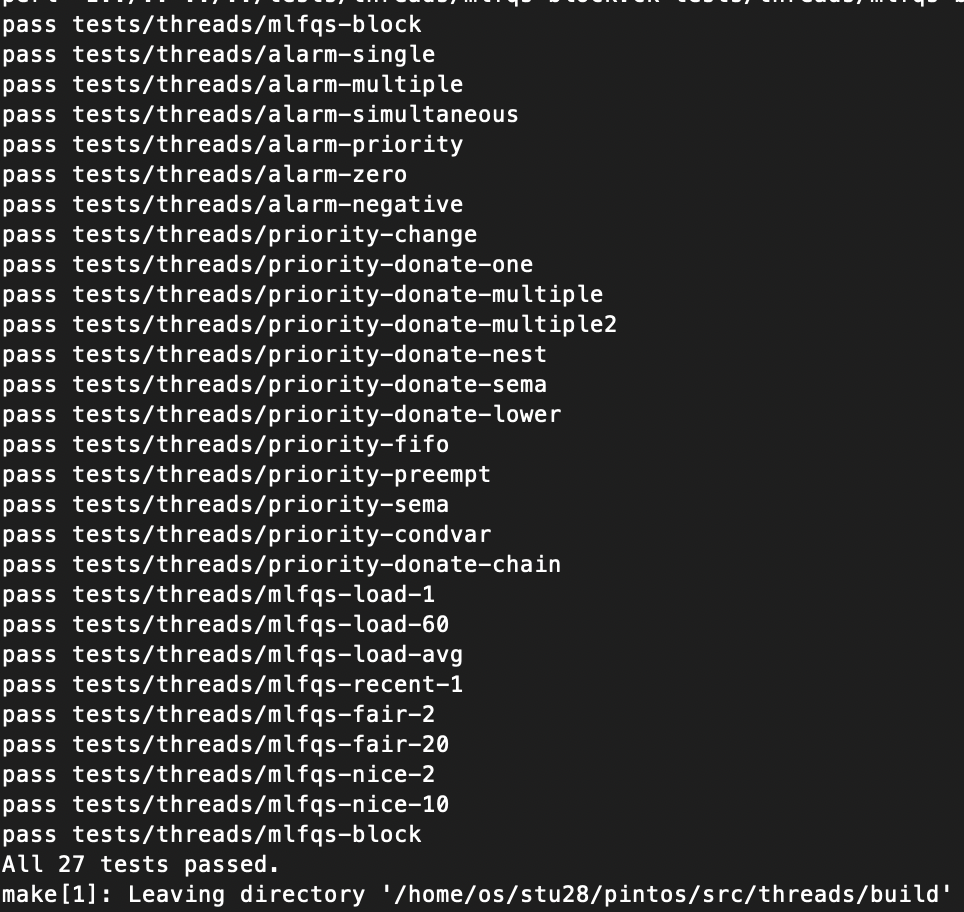

# Project 1 - Final Report (Team 28)
Project 1은 Alarm Clock, Priority Queue Scheduling, Multilevel Priority Queue Scheduling의 세 부분으로 나눌 수 있다. 본 보고서에서는 각 부분을 이전의 Pintos 구현과 비교하여 변화한 점을 서술하는 Improvement 단락, 구현의 세부사항과 설계상의 결정사항을 설명하는 Detail and Rationale 단락, 마지막으로 해당 부분에서 설계상의 난점, 이후 발전될 수 있는 사항, 현재 구현의 한계점 등을 논의하는 Discussion 단락으로 나누서 서술한다.

## Task 1 - Alarm Clock 
Pintos Project 1의 첫 번째 과제는 기존에 구현된 바쁜 대기(Busy waiting) 방식 `timer_sleep()`을 개선하는 것을 목표로 한다. 

### Improvement
기존의 `timer_sleep()`은 계속해서 반복문을 돌며 `start`로부터 현재까지 지난 틱을 측정하고, 만약 `start`로부터 지난 틱이 `ticks`보다 작다면 `thread_yield()`를 호출해 다른 스레드에 실행 흐름을 넘겨주는 방식으로 구현되어 있다. 이 방식은 round robin 방식 스케줄러에서는 `thread_yield()` 호출 시, 현재 스레드가 대기열(Ready queue)의 가장 끝에 추가되므로 비효율적이나 최소한 기능적으로는 잘 작동한다. 하지만, 우선순위 큐 기반 스케줄러에서는 만약 해당 스레드가 현재 대기열에 있는 다른 어떤 스레드보다 높은 우선순위를 가지고 있을 경우, `timer_sleep()`을 호출한 스레드만이 계속 실행되므로 심각한 기아(Starvation) 문제를 야기할 가능성이 있다.

이러한 문제를 해결하기 위해, 새로 구현된 `timer_sleep()`에서는 `set_alarm()`이라는 새로운 함수를 호출한다. `set_alarm()`은 인간이 알람을 맞추고 잠에 들듯이, `ticks` 이후에 울리는 알람을 알람 목록에 추가하는 함수이다. `timer_sleep()`이 호출되면, 이를 호출한 스레드는 `set_alarm()`을 이용해 알람을 설정하고, `thread_block()`을 이용해 잠에 든다. 

이렇게 잠에 든 스레드를 깨우는 일은 타이머 인터럽트 핸들러가 담당한다. Pintos는 타이머 모듈을 초기화하는 함수 `timer_init()`에서 `intr_register_ext()`를 이용해 인터럽트 벡터 0x20에 해당하는 인터럽트 핸들러로 `timer_interrupt()`를 등록한다. 이렇게 등록된 타이머 인터럽트 핸들러 `timer_interrupt()`는 PIC(Programmable Interrupt Controller)에 의해 0x20에 해당하는 인터럽트가 발생할 때마다 실행된다. `timer_interrupt()`의 기존 구현은 스레드 실행에 관한 통계치를 업데이트하고 `TIME_SLICE`가 지나면 운영체제가 실행 흐름을 선점하는 `thread_tick()` 함수만이 호출되는 형태로 구현되어 있다. 

`timer_interrupt()`의 새로운 구현은 `check_alarm()`함수 또한 호출한다. `check_alarm()`은 현재 설정된 알람들을 저장하는 리스트인 `alarm_list`를 순회하며 깨워야 할 스레드를 찾아내 `thread_unblock()`을 호출해 깨우는 것으로 구현되어 있다. 이후 이렇게 종료된 알람은 `alarm_list`에서 제거된다.

### Detail and Rationale
#### `struct alarm`
```C
struct alarm 
  {
    struct list_elem elem;      /* List element for alarm_list. */ 
    struct thread *t;           /* Thread to awaken. */
    int64_t start, ticks;       /* Start time and duration of alarm. */
  };
```
`alarm` 구조체는 `set_alarm()`에 의해 설정되는 하나의 알람을 나타내기 위한 구조체이다. 알람은 전역 리스트에 저장되고 확인되므로, 리스트에 추가하기 위해서는 `elem` 멤버를 가지고 있다. 또한 알람으로 깨울 스레드를 나타내는 `t`, 알람의 시작 시각과 스레드를 깨울 시각을 저장하기 위한 `start`, `ticks` 원소를 가지고 있다. 

#### `alarm_list`, `alarm_list_lock`
```C
/* List of alarms set currently. */
static struct list alarm_list;

/* Lock for manipulating alarm_list. */
static struct lock alarm_list_lock;
```
`alarm_list`와 `alarm_list_lock`은 알람들의 목록을 저장할 리스트와 이 리스트를 다룰 때 획득(Acquire)해야 하는 lock으로 구성되어 있다. 여기서 알람 리스트를 lock을 이용해 보호해야 하는 이유는 이후 `timer_sleep()`과 `set_alarm()` 함수를 다루며 설명할 예정이다. 

#### `timer_init()`
```C
/* Sets up the timer to interrupt TIMER_FREQ times per second,
   and registers the corresponding interrupt. */
void
timer_init (void) 
{
  pit_configure_channel (0, 2, TIMER_FREQ);
  intr_register_ext (0x20, timer_interrupt, "8254 Timer");

  list_init (&alarm_list);
  lock_init (&alarm_list_lock);
}
```
`timer_init()` 함수는 타이머 모듈을 초기화하는 함수로, Pintos 부팅 이후 `main()`의 초기화 과정 중 실행된다. 이전 구현과 비교하였을 때 `alarm_list`와 `alarm_list_lock`을 초기화하는 `list_init()`과 `lock_init()` 호출이 추가되었다는 차이점이 있다.

#### `timer_sleep()`
```C
void
timer_sleep (int64_t ticks) 
{
  ASSERT (intr_get_level () == INTR_ON);

  struct alarm *alarm = set_alarm (ticks);

  intr_disable ();
  thread_block ();
  free (alarm);
  intr_enable ();
}
```
`timer_sleep()` 함수는 기존의 바쁜 대기 기반 구현에서 벗어나 `thread_block()`을 이용하도록 구현되었다. 이때, 상술한 바과 같이 정지(Block) 상태인 스레드는 다른 스레드 혹은 인터럽트 핸들러에 의해 다시 실행되기 전까지 자력으로 다시 실행될 수 없으므로, `set_alarm()`을 호출해 알람을 설정한 후 타이머 인터럽트 핸들러에 의해 깨워지도록 구현되어 있다.

이때 주목할 점은 `timer_sleep()` 함수는 `set_alarm()`이 반환하는 알람의 주소를 현재 실행중인 스레드의 맥락(Context)안에 넣고 `thread_block()`을 호출한다는 사실이다. 즉, 알람을 설정하고 잠에 든 이후 일어났을 때 해당 알람에 대한 메모리를 해제할 책임은 `timer_sleep()`과 이를 호출한 스레드에 있다. `set_alarm()`은 알람을 설정할 때 `malloc()`을 이용한 동적 메모리 할당을 이용하며, 이렇게 할당된 메모리는 반드시 어디에선가 해제되어야 한다. 이러한 메모리 해제 작업은 알람을 확인하고 스레드를 깨우는 `check_alarm()` 함수에서 수행해도 기능상 문제는 없지만, 코드의 단순성과 가독성을 위해 이렇게 설계하였다. 

#### `timer_interrupt()`
```C
/* Timer interrupt handler. */
static void
timer_interrupt (struct intr_frame *args UNUSED)
{
  ticks++;

  check_alarm ();
  thread_tick ();
}
```
타이머 인터럽트 핸들러이다. 기존의 구현에 더해 알람 목록을 확인하고 알람으로 설정된 틱이 다 지난 스레드를 깨우는 `check_alarm()` 호출이 추가되었다.

#### `check_alarm()`
```C
/* Checks alarm lists, and rings alarm if there exists a thread that
   needs to be awakened. */
static void 
check_alarm (void)
{
  struct list_elem *e;
  struct alarm *cur;

  for (e = list_begin (&alarm_list); e != list_end (&alarm_list); )
    {
      cur = list_entry (e, struct alarm, elem);
      
      if (timer_elapsed (cur->start) >= cur->ticks) 
        {
          thread_unblock (cur->t);
          e = list_remove (e);
        }
      else
        {
          e = list_next (e);
        }
    }
}
```
타이머 인터럽트 핸들러에서 호출되어 알람 목록을 확인하고 대기 시간이 지난 스레드를 깨우는 함수이다. 상술한 `alarm_list`를 순회하며 알람 설정으로부터 지난 시간이 설정된 알람 시간보다 큰 스레드를 찾아 `thread_unblock()` 함수를 이용하여 깨우고, 해당 알람은 알람 목록에서 삭제한다.

`check_thread()`의 구현에서 주목할 점은 크게 두 가지이다. 첫째로, 몇몇 알람 시계 구현에서는 알람의 목록인 `alarm_list`, 혹은 이에 상응하는 역할을 하는 리스트를 *오름차순으로 정렬된 상태*로 저장하여, 이후 알람 목록 순회에 소요되는 시간을 줄이고자 한다. 이 구현에서는 그러한 접근을 채택하지 않았다. n개의 알람이 설정되고, 이후 n개의 알람이 울리는 경우를 생각해 보자. 

이때 현재의 구현은 알람 설정 (리스트 삽입)에 각각 상수 시간이 걸리므로 O(n), 모든 알람을 깨우는 데 O(n + (n - 1) + ... + 1) = O(n^2) 시간이 걸려 전체적으로 O(n^2) 시간이 걸린다. 알람을 삽입할 때 정렬된 상태를 유지할 수 있도록 리스트를 한 번 순회하는 경우 (lib/kernel/list.c의 `list_insert_ordered()` 구현은 리스트를 순회하여 새로이 삽입되는 원소가 들어갈 곳을 찾는다.), n개의 알람을 삽입하는 데 O(1 + 2 + ... + n) = O(n^2), n개의 알람을 울리는 데 O(n) 시간이 걸리므로 전체 시간복잡도는 같다.

알람 목록의 정렬을 유지하기 위해 알람을 삽입할 때 리스트를 순회하는 것이 아닌, 이진 탐색 알고리즘을 이용하거나 정렬 알고리즘을 이용하는 경우 삽입에 O(log1 + log2 + ... + logn) = O(nlogn) 시간이 걸린다고 주장할 수도 있을 것이다. 타당한 주장이며 실제로 n이 커질 경우 정렬 알고리즘을 이용하는 방식이 더 빠를 수도 있다. 하지만, 정렬 알고리즘을 이용하는 과정에서 함수 호출로 인해 생기는 오버헤드 또한 무시할 수 없으며 충분히 작은 n에 대해서는 추가적인 함수 호출이 없는 리스트 순회 알고리즘이 더 좋은 성능을 낼 것이라 생각할 수 있다.

두 번째 주목할 점은 `check_alarm()`에서는 `alarm_list`를 조작할 때 `alarm_list_lock`을 이용하지 않는다는 점이다. 이를 이해하기 위해서는 `check_alarm()`은 오직 인터럽트 맥락(Interrupt context) 내에서만 호출되는 함수라는 점을 이해해야 한다. 단일 프로세서 환경에서 공유 자원에 대한 일관성(Consistency) 문제가 일어나기 위해서는 선점형 스케줄러로 인해 다른 스레드로 실행 흐름이 넘어가야 한다. 이때 운영체제에 의한 프로세서 선점은 타이머 인터럽트에 의해서만 발생하고, 외부 인터럽트 실행 맥락에서 인터럽트는 비활성화된다. Pintos는 단일 프로세서(Uniprocessor) 환경에서 실행되는 운영체제이므로, 인터럽트 핸들러 내에서의 공유 자원 접근은 안전하다는 것을 알 수 있다. 무엇보다도, 인터럽트 핸들러 내에서는 함수 실행을 정지시킬 수 없기 때문에, lock을 획득하려 시도할 수 없다.

#### `set_alarm()`
```C
/* Sets an alarm that rings after TICKS, and awakens current thread. 
   */
static struct alarm *
set_alarm (int64_t ticks)
{
  struct thread *current = thread_current();
  struct alarm *new = (struct alarm *) malloc(sizeof(struct alarm));

  new->t = current;
  new->start = timer_ticks();
  new->ticks = ticks;

  lock_acquire (&alarm_list_lock);
  list_push_back (&alarm_list, &new->elem);
  lock_release (&alarm_list_lock);

  return new;
}
```
`thread_block()`을 호출해 정지 상태에 들어간 스레드를 깨우기 위한 알람을 설정하는 함수이다. 새로운 알람에 사용될 메모리를 동적 할당해 해당 알람을 알람 리스트의 맨 끝에 추가하도록 구현되어 있다.

알람을 구현하기 위한 방법으로 위와 같이 동적 할당을 이용할 수도 있고, `thread` 구조체에 `alarm_list`에 대응하는 `list_elem` 멤버와 알람이 울릴 tick을 저장하는 멤버를 추가하여 구현할 수도 있을 것이다. 동적 할당을 이용하는 구현은 필요할 때만 알람에 대한 정보를 저장할 메모리 공간을 힙 영역에 할당하므로 메모리에 효율적이지만, 메모리 동적 할당은 느린 작업이므로 시간에는 비효율적이다. 반대로 `thread` 구조체를 수정하는 방식은 알람을 설정하지 않은 스레드들도 알람에 대한 정보를 스레드 페이지 내에 저장해야 하므로 메모리에 비효율적이다. 현재 구현과 같은 방식을 채택한 이유는 `set_alarm()` 호출이 충분히 많지 않은 이상 상술한 메모리 동적 할당 지연시간 문제는 무시할 만하고, 반대로 `thread` 구조체의 크기가 늘어나는 것은 하나의 스레드에 4KiB의 메모리만이 할당되고 이 안에 스레드 스택, `thread` 구조체 모두를 저장하는 Pintos의 특성상 치명적이기 때문이다.

`set_alarm()`은 `check_alarm()`과는 다르게 알람 목록에 새로운 알람을 추가할 때 대응되는 lock을 먼저 획득한다. 이는 `set_alarm()`은 인터럽트 실행 맥락이 아닌 일반적인 실행 맥락에서도 호출될 수 있는 함수이기 때문이다. 따라서, `list_push_back()` 실행 도중 충분히 타이머 인터럽트에 의해 실행 흐름이 다른 스레드로 넘어갈 수 있으며, lock을 이용해 임계 구역의 실행을 통제하고 공유 자원을 보호해야 한다.

### Discussion
#### What is the best way to manage the list of alarms?
현재 알람 구현은 타이머 인터럽트 핸들러가 각 알람을 확인하고 스레드를 깨우는 책임을 가지고 있다. 이 이전에 제안되었던 구현 중 하나로는 이러한 스레드를 깨우는 책임을 지는 스레드를 따로 만들어, 그 스레드가 실행될 때마다 알람 목록을 확인하고 스레드를 깨울 수 있도록 하는 구현이 있었다.

하지만, 이는 비효율적인 구현인데, 그 이유는 다음과 같다. 먼저 이러한 책임을 인터럽트 핸들러가 아닌 일반적인 스레드가 진다면 해당 스레드의 실행이 늦어진다면 스레드를 깨우는 작업이 늦어질 수 있다. 비록 Pintos 문서에 따르면 `timer_sleep()`은 *최소한* 인자 `ticks`만큼의 시간이 지난 후 현재 스레드를 깨우는 것 이외에 다른 제약조건을 두고 있지는 않아 이 또한 옳은 구현이지만, 최대한 `ticks`에 근접한 시간 동안에만 스레드 실행을 멈추는 것이 합리적인 구현일 것이다.

두 번째 이유는 그러한 책임을 지는 스레드를 만들고, 최대한 정확한 sleep을 구현하기 위해 스레드에 프로세서 사용 권한이 있는 동안 반복문을 실행하게 만드는 것은 이전의 구현인 바쁜 대기 구현과 다를 것이 없기 때문이다.

## Task 2 - Priority Queue Scheduling 
### Improvement
디자인 레포트를 통해 알아봤던 것과 같이 우선순위에 따른 스케쥴러를 개발하는 것이 처음 목표이다. 우선순위 스케쥴러를 만들어 우선순위에 따라 쓰레드를 할당하고 실행하게 되도록 수정해야 하며, 단순히 우선순위만 수정할 시에 발생이 가능한 문제인 Prioriry Donation이 작동할 수 있도록 구조를 잘 설계하는 것이 중요하다. 기존 pintOS에서는 스케쥴러는 매우 단순한 구조로 이루어져 있다. `schedule()` 함수에서 다음에 실행될 쓰레들을 불러와서 실행하게 되는데, 이 때 다음으로 실행할 쓰레드를 찾는 것이 바로 `next_thread_to_run()` 이다. ready_list 에서 저장되어 있는 쓰레드 중에서 가장 앞에 있는 쓰레드를 불러와서 리스트에서 제거하고, 반환하는 것이 해당 함수의 실행인데, 이 때 다음에 실행될 쓰레드를 우선순위에 따라서 반환하게 된다면, 우선순위 스케쥴러는 보다 간단하게 구현할 수 있을 것이다. 

이를 구현하기 위해서 제일 주목해서 수정한 부분은 바로 `next_thread_to_run()`이다. 우선 모든 `switch_thread()`는 `schedule()` 에서만 발생되므로 다른 로직을 수정하기보단 기존의 부분만 수정하는 것으로 하였으며, 이 떄 ready_list 에서 가장 높은 우선순위를 가진 부분만 반환하는 것을 통해 우선순위 스케쥴러의 기틀을 마련했다. 하지만 해당 부분만으로는 매우 부족하다.  쓰레드의 우선순위가 바뀌게 되는 경우를 추가적으로 고려해야 한다. 기존 구현에서는 thread의 우선순위가 바뀌거나, 새로운 쓰레드가 생성되거나 하는 경우에 스케쥴러를 실행시키지 않게 되는데, 이제는 우선순위에 따라 작동해야 하므로, 변경 가능한 경우인 `thread_create()` `thread_set_priority()` 에서도 새로운 thread가 생기거나 변경되었을 경우 현재 실행되고 있는 thread와의 우선순위 비교를 진행하고, 문제가 있을 경우 `thread_yield()`를 통해 우선순위를 반영하는 과정을 추가하도록 하는 `thread_check()` 함수를 선언하였다. 이 함수 내에서는 현재 실행 중인 thread_current() 와의 비교를 통해 우선순위에 따라 실행을 유지하게 된다.

다음으로는 우선순위 기부에 관한 구현이다. 이 경우에는 보다 복잡하다. 우선 우선순위가 여러번 기부되는 경우를 고려해야 한다. 그러기 위해서는 처음 고려했던 것은 전역변수를 위한 리스트를 하나 생성해서 기부한 thread, 기부받은 thread를 pair 형태로 기입하여 저장하는 방식이었다. 하지만 이 경우 locK의 종류에 따라 기부가 다르게 시행될 수 있으며, 때에 따라서는 한 thread가 여러 thread에게 기부하기도 하는데 이러한 경우들에 대해서 굉장히 리스트가 너무 비대해지는 경향이 있어, lock을 해제할 때 다시 복원할 때 굉장히 문제가 많이 발생했다. 그래서 구조를 다시 고려한 결과 thread 구조체 자체에 기부해준 쓰레드를 저장하기 위한 donator_list, 기존 우선순위를 저장하기 위한 prev_priority, 어떤 lock에 의해서 block 되었는지 기록할 lock_waiting로 구성되어 있다. 기부한 thread를 저장하고, 이 리스트를 활용하여 기부가 끝난 이후 반환할 때 사용하였다. 이 때 사용할 함수인 `thread_donate()`를 통해서 현재 실행 중인 쓰레드가 lock에 걸려서 실행은 못하면서 lock->holder가 우선순위가 더 높다면 우선순위를 기부하는 방식으로 구현을 완료했다.

우선순위를 복구하는 과정에서 사용할 `thread_restore()`를 정의하였는데, 이 때는 보다 복잡한 과정이 포함되어 있다. 단순히 모든 donator_list의 thread를 해제하면 되는 것이 아닌, 지금 해제하고자 하는 lock에 정확히 해당하는 thread만 unblock 시켜줘야 한다. 따라서 이 경우에 donator_list를 순회하면서 lock_waiting을 확인하여 해당하는 쓰레드만 unblock 시켜주는 과정이 핵심이다. 이외에도 우선순위를 다시 확인하여, 기존에 남아있는 donator_list에 남은 쓰레드의 우선순위 중 가장 높은 우선순위를 가진 쓰레드와 비교하여 우선순위를 다시 복구하게 된다. 

또한, `thread_donate()`와 `thread_restore()`가 실행되는 부분에 대해서 알아보자면, `lock_acquire()`할 떄 lock이 이미 holder가 존재하며, 우선순위가 더 높은 경우에 우선순위 기부를 위해 실행되게 된다. 이외에도 `thread_restore()`는 `lock_release()`에서 실행된다. 다음으로 확인할 부분은 semaphore이다. semaphore에 저장되어 있는 waiters에서도 쓰레드를 unblock 할 때 실행되는 `sema_up()`에서도 우선순위가 가장 높은 waiters의 쓰레드만 unblock하고, `thread_check()`를 통해 다시 실행을 확인하도록 구현을 완료했다.

마지막으로 확인할 부분은 condition 관련한 부분이다. condition에서도 마찬가지로 여러 리스트를 통해서 semaphore를 저장하고 관리하게 되는데 이 때 사용되는 `semaphore_max_priority()`와 `semaphore_compare()`를 통해서 semaphore를 `cond_wait()`에서 정렬하여 실행하게 되고, 마찬가지로 `cond_signal()`과 `cond_braodcast()`에서도 이미 리스트가 정렬되어 있으므로, 정렬을 확인한 뒤에 signal 통해서 해제하게 된다.

### Detail and Rationale
#### thread_create()
```C
tid_t
thread_create (const char *name, int priority,
               thread_func *function, void *aux) 
{
  ...

  thread_unblock (t);
  thread_check ();

  return tid;
}
```
thread가 새롭게 생성되는 경우에 새로운 thread가 current와 교체될 수 있도록 하는 thread_check 함수의 실행을 추가하였다. 

#### thread_set_priority()
```C
void
thread_set_priority (int new_priority) 
{
  struct list_elem *e;
  struct thread *t, *cur = thread_current ();

  cur->priority = new_priority;
  cur->prev_priority = new_priority;

  if (thread_mlfqs) 
    return;

  /* New priority should be ignored when current thread has been
     donated from someone else, and the donation is greater than
     new one. */
  for (e = list_begin (&cur->donator_list); e != list_end (&cur->donator_list); 
       e = list_next (e))
    {
      t = list_entry (e, struct thread, donator);

      if (t->priority > cur->priority)
        cur->priority = t->priority;
    }
  
  thread_check ();
}
```
새로운 pirority로 변경을 위해 실행시키는 함수인데, 만약 새로운 우선순위로 업데이트 될 때 기존의 우선순위가 만약에 다른 쓰레드에게 기부받은 경우가 있을 수 있기 때문에 우선 prev_priority에 새롭게 입력받은 우선순위를 넣고, 이후에 donator_list를 순회하면서 더 가장 높은 우선순위로 priority를 대체하게 된다. 또한, 앞에서 언급한 것처럼 우선순위 순서에 변동이 생긴 경우를 위해 thread_check()를 실행하게 된다.

#### init_thread()
```C
static void
init_thread (struct thread *t, const char *name, int priority)
{
  ...

  /* Initialize donator list. */
  list_init (&t->donator_list);
  t->prev_priority = priority;

  ...
}
```
초기화 시에 새로 추가된 donator_list와 prev_priority를 함께 초기화해주는 부분을 추가했다.

#### next_thread_to_run
```C
static struct thread *
next_thread_to_run (void) 
{
  ASSERT (!thread_mlfqs);

  if (list_empty (&ready_list))
    return idle_thread;

  struct list_elem *max_e = list_max (&ready_list, thread_compare, NULL);
  struct thread *max_t = list_entry (max_e, struct thread, elem);

  list_remove (max_e);
  return max_t;
}
```
다음에 실행할 thread를 ready_list에서 priority 기준으로 가장 높은 priority를 가진 max_t를 찾아서 리스트에서 지우고 반환하여, 다음에 switch 될 수 있도록 구현하였다.

#### thread_check()
```C
/* Checks ready queue, and yields current thread if thread with 
   maximum priority has higher priority than current thread. */
void
thread_check (void)
{
  int max;
  struct thread *cur = thread_current ();

  if (thread_mlfqs)
    max = mlfqs_max_priority ();
  else
    max = max_priority ();

  if (max > cur->priority)
    thread_yield ();
}
```
thread_check 함수는 새롭게 선언한 함수로 현재 thread_create(), thread_set_priority(), thread_set_nice() 와 같이 우선순위가 바뀔 수 있는 경우에 실행되는 함수로, 현재 실행되고 있는 쓰레드와 비교하여 우선순위가 더 높다면 실행중인 쓰레드를 thread_yield() 하여 실행을 우선순위에 따라 바꿔주는 함수이다.

#### thread_dondate()
```C
/* Donates priority of current thread to T, in current depth of DEPTH. 
   Notice that this function may be called recursively, donating 
   current thread's priority to all other threads holding the locks 
   required for current thread. */
void
thread_donate (struct thread *t, int depth)
{
  t->priority = thread_current ()->priority;

  if (depth >= MAX_DONATION_DEPTH || t->lock_waiting == NULL)
    return;

  struct lock *waiting = t->lock_waiting;
  thread_donate (waiting->holder, depth + 1);
}
```
위에서 언급했던 우선순위 기부를 위해 구현된 함수로 lock_acquire() 에서만 실행되는 함수이다. 우선 lock 을 소유하려고 했지만 소유하지 못한 쓰레드를 대상으로 lock->holder와 비교했을 떄 우선순위가 더 높을 경우에 실행되는 함수이며, 문서에서 언급된 바와 같이 MAX_DONATION_DEPTH를 8로 설정하여 총 8번까지 기부가 진행되도록 구현했으며, 지속적으로 lock_waiting->holder 로 넘어가며 기부할 수 있다면 기부를 반복하게 된다. 이 경우 기부된 이후에 다시 lock_acquire()로 돌아와서 sema_down()으로 실행이 넘어가게 되면서 ready_list에 우선순위를 기부를 받은 쓰레드가 존재하기 때문에 상태가 변경되어 다시 switch가 발생하게 되는 구조로 실행된다. 

#### thread_restore()
```C
/* Restores donated priority of current thread, caused by acquisition
   of LOCK. It first deletes all donators that donated its priority 
   to current thread because of LOCK from current thread's donator 
   list. Also, it restores current thread's priority into the maximum
   among those remaining in the donator list and previous priority of
   current thread. */
void
thread_restore (struct lock *lock)
{
  struct list_elem *e;
  struct thread *t, *max, *cur = thread_current ();
  struct list *li = &(cur->donator_list);

  if (list_empty(li))
    {
      cur->priority = cur->prev_priority;
      return;
    }

  for (e = list_begin (li); e != list_end (li); )
    {
      t = list_entry (e, struct thread, donator);

      if (t->lock_waiting != NULL && t->lock_waiting == lock)
        e = list_remove (e);
      else
        e = list_next (e);
    }

  max = list_entry (list_max (li, thread_compare, NULL), struct thread, 
                    donator);

  if (max->priority > cur->prev_priority)
    cur->priority = max->priority;
  else
    cur->priority = cur->prev_priority;
}
```
마찬가지로 donation 한 쓰레드를 풀어주기 위한 thread_restore()를 선언했다. 우선 이 경우에 현재 실행되고 있는 thread가 lock 을 해제했을 때 실행되도록 한 함수로 제일 중요한 것은 현재 해제하고자 하는 Lock에 해당하는 쓰레드만 리스트에서 제거하는 것이 중요하다. 다시 정리해보면 이전에 lock_acquire()의 실행 중 조건이 맞는 경우 thread_donate()를 통해서 리스트에 추가가 되었고, 우선순위를 thread_current()에게 기부하게 된다. 이후에 sema_down()을 실패하는 과정에서 block을 당하게 되었고, 이후에 lock->holder가 lock_release() 통해서 lock을 해제하는 경우에 thread_restore()함수가 실행이 되며 리스트에 그 lock으로 인해 기부가 된 thread들을 삭제하게 된다. 이후 위에서 언급한 것처럼 다시금 우선순위를 남은 기부자들과 자신의 원래 우선순위와 비교하여 가장 높은 우선순위로 재 조정을 한 뒤에 마무리하게 된다. 이 이후에 sema_up()을 통해서 donator 중에서 실행이 될 것이며, unblock() 이후에 thread_check() 를 통해서 switch 될 것이다.

#### thread_compare()
```C
/* Compare two list elements that belong to thread according to their 
   priorities, and return true if thread A's priority is less than B's. */
bool 
thread_compare (const struct list_elem *a, const struct list_elem *b,
                void *aux UNUSED)
{
  struct thread *ta = list_entry (a, struct thread, elem);
  struct thread *tb = list_entry (b, struct thread, elem);

  return ta->priority < tb->priority;
}
```
우선순위에 따라 쓰레드를 비교하고, 정렬하기 위해 정의된 함수로 우선순위에 따라서 쓰레드를 내림차순으로 정렬되도록 한다.

#### max_priority()
```C
/* Returns maximum priority among threads in current ready_list.
   If ready_list is empty, returns -1. Notice that this function
   must not be used when the kernel uses multilevel feedback queue
   scheduling. Use mlfqs_max_priority() instead. */
static int
max_priority (void)
{
  ASSERT (!thread_mlfqs);

  if (list_empty (&ready_list))
    return -1;
  
  struct thread *max = list_entry (list_max (&ready_list, thread_compare, NULL), 
                                   struct thread, elem);
  return max->priority;
}
```
가장 높은 우선순위를 지닌 쓰레드의 우선순위를 반환하는 함수이다. 아까 정의한 thread_compare()를 활용하여 가장 높은 우선순위를 지닌 thread의 우선순위를 반환하게 된다.

#### sema_up()
```C
/* Up or "V" operation on a semaphore.  Increments SEMA's value
   and wakes up one thread of those waiting for SEMA, if any.

   This function may be called from an interrupt handler. */
void
sema_up (struct semaphore *sema) 
{
  ...

  if (!list_empty (&sema->waiters)) 
    {
      max = list_max (&sema->waiters, thread_compare, NULL);
      list_remove (max);
      thread_unblock (list_entry (max, struct thread, elem));
    }
  sema->value++;
  
  thread_check ();
  intr_set_level (old_level);
}
```
sema_up() 함수의 일 부분을 수정하였으며, sema_up 시에 원래는 sema_waiter에서 가장 front에 있는 쓰레드를 반환하는 구조로 되어있었으나, 우선순위에 따라 가장 높은 우선순위를 지닌 쓰레드를 unblock 하게 되며, 이 쓰레드는 이전에 thread_restore()의 실행 중에 donator_list 에서 제거된 쓰레드 중 하나일 것이다.

#### semaphore_max_priority()
```C
/* Returns maximum priority among waiters of S. If S has no waiter,
   returns PRI_MIN. */
static int
semaphore_max_priority (struct semaphore *s)
{
  struct list_elem *max;

  if (list_empty (&s->waiters))
    return PRI_MIN;
  
  max = list_max (&s->waiters, thread_compare, NULL);
  return list_entry (max, struct thread, elem)->priority;
}
```
이 함수는 semaphore 사이의 정렬을 위한 함수에 사용될 함수로, condition에 의해 block 될 경우에 semaphore 내의 waiters 중에서 가장 높은 우선순위에 따라 signal을 보내게 되는데 이를 위해서 semaphore의 리스트를 확인하여 가장 높은 우선순위를 지닌 쓰레드만 반환하게 되는데, 이 때 사용되는 함수로 가장 높은 우선순위를 지닌 쓰레드를 찾아서 반환하게 된다.

### semaphore_compare()
```C
/* Compare two semaphore element, and returns true if semaphore
   associated with A has less maximum priority among waiters than
   B. */
static bool 
semaphore_compare (const struct list_elem *a, 
                   const struct list_elem *b, void *aux UNUSED)
{
  struct semaphore_elem *ea = list_entry (a, struct semaphore_elem, elem);
  struct semaphore_elem *eb = list_entry (b, struct semaphore_elem, elem);

  return semaphore_max_priority (&ea->semaphore) 
         < semaphore_max_priority (&eb->semaphore);
}
```
semaphore의 우선순위에 따라 비교하는 함수로, 아까 선언했던 함수를 활용하여 가장 높은 우선순위를 지닌 쓰레드가 기다리고 있는 세마포어를 내림차순으로 정렬하기 위한 비교함수이다.

#### lock_acquire()
```C
void
lock_acquire (struct lock *lock)
{
  ...

  if (!thread_mlfqs && holder != NULL && cur->priority > holder->priority)
    {
      cur->lock_waiting = lock;
      list_push_back (&holder->donator_list, &cur->donator);
      thread_donate (holder, 1);
    }

  ...

  cur->lock_waiting = NULL;
}
```
lock_acquire 시에 만약 우선순위가 더 낮은 holder로 인해서 우선순위 기부 상황이 생겨난 경우에 donator_list에 해당 쓰레드를 추가하게 되며, thread_donate() 함수의 실행을 통해서 nested donation을 해결하게 된다. 예를 들어 우선순위가 A > B > C 인 경우인데 이미 B -> C 로 기부가 일어난 경우를 가정하면, A 가 실행하여 lock 을 확인했지만 B 가 holder인 경우에는 B에게 기부하는 것도 필요하지만, 이 우선순위가 또다시 C에게 넘어가야 하며, 이를 위해서 thread_donate() 함수를 통해서 C까지 우선순위가 전파되어 실행되도록 구현하였다. 마지막으로 lock_acquire()의 실행이 종료되었다는 의미는 lock을 가졌다는 것이므로 lock_waiting 을 NULL 로 변경하게 된다.

#### lock_release
```C
void
lock_release (struct lock *lock) 
{
  ...

  if (!thread_mlfqs)
    thread_restore (lock);

  ...
}
```
lock_release를 통해서 lock을 해제하는 경우에 아까 위에서 정의했던 thread_restore() 를 실행하여 현재 Lock 에 대해서 모든 donator_list 에서 쓰레드를 제거하게 되며, 여기서 제거된 쓰레드들 중에서 sema_down() 을 통해 unblock 되며, 이렇게 unblock 된 쓰레드가 switch_thread 를 통해서 반환되게 된다.

#### cond_wait()
```C
void
cond_wait (struct condition *cond, struct lock *lock) 
{
  ...

  sema_init (&waiter.semaphore, 0);
  list_insert_ordered (&cond->waiters, &waiter.elem, semaphore_compare, NULL);
  lock_release (lock);
  sema_down (&waiter.semaphore);
  lock_acquire (lock);
}
```
이 경우에는 각 cond 에 해당하는 waiter에 semaphore를 추가하게 되는 경우인데, 이 경우 현재 실행 중인 쓰레드가 해당하는 세마포어를 cond->waiters에 추가해주게 된다. 이 경우에는 앞선 말했던 것처럼 signal과 broadcast를 통해서 sema를 해제해주게 되는데, 사실 이 경우에 문제점으로 생각될 수 있는게 앞선 ready_list의 구현과 같이 리스트를 그대로 두고 Pop 시에만 정렬을 확인하게 될 경우에는 각 sema와 그 해당 sema->waiters 에서도 각각 정렬이 필요하게 되는데 너무나 많은 연산이 한번에 실행될 가능성이 있다고 판단하여 push 시에도 정렬을 확인하는 것으로 구현을 진행했다.

#### cond_signal()
```C
void
cond_signal (struct condition *cond, struct lock *lock UNUSED) 
{
  ASSERT (cond != NULL);
  ASSERT (lock != NULL);
  ASSERT (!intr_context ());
  ASSERT (lock_held_by_current_thread (lock));

  if (!list_empty (&cond->waiters)) 
  {
    list_sort (&cond->waiters, semaphore_compare, NULL);
    sema_up (&list_entry (list_pop_back (&cond->waiters),
                          struct semaphore_elem, elem)->semaphore);
  }
}
```
위의 구현과 마찬가지로 sema_up 을 실행하게 되는 경우이지만, 사실 list_sort() 는 정의 상으로는 필요가 없는 부분일 수 있지만, 만에 하나 cond_wait() 실행 시에 우선순위의 역전이나 정렬이 깨지는 경우에 대비하기 위해서 정렬을 확인하는 부분을 추가하였다. 정렬되지 않은 리스트일 경우에 시간복잡도는 O(nlogn) 이지만, 정렬된 리스트의 시간복잡도이므로 O(n) 으로 판단하여 혹시 모르는 오류를 방지하기 위한 수단으로 코드를 추가하였다.

#### cond_broadcast()
```C
void
cond_broadcast (struct condition *cond, struct lock *lock) 
{
  ASSERT (cond != NULL);
  ASSERT (lock != NULL);

  if (list_empty (&cond->waiters))
    return;
  list_sort (&cond->waiters, semaphore_compare, NULL);

  while (!list_empty (&cond->waiters))
    cond_signal (cond, lock);
}
```
cond_broadcast를 통해서 signal을 각각 진행할 때에도 마찬가지로 순서가 중요하므로, list_sort() 를 통해 우선순위를 추가로 확인을 진행하고, 이후에 sema의 우선순위에 따라 cond_signal() 을 실행하여 우선순위에 맞춰서 waiters 에서 해제하게 된다.

#### struct thread
```C
struct thread
  {
    ...

    struct list donator_list;           
    struct list_elem donator;
    struct lock *lock_waiting;         
    int prev_priority; 
    
    ...
  };
```
기존 구조체 thread에서 새롭게 추가된 구조체로 기부한 쓰레드를 저장하기 위한 donator_list, 그리고 donator_list에 포함되기 위해서 사용될 list_elem type의 donator, 그리고 만약 lock을 얻지 못해서 block 된 경우를 저장하여 이후 thread_restore()에서 사용하기 위해서 lock_waiting, 마지막으로 우선순위의 원상 복구를 위한 prev_priority 를 구조체에 추가로 선언하게 되었다.

### Discussion
#### ready_list를 관리할 떄 원소 추가 시에 sort를 유지하는 것이 항상 효율적일까?
다른 학생들의 design report 발표를 들으며 느꼈던 제일 큰 차이점은 바로 ready_list를 push 시에 정렬을 유지하여 이를 토대로 관리하는 방식이었다. 우리 팀의 구현은 ready_list를 바로 sort 하지 않고, next_thread_to_run() 에서 가장 높은 우선순위의 쓰레드를 반환할 때에만 실행하는 구조로 작성하였다. 이렇게 작성한 이유는 다음과 같다. 우선 구현이 훨씬 간단해진다. 만약에 ready_list에 push 하는 경우를 바꾼다고 가정하게 되면, 모든 push 하는 부분을 수정해야 한다. thread_create(), thread_unblock(), thread_yield()를 포함하여 정말 많은 함수에서 사용되고 있는 부분에서 수정이 필요하게 되며, 이는 단순히 코드 작성 외에도 만약 한 경우를 빠뜨리게 된다면 실행에 심각한 오류를 야기할 수 있다. 이러한 오류를 대비하기 위해서 만약 next_thread_to_run()에도 sort를 체크하는 함수를 추가하게 된다면, 사실상 시간복잡도는 오히려 더 복잡해질 수 있다. 따라서 구현의 편리성과 전반적인 구조 상 pop 할 때 실행하게 되었다. 

다음 이유는 시간복잡도 측면에서 큰 차이가 없기 때문이었다. 우선 sort를 통해 정렬할 경우에는 최대 O(n log n)이 되며 시간 복잡도가 단순 search O(n)에 비해 커지게 되는데, 위에서 언급한 많은 Push되는 부분마다 정렬을 하게 된다면 시간복잡도가 더 커지게 될 것이라 생각했다. 사실 정렬을 초기에 한 이후에는 매번 정렬 시에 O(n)이라고 추론할 수 있으므로 사실 시간복잡도 측면에서는 다른 많은 팀의 구현과 큰 차이가 없다 라고 고려했으며, search 로 인해 시간복잡도가 추가될 수 있는 문제가 있지만, 이는 위에서 언급한 구현 및 구조의 편리성과 비교했을 때 장점이 더 크다고 판단하여 pop 시에 max만 리스트에서 제거하는 구조를 택했다. 

이외에도 cond 에서는 반대로 sort를 유지했는데 위에서 설명한 바와 같이 각 semaphore와 그 내부 waiters의 정렬까지 signal 함수나 broadcast에서 관리하기에는 비효율적이라 판단하여 초기에 정렬을 유지하는 방식의 구현을 택했으며, 이 구현 역시 시간복잡도 측면과 비교해서 구현의 복잡도가 매우 올라간다고 생각해서 push 시에 sort 하는 방식을 선택하였다.

#### donation 시에 기부한 쓰레드의 우선순위를 swap 않는 이유가 무엇일까?
사실 초기에 swap으로 구현을 설계했었고, 당연히 우선순위를 기부했기 때문에 swap 이 필요하다고 생각했었다. 하지만 초기 구현 방식에서 고민했던 부분은 donation_list를 thread 개별로 소유하고 있기보단 전역변수로 선언하여 모든 기부를 관리하고자 했다. 하지만 이 경우에는 nested donation과 더불어 많은 케이스에서 문제가 예상되었고, 구조가 자연스레 쓰레드 개별적으로 donator를 소유하고 이를 관리하는 방식으로 바뀌었다. 이와 마찬가지로 우선순위 또한 swap이 필요할 것이라 생각했지만, 현재 donator_list 의 구조로 확인했을 때 swap을 하지 않는 이유는 다음과 같다. 첫째, swap과 상관없이 기부반은 쓰레드는 먼저 실행하게 된다. 즉, 기부한 쓰레드는 현재 실행 중인 상황으로 ready_list에는 포함되어 있지 않다. 우선순위가 제일 높기 때문에 현재 실행 중인 쓰레드의 우선순위를 기부받게 된다면 ready_list에서는 당연히 제일 우선순위가 높게 될 것이며, 이는 이후 thread_check() 를 통해서 switch되어 실행하게 되고 추가로 기부한 쓰레드는 thread_block()를 통해 이미 실행되고 있지 않으므로 swap이 필요가 없게 된다. 따라서 굳이 swap하지 않았고, 이 경우에 nested donation이라면 swap을 통해서 구현하게 된다면, 나중에 restore 시에 많은 문제가 발생할 것으로 생각되어 swap 을 택하지 않았다.

## Task 3 - Multilevel Priority Queue Scheduling
### Improvement
Task 2에서는 각 스레드별로 우선순위를 할당하고, 그 우선순위에 기반해 다음에 실행할 스레드를 실행하는 우선순위 큐 기반 스케줄링을 구현하였다. 우선순위 큐 기반 스케줄러는 각 스레드에 우선순위를 주어 중요한 작업을 빠르게 처리할 수 있게 하였다는 장점이 있지만, 우선순위가 높은 스레드가 계속 프로세서를 독점하여 낮은 우선순위의 스레드가 기아 문제를 겪을 수 있다는 단점이 있다. Task 3에서는 다계층 피드백 큐 기반 스케줄러(Multilevel priority queue scheduler, 이후 MLFQS라 칭함)를 구현하여 스레드가 각각의 우선순위를 직접 정할 수 있게 하는 대신, 친절도, 혹은 niceness라 이름붙혀진 값만을 정할 수 있도록 허용하고 이를 간접적으로 우선순위에 반영하도록 하는 것을 목표로 한다.

Pintos 문서에 설명된 MLFQS를 잠시 살펴보자. MLFQS는 이름 그대로 각 우선순위마다 하나의 큐를 가지고, 각 스레드는 자신의 우선순위에 해당하는 큐에 삽입된다. 그리고 스케줄러는 매 초마다 스레드 실행에 관련된 정보를 업데이트하고, 스레드의 우선순위는 이 정보를 이용해 매 time slice마다 업데이트되고 스레드는 자신의 우선순위에 맞는 큐로 이동한다. 각 우선순위에 해당하는 큐는 선입선출 방식으로 동작한다. 상술했듯이, 스레드 실행과 프로세서 부하와 관련된 정보는 우선순위에 바로 반영되지 않고 친절도에 영향을 받아 반영되므로, 유저는 스레드의 우선순위를 간접적으로 조절하게 된다.

### Detail and Rationale
#### `struct thread`
```C
struct thread
  {
    ...
    int nice;                           /* Niceness. */ 
    fixed recent_cpu;                   /* Recent CPU usage. */
    ...
  };
```
`thread` 구조체의 선언을 보면, 상술한 친절도를 나타내는 멤버 `nice`와 해당 스레드의 최근 프로세서 사용량을 나타내는 멤버 `recent_cpu`가 추가되었다. 각 값들이 어떻게 업데이트되고 우선순위에 반영되는지는 이후 `update_priorities()`, `update_recent_cpu()`, `update_load_avg()`, `mlfqs_update()` 함수를 다루며 자세히 설명한다.

#### `mlfqs_queues` 
```C
/* Array of lists that holds processes in THREAD_READY state with 
   certain priority.  This is used instead of ready_list when the 
   kernel uses multilevel feedback queue scheduling. */
static struct list mlfqs_queues[PRI_MAX + 1];
```
`mlfqs_queues`는 각각의 우선순위에 해당하는 큐들을 모아놓은 배열이다. Pintos의 우선순위의 최소값은 0, 최대값은 63이므로, `mlfqs_queues`는 총 64개의 큐를 묶어서 저장하게 된다. 해당 리스트들은 Pintos의 초기화 과정 중 `thread_init()` 함수에서 초기화된다.

#### `load_avg`
```C
/* Current system's averge load. Used to calculate recent CPU usage 
   of a thread. */
fixed load_avg;
```
`load_avg`는 현재 시스템의 평균적 부하를 나타내는 전역 변수이다. 이후 `update_load_avg()` 함수에서 다시 설명하겠지만, `load_avg`는 이전 틱의 `load_avg`와 현재 실행중인 스레드의 개수의 가중평균으로 계산된다. 즉, `load_avg`는 현재 실행중인 스레드의 개수에 비례하는 값이지만, 현재 실행중인 스레드의 개수에 의해 큰 폭으로 변동하지는 않는 값으로 이해할 수 있다.

#### `thread_tick()`
```C
/* Called by the timer interrupt handler at each timer tick.
   Thus, this function runs in an external interrupt context. */
void
thread_tick (void) 
{
  struct thread *t = thread_current ();

  ...
  /* Routines for multilevel feedback queue scheduling. */
  if (thread_mlfqs)
    mlfqs_update ();

  if (thread_mlfqs && timer_ticks () % TIME_SLICE == 0) {
    mlfqs_organize ();
    intr_yield_on_return ();
  }
}
```
`thread_tick()`은 타이머 인터럽트 핸들러에 의해 매 틱마다 호출되는 함수이다. 기존 구현에 더해, `thread_tick()`은 커널의 MLFQS 사용 여부에 따라 새로운 함수인 `mlfqs_update()`와 `mlfqs_organize()`를 호출하고, 매 time slice가 만료될때마다 현재 실행중인 스레드를 강제로 준비(Ready) 상태로 되돌린다. `mlfqs_update()`는 상술한 현재 시스템의 스레드 실행에 관한 정보들과 각 스레드의 우선순위를 업데이트하는 함수, `mlfqs_organize()`는 업데이트된 우선순위에 맞추어 스레드를 대응되는 큐에 삽입하는 함수이다. 각 함수의 자세한 동작은 각 함수 단락에서 설명한다.

#### `thread_unblock()`
```C
/* Transitions a blocked thread T to the ready-to-run state.
   This is an error if T is not blocked.  (Use thread_yield() to
   make the running thread ready.)

   This function does not preempt the running thread.  This can
   be important: if the caller had disabled interrupts itself,
   it may expect that it can atomically unblock a thread and
   update other data. */
void
thread_unblock (struct thread *t) 
{
  enum intr_level old_level;

  ASSERT (is_thread (t));

  old_level = intr_disable ();
  ASSERT (t->status == THREAD_BLOCKED);

  if (thread_mlfqs)
    list_push_back (&mlfqs_queues[t->priority], &t->elem);
  else
    list_push_back (&ready_list, &t->elem);

  t->status = THREAD_READY;
  intr_set_level (old_level);
}
```
인자로 넘어온 스레드 `t`를 정지 상태에서 준비 상태로 바꾸어주는 함수이다. 이때 스레드의 상태를 정지 상태에서 준비 상태로 바꾸며 `t`를 대기열에 넣어주어야 하는데, 이 과정에서 커널이 MLFQS를 사용하는 경우와 아닌 경우의 동작이 달라진다. MLFQS를 사용하지 않는 경우에는 `ready_list`에만 해당 스레드를 삽입하면 되지만, MLFQS를 사용하는 경우에는 `mlfqs_queues` 중 `t`의 우선순위에 알맞은 리스트에 `t`를 삽입해야 한다. 위 코드는 이를 보여준다.

`thread_yield()` 또한 `thread_unblock()`과 같이 스레드를 대기열에 삽입하는 과정을 포함하는데, 이 또한 `thread_mlfqs` 플래그의 설정 여부에 따라 동작이 달라지도록 구현되어 있다. 두 함수의 동작은 해당 함수가 현재 실행중인(Running) 스레드를 대상으로 하는지, 혹은 현재 정지(Blocked) 상태인 스레드를 대상으로 하는지를 제외하면 거의 동일하므로 이 보고서에서 다루지 않는다.

Pintos의 기존 구현과 같이, `thread_unblock()`은 여러 스레드에 의해 공유되는 공유 자원, 즉 `mlfqs_queues`나 `ready_list`에 접근하기 전에 인터럽트를 비활성화하도록 되어 있다.

#### `thread_check()`
```C
/* Checks ready queue, and yields current thread if thread with 
   maximum priority has higher priority than current thread. */
void
thread_check (void)
{
  int max;
  struct thread *cur = thread_current ();

  if (thread_mlfqs)
    max = mlfqs_max_priority ();
  else
    max = max_priority ();

  if (max > cur->priority)
    thread_yield ();
}
```
`thread_check()`는 현재 준비 상태에 있는 모든 스레드의 우선순위를 확인하여, 현재 스레드의 우선순위보다 높은 우선순위의 스레드가 존재할 경우 현재 스레드가 실행 흐름을 다른 스레드로 넘기도록 하여 우선순위에 따른 스케줄링을 보장하는 함수이다. 커널이 MLFQS를 사용할 경우와 사용하지 않을 경우 준비 상태의 스레드 중 가장 큰 우선순위를 가진 스레드를 찾는 방법이 달라지므로, `thread_mlfqs` 플래그를 확인하여 이에 따른 함수를 호출하도록 구성되어 있다. `mlfqs_max_priority()`는 `mlfqs_queues`를 가장 높은 우선순위의 리스트부터 순회하며 원소가 존재하는 가장 높은 우선순위의 리스트를 찾고 해당 우선순위를 반환하는 함수이다. 즉, 현재 존재하는 스레드 중 가장 높은 우선순위의 스레드를 찾는 함수로 동작이 극히 단순하므로 이 보고서에서의 설명은 생략한다.

#### `thread_set_nice()`
```C
/* Sets the current thread's nice value to NICE. */
void
thread_set_nice (int nice) 
{
  struct thread *cur = thread_current ();

  cur->nice = nice < MAX_NICE ? (nice > MIN_NICE ? nice : MIN_NICE) : MAX_NICE;

  if (cur != idle_thread)
    cur->priority = calculate_priority (cur);

  thread_check ();
}
```
스레드의 친절도를 설정하는 함수이다. 스레드의 친절도를 받아 해당 친절도가 `[MIN_NICE, MAX_NICE]` 범위 안에 들어가도록 잘라낸 뒤, 새로운 `nice`에 따라 우선순위를 새로 계산한다. 

몇몇 구현에서는 `thread_set_nice()`에서 인터럽트를 비활성화하여 현재 스레드의 `nice` 값이 일관적으로(Consistently) 설정되도록 하는 경우가 있다. 하지만 인터럽트를 비활성화하거나 lock을 이용하는 등의 동기화 방법은 `thread_set_nice()`에서는 *필요하지 않다*. 

그 이유는 다음과 같다. 개념적으로 보았을 때 `nice`는 원칙적으로 `nice`가 속한 스레드가 소유하는 값이므로 다른 스레드 혹은 인터럽트 핸들러가 이 값에 접근할 때의 데이터 일관성 문제를 걱정할 필요가 없다. 이는 마치 룸메이트와 같이 사용하는 공용 물품에 대해서는 룸메이트와 공용 물품의 사용 시간을 미리 합의해야 하며 합의되지 않은 사용은 자신의 잘못이지만, 내 물건은 내가 언제 사용하던 상관이 없는 것과 같다. 만약 내 물품을 내가 사용하는데 룸메이트가 성을 낸다면, 이는 *룸메이트의 잘못*이지 내 잘못이 아닌 것과 같다.

또한 `thread_set_nice()`는 `nice`의 이전 값을 읽지 않고 해당 변수를 쓰기만 하기 때문에, 데이터 일관성 문제가 발생하는 것을 걱정할 필요가 없다. `thread_set_nice()`는 `thread_set_nice()` 함수의 실행이 끝났을 때 현재 스레드의 `nice`가 새로이 업데이트되어야 한다는 제약조건(Invariant)만을 지키면 된다.

#### `thread_get_nice()`
```C
/* Returns the current thread's nice value. */
int
thread_get_nice (void) 
  return thread_current ()->nice;
}
```
현재 스레드의 친절도를 반환하는 함수이다.

#### `thread_get_load_avg()`, `thread_get_recent_cpu()`, 
```C
/* Returns 100 times the system load average. */
int
thread_get_load_avg (void) 
{
  enum intr_level old_level = intr_disable ();
  int result = x_to_n_near (mul_x_n (load_avg, 100));
  intr_set_level (old_level);

  return result;
}

/* Returns 100 times the current thread's recent_cpu value. */
int
thread_get_recent_cpu (void) 
{
  struct thread *t = thread_current ();
  int result = x_to_n_near (mul_x_n (t->recent_cpu, 100));

  return result;
}
```
현재 시스템의 `load_avg` 값과 `recent_cpu` 값에 100을 곱한 값을 반환하는 함수로, Pintos의 테스트 용도로 쓰이는 함수이다. 이때, 위에서 설명한 `nice`와 `recent_cpu`와는 달리, `load_avg`는 모든 스레드에 의해 공유되는 값이며, 인터럽트 핸들러에 의해 변경될 수도 있으므로 인터럽트를 비활성화하고 이에 접근하도록 구현되었다.

#### `init_thread()`
```C
/* Does basic initialization of T as a blocked thread named
   NAME. */
static void
init_thread (struct thread *t, const char *name, int priority)
{

  ...
  /* Initialize mlfqs variables. */
  t->nice = 0;
  t->recent_cpu = (fixed) 0;

  /* PRIORITY should be ignored when thread_mlfqs enabled. If so, 
     calculate initial priority based on initial nice and
     recent_cpu. */
  if (thread_mlfqs)
    t->priority = calculate_priority (t);
  else
    t->priority = priority;
  ...

}
```
`thread_create()`에서 스레드에 페이지를 할당한 후 해당 스레드의 기본적인 정보를 초기화하기 위한 함수로, 커널이 MLFQS를 사용한다면, 인자로 넘겨진 `priority`를 무시하고 초기 `nice` 값과 `recent_cpu` 값을 이용해 새로이 스레드의 우선순위를 설정하도록 구현되어 있다. 

#### `mlfqs_next_thread_to_run()`
```C
/* Multilevel feedback queue scheduler version of 
   next_thread_to_run(). Returns thread that has highest priority 
   among those in feedback queues. If there exist more than one 
   threads having highest priority, returns thread that were in ready
   queue the longest. If all feedback queues are empty, return idle 
   thread. */
static struct thread *
mlfqs_next_thread_to_run (void)
{
  struct list_elem *e = NULL;

  for (int priority = PRI_MAX; priority >= 0; priority--)
    {
      if (list_empty (&mlfqs_queues[priority]))
        continue;
      
      e = list_pop_front (&mlfqs_queues[priority]);
      break;
    }
  
  return e ? list_entry (e, struct thread, elem) : idle_thread;
}
```
Pintos는 각 time slice마다, 혹은 `thread_yield()` 호출 등으로 다음 실행될 스레드를 결정하고 그 스레드로 실행 흐름을 전환해야 할 때 마다 `schedule()` 함수를 호출하고, `schedule()`은 `next_thread_to_run()`을 통해 다음에 실행될 스레드를 결정한다. 이때 커널이 MLFQS를 사용하는 경우 다음 실행될 스레드를 결정하는 데 다른 정책이 사용되어야 한다. 이러한 목적을 위해 사용되는 함수가 `mlfqs_next_thread_to_run()`이다. `mlfqs_next_thread_to_run()`은 `thread_mlfqs` 플래그가 설정된 상태에서 `next_thread_to_run()`을 대신해 호출되는 함수로, 다음에 실행될 스레드를 선택하는 함수이다.

동작은 매우 간단하며, 각 우선순위에 해당하는 대기열이 비어있는지 확인하고, 비어있지 않은 대기열 중 가장 큰 우선순위를 가진 대기열의 첫 원소를 빼서(Pop) 해당하는 스레드를 반환한다. 이때 모든 대기열이 비어 있어 `e`가 널 포인터인 상태라면 `idle_thread`를 반환한다.

이 함수의 실행 시간은 스레드의 개수에 상관 없이 상수 시간, 즉 O(1) 시간을 가진다. 대기열에 개수는 스레드의 개수와 상관 없이 이미 정해진 값이며, 만약 비어있지 않은 대기열을 찾은 경우 `list_pop_front()` 함수를 이용하는데, 이 또한 상수 시간이 걸리는 함수이기 때문이다. `list_empty()`는 내부적으로 두 포인터를 비교하는 함수로 이 또한 실행 시간이 상수 시간이므로, 전체 함수의 실행 시간 또한 O(1)이라 추론할 수 있다.

#### `mlfqs_update()`
```C
/* Updates statistics that are needed for multilevel feedback queue 
   scheduling. This function should be called on every ticks by timer 
   interrupt handler. 
   
   Notice that this function must called only when the kernel uses
   multilevel feedback queue scheduling, i.e. when thread_mlfqs is 
   enabled. */
static void
mlfqs_update (void)
{
  ASSERT (thread_mlfqs);

  struct thread *cur = thread_current ();
  cur->recent_cpu = add_x_n (cur->recent_cpu, 1);

  if (timer_ticks () % TIME_SLICE == 0)
    update_priorities ();
  
  if (timer_ticks () % TIMER_FREQ == 0) {
    update_recent_cpu ();
    update_load_avg ();
  }
}
```
매 타이머 인터럽트, 즉 매 tick마다 호출되어 스레드 실행에 관련된 정보를 업데이트하고, 이에 기반하여 스레드의 우선순위를 업데이트하는 함수이다. `TIMER_FREQ`는 1초에 상응하는 tick 수이다. 즉, 이 함수는 1초에 한번씩 스레드 실행에 관련된 정보를 업데이트하고 매 time slice, 즉 4 tick마다 스레드의 우선순위를 업데이트한다. 또 현재 스레드의 최근 프로세서 사용량을 나타내는 `recent_cpu` 값 또한 매 tick마다 1씩 증가시킨다.

#### `mlfqs_organize()`, `organize_single_mlfqs_queue()`
```C
/* Organizes threads into ready queues according to their priorities.
   This function must be called only when the kernel uses multilevel 
   feedback queue scheduling. */
static void
mlfqs_organize (void)
{
  ASSERT (thread_mlfqs);

  for (int priority = 0; priority < PRI_MAX + 1; priority++)
    organize_single_mlfqs_queue (priority);
}

/* Checks single ready queue that is of PRIORITY. If a thread is 
   not in the queue that has same priority with the thread's priority,
   then organizes it into the queue that has same priority. */
static void
organize_single_mlfqs_queue (int priority)
{
  struct thread *t;
  struct list_elem *e, *next;
  struct list *queue = &mlfqs_queues[priority];

  for (e = list_begin (queue); e != list_end (queue); )
    {
      t = list_entry (e, struct thread, elem);

      /* Notice that the next element of E, i.e. NEXT, must be saved
         since QUEUE is manipluated while iterating it. */
      if (t->priority != priority)
        {
          next = list_remove (e);
          list_push_back (&mlfqs_queues[t->priority], e);
        }
      else
        next = list_next (e);
      
      e = next;
    }
}
```
각 스레드를 우선순위에 맞는 대기열로 이동시키는 함수이다. 먼저 `mlfqs_organize()`는 각 우선순위마다 `organize_single_mlfqs_queue()`를 호출한다. `organize_single_mlfqs_queue()`는 인자로 넘어온 `priority`에 해당하는 대기열을 확인하여, 만약 해당 대기열의 우선순위와 다른 우선순위를 가지는 스레드가 있다면 그 스레드를 맞는 우선순위의 대기열로 옮기는 함수이다. 

이러한 함수는 왜 필요하며, 왜 매 time slice마다 호출되는가? 그 이유는 매 time slice마다 `thread_tick()`이 `mlfqs_update()`를 호출하여 스레드의 우선순위를 변경하기 때문이다. 이후의 스케줄링은 이 변경된 우선순위에 맞추어 이루어져야 하므로, `thread_tick()`은 매 업데이트마다 이러한 함수를 호출하여 '각 스레드는 자신의 우선순위에 상응하는 큐에 존재한다'는 규칙에 일관되게 스레드를 관리한다.

#### `update_load_avg()`, `calculate_priority()`, `calculate_recent_cpu()`
```C
/* Updates load_avg value according to the number of the threads 
   that are currently either running or ready, and not idle thread. */
static void
update_load_avg (void)
{
  struct thread *t;
  struct list_elem *e;
  int ready_threads = 0;

  for (e = list_begin (&all_list); e != list_end (&all_list); e = list_next (e))
    {
      t = list_entry (e, struct thread, allelem);

      if (t != idle_thread 
          && (t->status == THREAD_READY || t->status == THREAD_RUNNING))
          ready_threads++;
    }
    
  /* load_avg = (59/60)*load_avg + (1/60)*ready_threads */
  load_avg = add_x_y (mul_x_y (div_x_y (n_to_x (59), n_to_x (60)), load_avg),
                      div_x_n (n_to_x (ready_threads), 60));
}

/* Calculates new priority of thread T according to its recent_cpu 
   and nice. This function cuts result when it is out of boundary 
   [PRI_MIN, PRI_MAX]. */
static int
calculate_priority (struct thread *t) {

  /* result = PRI_MAX - (recent_cpu / 4) - (nice * 2)
     This result is truncated to nearest integer. */
  int result = x_to_n_near (sub_x_n (sub_x_y (n_to_x (PRI_MAX), 
                            div_x_n (t->recent_cpu, 4)), 2*(t->nice)));

  return result > PRI_MAX ? PRI_MAX : (result < PRI_MIN ? PRI_MIN : result);
}

/* Calculates new recent_cpu value of thread T according to current 
   load_avg. */
static fixed
calculate_recent_cpu (struct thread *t) 
{
  fixed load_avg_doubled = mul_x_n (load_avg, 2);

  /* result = (2*load_avg)/(2*load_avg + 1) * recent_cpu + nice */
  return add_x_n (mul_x_y (div_x_y (load_avg_doubled,
                  add_x_n (load_avg_doubled, 1)), t->recent_cpu), t->nice);
}
```
현재 시스템의 총 부하를 나타내는 `load_avg`와, 각 스레드의 우선순위, 그리고 `recent_cpu` 값을 계산하는 함수이다. 이때 `load_avg`는 상술한 바와 같이 이전의 `load_avg` 값과 현재 대기중인 스레드 개수의 가중평균으로 구해지며, `recent_cpu` 값은 스레드가 현재까지 프로세서를 점유하고 있던 tick 수와 (`thread_tick()`에서 매 tick마다 현재 스레드의 `recent_cpu`를 1씩 증가시킨다는 점을 기억하자) `nice` 값의 지수가중이동평균(Exponentially weighted moving average)으로 계산되며, 이때 가중치는 `load_avg` 값을 이용해 계산된다.

이러한 계산은 MLFQS의 구현에 따라 필요 없을 수도 있다. 가장 단순한 버전의 MLFQS 스케줄러는 현재 프로세서를 점유하고 있는 스레드의 우선순위를 각 time slice마다 1씩 감소시키고, 충분히 긴 시간동안 실행되지 못했거나 IO를 대기하는 스레드의 우선순위를 증가시키는 방식으로도 구현할 수 있다. 그렇다면 왜 4.4BSD 스케줄러는 이러한 방식을 택했을까?  

추측 가능한 이유로는 첫 번째로, 4.4BSD 스케줄러에서는 `nice`를 사용자가 설정할 수 있게 함으로써, 스레드의 우선순위에 간접적인 영향을 미칠 수 있다. `nice`는 스레드가 실행된 tick 수와 함께 `recent_cpu` 값을 지수가중이동평균으로 계산하고 이후 우선순위를 계산하는데 포함된다. 이는 사용자의 프로세서 자원 독점 시도를 막으면서도 스레드의 우선순위에 간접적으로 영향을 미치는 것을 허용한다. 

두 번째로, 4.4BSD 스케줄러에서는 `recent_cpu` 값을 계산할 때 이동 평균을 사용하는데, 단순이동평균 방식은 n개의 단위 시간동안의 `recent_cpu` 값을 저장할 공간이 필요하다는 문제가 있다. 즉, 단순이동평균 방식은 공간복잡도가 O(n)이며, 이 공간복잡도는 각 스레드마다 적용된다. 즉, m개의 스레드가 n개의 단위 시간만큼의 데이터를 이용하여 단순이동평균을 계산하고자 한다면 O(mn)의 공간이 필요하다. 지수가중이동평균 방식은 하나의 변수만 필요하기 때문에 이 문제를 효과적으로 해결하면서도, 현재 시스템 부하가 커지면 가중치 또한 커지는 방식으로 (2*`load_avg`/(2*`load_avg` + 1) 값은 0과 1 사이의 값으로 `load_avg`가 커질 수록 1에 가까워진다) 가중치를 차등 적용할 수 있다.

### Discussion
#### The definition of `mlfqs_queues` - was it the best decision?
최종적으로 구현된 MLFQS는 `mlfqs_queues`라는 64개의 독립된 리스트 혹은 대기열을 이용하는 방식으로 구현되어 있다. 하지만, Pintos 공식 문서의 FAQ와 다른 구현을 살펴보면 64개의 대기열을 이용하는 대신 하나의 리스트를 이용하도록 구현할 수도 있다는 사실을 알 수 있다. 

두 구현의 차이점은 무엇인가? 여러 개의 대기열을 이용하는 방식은 해당 대기열을 관리하기 위한 정보를 저장해야 하므로 메모리 사용이 더 많은 대신, 각 우선순위를 가진 스레드들을 묶어 저장하므로 이후 특정 우선순위를 가진 스레드를 찾을 때 지연 시간이 더 적을 것이라 예상할 수 있다. 하나의 리스트를 이용하는 방식은 메모리 사용은 더 적은 대신, 가장 큰 우선순위를 가진 스레드를 찾을 때 `list_max()`를 이용하거나, 애초에 스레드를 대기열에 추가할 때 `list_sort()` 혹은 `list_insert_ordered()`를 호출하여 리스트를 정렬된 상태로 유지해야 하므로 지연시간이 더 길 것이라 예상할 수 있다.

이 문제에 대해 더 자세히 살펴보자. 우선 현재 구현은 64 = 2^6개의 리스트를 원소로 가지는 배열이 커널 자료구조로서 존재한다. 하나의 리스트는 lib/kernel/list.h에 따르면 두 `list_elem` 멤버를 가지는데, `list_elem`은 다시 두 개의 포인터를 멤버로 가지고 Pintos는 32비트 환경에서 실행되므로 하나의 포인터는 4바이트이다. 즉, 하나의 `list` 구조체는 리스트를 관리하기 위해 최소한 4 * 2 * 2 = 2^4 바이트의 공간을 사용하며, 이러한 구조체가 2^6개 존재하므로 현재 구현은 대기열을 관리하기 위해 2^10 바이트 = 1KiB 만큼의 메모리 공간을 사용한다. 

커널 자료구조로서는 꽤 큰 용량이지만, 이 문제는 일단 접어두고 이 자료구조의 접근에 따르는 시간복잡도를 생각해 보자. 대기열에 적용되는 연산은 크게 대기열에 새 스레드를 추가하는 연산과 대기열에서 가장 큰 우선순위를 가지는 스레드를 찾는 연산으로 나눌 수 있을 것이다. 새로운 스레드를 추가하는 경우와 가장 큰 우선순위를 가지는 스레드를 찾는 경우 모두 현재 구현에서는 상수 시간이 걸리는데, 최악의 경우에서도 스레드의 개수와 상관 없이 고정된 값인 큐의 개수에 비례하는 시간만이 걸리기 때문이다. 즉, 두 경우 모두 현재 구현은 O(1)이다.

한 개의 리스트를 이용하는 구현은 (리스트에 삽입할 때 `list_insert_ordered()`를 이용하고 리스트에서 가장 큰 스레드를 찾는 과정은 리스트의 첫 번째 원소를 반환하는 구현이라 가정했을 때) 새로운 스레드 추가 시 O(n), 최대 우선순위의 스레드를 찾을 때 O(1) 시간이 걸린다. 리스트 자체를 관리하기 위한 메모리 소모는 현재 구현의 1/64일 것이다.

결론적으로, 현재 구현이 꽤 큰 용량을 소모하지만 스케줄러의 지연시간이라는 측면에서는 더 효율적임을 알 수 있다. 또한, 스레드의 개수가 많아지고, 메모리의 용량이 더 커질 수록 현재 구현이 더 효율적일 것이다.

## Overall Discussion
이와 같이 전체 프로젝트 1의 구현을 마칠 수 있었으며, 모든 테스트에 대해서 성공한 것을 확인할 수 있었다.



이전 디자인 레포트를 작성하면서 핀토스의 기초에 대해서 배울 수 있었는데, 이번에 직접 구현을 하면서 새롭게 핀토스의 구현을 다른 측면에서 바라보게 되었다. 코드의 구현 과정에서 문제가 될 수 있는 점들이 굉장히 많은데 특히 인터럽트 핸들링과 관련해서 인터럽트를 잘 설정하지 않았을 경우에 생길 수 있는 문제가 굉장히 많았다. mlfqs를 구현하는 과정에서 timer_interrupt 의 시간에 따라서 달라지는 결과가 발생할 수 있었고, 인터럽트와 관련된 여러 부가적인 문제들이 발생하였다. 이외에도 우선순위 스케쥴러의 구현 과정에서도 다양한 문제들이 발생하였는데, 특히나 여러 가능한 문제점들을 고려해서 설계를 했다고 생각했으나, 실제 테스트 케이스에서는 아예 다른 문제점들이 발견되기도 하는 등 정말 디자인 하는 과정에서 신중에 신중을 기해야 한다는 점을 느낄 수 있었다. 또한, 테스트 케이스 중에서도 malloc과 관련하여 여러 구조체들을 함수 내에서 선언하고 사용하기 위해서 포인터 형태로 변수를 선언하고, malloc을 통해서 메모리를 할당하는 방식의 구현 방법을 취했으나, 사실 이렇게 구현될 경우에 Lock이 없다면 아예 실행 자체가 될 수 없는 문제를 내포하고 있었다. 즉, Lock 과 관련해서 Malloc이 가질 수 있는 사이드 이펙트가 존재했다. 따라서 이러한 과정에서도 새로운 변수가 필요할 때에는 구조를 고민해보고, 가능하면 함수 내에서 선언하는 방식이 아닌 전역변수로 선언하거나 혹은 구조체 내에 새롭게 선언하여 init을 하고 사용하는 방식의 구현 방법을 이해할 수 있었다. 따라서 우선순위 스케쥴러에서도 struct thread 내에 새로운 변수를 선언하는 것 자체가 문제가 될 것으로 생각하여, 저장할 변수를 함수 내에 선언하는 기행을 펼쳤었는데, 사실 이는 구현 시에 많은 문제점을 내포하고 있는 방식이었기 때문에 구현 방법을 구조체 내에 최소한으로 필요한 변수를 사용하는 것으로 구현 방식을 변경했다.