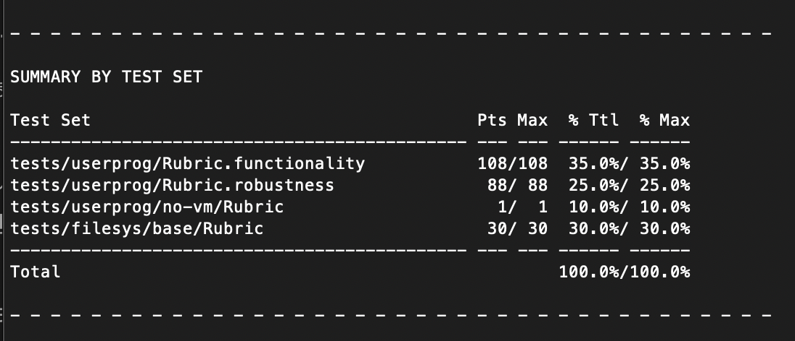

# Project 2 - Final Report (Team 28)
프로젝트 2는 프로세스 종료 메세지 출력, 인자 전달, 시스템 호출 구현, 실행 파일에
대한 쓰기 금지의 네 가지 Task를 완료하여야 한다. 이를 위해 본 팀에서는 먼저 
기존의 Pintos 코드를 사용자 프로세스 관점에서 재작성하였으며, 이를 토대로 시스템
호출을 구현하였다. 따라서, 본 보고서에서는 먼저 사용자 프로세스를 나타내기 위한
자료구조와 사용자 프로세스에 대한 인터페이스 함수들의 구현에 대해서 먼저 다루고,
이를 토대로 구현된 시스템 호출 함수들에 대해 다룬다.

## Process Data Structures and Implementations

### Improvements
프로세스는 독립된 주소 공간과 실행 흐름을 가지는, 프로그램 실행의 한 단위이다.
또한, 프로그램이 디스크 내의 코드의 나열으로 나타내어지는 정적인 대상이라면,
프로세스는 이 프로그램이 실체화되어 메모리에 적재된 동적인 대상이라고 볼 수도
있다. 따라서, 프로세스를 구현하기 위해서는 디스크에 ELF(Executable and Linkable
File format) 파일로 존재하는 프로그램을 메모리에 적재하는 과정과, 각 
프로세스마다 독립된 주소 공간을 제공하는 과정이 구현되어야 한다.

Pintos의 기존 구현은 둘 모두를 어느 정도 구현하지만, 프로세스를 실행하는데 
필수적인 함수들, `process_execute()`, `process_wait()`, `process_exit()` 등이
미완성된 상태로 아직 제대로 동작하지 않는 상태이다. 따라서, 이번 프로젝트에서는
이러한 사용자 프로세스에 대한 커널 계층에서의 인터페이스 함수들을 구현해야 한다.

이러한 인터페이스 함수들을 구현하는 데 있어 한 가지 난점은, Pintos의 기존 구현은
사용자 프로세스와 커널 스레드를 구분하지 않는다는 점이다. `thread.h`에 정의된
기존의 `struct thread`의 코드를 살펴보면 다음과 같다.
 
```C
/* From former version of threads/thread.h. */
struct thread
  {
    ...

#ifdef USERPROG
    /* Owned by userprog/process.c. */
    uint32_t *pagedir;                  /* Page directory. */
#endif

    ...
  };
```

`pagedir`은 메모리 상의 페이지 디렉터리, 혹은 최상위 계층의 페이지 테이블을 
가리키는 포인터이다. Pintos의 기존 구현에서는, `pagedir`이 `struct thread`의
멤버로 구현되어 있다. 다시 말해, Pintos의 기존 구현은 모든 스레드가 각각의 주소 
공간을 가지고 있으며 프로세스와 분리되지 않는다. 이는 이후 `process_wait()`와
`process_exit()` 등의 함수를 구현할 때 한 가지 난점을 불러일으키며, 개념적으로도
커널 스레드와 그와 연관된 사용자 프로세스는 분리되어 존재하는 것이 맞기 때문에
사용자 프로세스를 나타내는 `struct process`를 새롭게 정의하기로 결정하였다. 
`struct process`는 일반적으로 PCB(Process Control Block)으로 불리는 자료구조로,
자세한 설명은 다음 단락에서 다룰 것이다.

### Details and Rationales

#### `struct process`
```C
/* From userprog/process.h. */
/* An user process. */
struct process
  {
    /* Owned by process.c. */
    pid_t pid;                    /* Process identifier. */
    int status;                   /* Exit status. */
    bool success;                 /* Has execution of its child succeeded? */
    bool waited;                  /* Is its parent waiting on this? */
    char name[16];                /* Name. */
    enum process_state state;     /* Process state. */
    uint32_t *pagedir;            /* Page directory. */
    struct semaphore sema;        /* Semaphore to order parent and child. */
    struct thread *thread;        /* Thread of this process.*/
    struct thread *parent;        /* Parent thread. */
    struct list children;         /* List of child processes. */
    struct list_elem elem;        /* List element. */

    /* Shared between syscall.c and process.c.*/
    struct list opened;           /* List of opened files. */
  };
```
상술한 바와 같이 `struct process`는 사용자 프로세스를 나타내기 위해 
`struct thread`에서 분리된 자료구조이다. 이러한 자료구조는 첫째로, 프로세스는 
개념적으로 스레드와 다른 객체이기 때문에 필요하며, 둘째로, Pintos는 프로세스 
하나 당 스레드 하나만을 허용하는 싱글 스레드 운영체제지만 이와 같이 구현한다면 
이후 멀티 스레드 운영체제로의 확장에도 유리할 것이다. 마지막으로,
`process_exit()`과 `process_wait()`를 구현할 때, `struct thread`에 프로세스의 
종료 상태 등이 전부 같이 저장되면 `thread_exit()` 호출 시, 부모 프로세스에
전달되어야 하는 종료 상태가 전부 날아가 버린다는 구현상 난점 때문에 필요하다.

이 문제에 대해 더 자세히 살펴보자. `process_exit()`는 현재 프로세스를 종료하는
함수로, 프로세스 종료와 함께 종료 상태(exit status)를 부모 스레드에게 넘겨주어야
한다. 한 가지 생각해봄직한 구현은 `struct thread`에 종료 상태를 저장해두고, 
부모 스레드가 자식 스레드에 대한 포인터를 이용해 해당 종료 상태를 역참조할
수 있도록 하는 구현이다. 하지만, 해당 구현은 그렇다면 해당 스레드를 할당 해제할
책임은 누가 져야 할 지 애매해지고, (현재의 구현은 스케줄링 과정에서 이를 
책임지도록 하고 있다.) 종료 상태만을 저장하기 위해 4KiB 크기의 스레드를 커널에서
유지하여야 한다는 단점 때문에 반려되었다.

다음으로 가능한 구현은, 자식 프로세스의 `struct thread`에 자기 자신의 종료 
상태를 저장하는 것이 아니라, 부모 프로세스의 `struct thread`에 자식 프로세스의
종료 상태를 저장하는 구현이 있다. 이 구현의 문제점은 자식 프로세스가 종료하고 난
후, 부모 프로세스가 자식 프로세스의 종료 상태를 확인하는 과정이 
원자적(atomic)이지 않다는 점이다. 다시 말해, 자식 프로세스 A가 종료된 후, 부모
프로세스가 A의 종료 코드를 확인하기 전에 자식 프로세스 B가 종료되어 부모 
프로세스의 `struct thread`에 저장된 종료 코드를 수정한다면, `process_wait()`는
의도와는 다른 동작을 보일 것이다. 각 스레드마다 부모 프로세스가 해당 프로세스를
대기 중인지를 나타내는 플래그를 저장하는 방법도 결국 플래그 자체를 수정하는
과정이 원자적이지 않아서 결국 인터럽트 비활성화와 같은 동기화 
방법(synchronization method)을 동원해야 한다. 

결국 가장 간단하면서 효과적인 방법은, 프로세스 자체를 나타내는 자료구조를 새로
만들어 `process_exit()`과 `process_wait()` 등이 이에 맞추어 동작하도록 구현하는
방법이다.

`struct process`의 멤버를 하나씩 살펴보자. `pid`는 프로세스마다 부여된 고유한
식별자, `name`은 프로세스의 이름으로 현재는 `make_process()`에 구현된 초기화 
과정에 따르면 `tid`와 연관된 커널 스레드의 이름과 같은 값을 가지도록 구현되어 
있다. Pintos는 하나의 프로세스에 하나의 스레드만이 존재할 수 있으므로, 이러한 
구현도 크게 문제가 없다고 판단하였다.

`status`는 종료 상태를 저장한다. `struct process`는 종료 후에도 메모리에 
유지되어 종료 상태를 저장하고 있다가, 부모 프로세스가 이를 확인하고 난 후에
할당 해제된다.

`waited`는 부모 프로세스가 현재 해당 프로세스를 기다리고 있는지를 나타내는 
플래그이다. 위에서 이러한 플래그는 플래그 자체를 수정하는 과정이 원자적이지 않아
쓸모 없다고 서술했지만, 사실 이는 종료 코드를 부모 프로세스에 전달해야할지 
결정할 때의 이야기이고, 이미 기다리고 있는 프로세스를 다시 기다리는 경우를
검사하거나, 부모 프로세스를 깨워야 할 지 결정할 때는 이러한 플래그가 아직 
필요하다. 따라서 `struct process`는 부모 프로세스가 해당 프로세스를 기다리고
있는지를 나타내는 플래그를 멤버로 가지고 있고, `process_wait()` 호출 시 자식 
프로세스의 `waited`를 수정하도록 구현되어 있다.

`state`는 프로세스의 실행 상태를 나타내는 멤버이다. 현재 구현에서 프로세스는
`process_exit()`를 통해 종료되더라도, 부모 프로세스가 아직 존재하는 경우 바로 
연관된 `struct process`가 소멸(destory)되지 않고, 부모 프로세스가 자식 
프로세스를 소멸시킬 책임을 지도록 되어 있다. 이때, 부모 프로세스가 모든 자식
프로세스를 소멸시키면 안되고, 반드시 `process_exit()`을 통해 종료된 프로세스만을
소멸시켜야 한다. 따라서, 이러한 프로세스의 실행 정보를 나타내는 멤버가
`struct process`에 존재해야 한다.

`pagedir`는 메모리에 존재하는 프로세스의 페이지 디렉터리를 가리키는 포인터이다.
프로세스는 독립된 주소 공간을 가지므로, 페이지 디렉터리도 각각 따로 존재해야 
한다. 기존의 Pintos 구현은 `struct thread`에 해당 멤버가 존재하였지만, 커널
스레드는 독립된 주소 공간을 가질 필요가 없기 때문에 이는 비효율적인 구현이다.
따라서, 새로운 구현은 사용자 프로세스에만 독립된 주소 공간을 할당하고, 연관된
사용자 프로세스가 존재하지 않는 커널 스레드에 대해서는 `PHYS_BASE` 위의 주소가
물리적 주소 공간에 바로 대응되는 `init_page_dir`이 활성화되도록 구현되어 있다.

`sema`는 `process_exec()`, `process_exit()`, `process_wait()` 과정에서의 올바른
실행 순서를 보장하기 위한 세마포어이다. `thread`는 연관된 커널 스레드를 가리키는
포인터이며, `children`은 자식 프로세스의 리스트, `elem`은 자식 프로세스의
리스트에 저장하기 위한 리스트 원소이다. 

`parent`는 부모 스레드 혹은 부모 프로세스를 가리키는 포인터인데, 이때 어떤 
프로세스를 생성하는 주체는 연관된 사용자 프로세스가 존재하지 않는 커널 스레드일
수도 있으므로 `struct thread *` 형으로 선언되어 있다.

`opened`는 현재 프로세스에 의해 열려있는 파일의 리스트이다. `process_exit()`
에서 `opened`에 등록된 파일들은 자동으로 `file_close()` 함수 호출으로
닫히게 된다. 프로세스의 실행 파일 또한 `opened`에 등록되어 프로세스 종료와 함께
같이 닫히게 된다.

#### `process_init()`
```C
/* From userprog/process.c. */
/* Initialize top level process. This should be called after thread_init(). */
void
process_init (void)
{
  make_process (NULL, thread_current ());
}
```
Pintos의 초기화 과정 중 호출되어 최상위 스레드에 연관된 최상위 프로세스를 
초기화하는 함수이다. 현재 열린 파일 리스트는 프로세스에서 관리되기 때문에, 
Pintos의 초기 실행 과정에서 최상위 스레드에 연관된 프로세스가 존재하지 않으면
파일을 열 수 없어진다. 따라서, 파일을 여는 작업을 하기 전에 해당 함수가 
호출되어야 한다.

```C
/* From userprog/process.c. */
/* Starts a new thread running a user program loaded from
   CMD_LINE.  The new thread may be scheduled (and may even exit)
   before process_execute() returns.  Returns the new process's
   process id, or PID_ERROR if the thread cannot be created. 
   This must be executed in user process's context. */
pid_t
process_execute (const char *cmd_line) 
{
  ...
  struct process *this = thread_current ()->process;
  struct process_exec_frame frame;
  bool success = false;
  ...

  ASSERT (this != NULL);

  ...

  /* Tokenize the copy of CMD_LINE, 
     and stores each address of tokenized string in ARGV. */
  argv = palloc_get_page (PAL_ZERO);
  if (argv == NULL)
    return PID_ERROR;
  for (token = strtok_r (cmd_line_copy, " ", &pos); token != NULL;
       token = strtok_r (NULL, " ", &pos))
    argv[i++] = token;

  /* Create a new thread to be executed with ARGV. */
  frame.argv = argv;
  frame.parent = this;
  frame.success = &success;

  tid = thread_create (argv[0], PRI_DEFAULT, start_process, &frame);

  ...

  sema_down (&this->sema);
  if (!success)
    return PID_ERROR;

  return (pid_t) tid;
}
```
명령행 `cmd_line`을 받아 해당하는 프로그램을 프로세스의 형태로 실행하는 
함수로, `exec()` 시스템 호출을 실제로 구현하는 함수이다. 기존의 구현과 달라진
점은 먼저 인수 벡터(argument vector)를 스페이스 단위로 파싱하여 해당 주소를
`argv`에 추가하는 과정이 추가되었다. 이렇게 파싱된 인수 벡터는 자식 프로세스에서
실행되는 `start_process`에서 인수를 자식 프로세스에 전달하는데 사용된다.
또한, 자식 프로세스에 연관된 커널 스레드를 생성하는 `thread_create()`에 전달되는
인자가 달라진 모습을 볼 수 있는데, 일단 스레드의 이름이 명령행 전체에서 실행
파일의 이름만을 파싱한 결과인 `argv[0]`로 초기화되도록 바뀌었으며, 
`start_process`의 인수로 단순히 파일 이름을 복사한 `fn_copy`가 아닌 `frame`이
전달되는 것을 볼 수 있다.

이때, 파싱된 명령행의 복사본과 인수 벡터를 저장하는 페이지의 할당 해제 책임은
자식 프로세스에서 진다. 자세한 내용은 `start_process()`에서 서술한다.

```C
/* From userprog/process.c. */
/* Frame needed to execute a process from command line. */
struct process_exec_frame
  {
    char **argv;
    struct process *parent;
    bool *success;
  };
```
`frame`은 `struct process_exec_frame` 형의 변수로, `struct process_exec_frame`은
새로운 프로세스를 실행하기 위한 정보를 전달하는 구조체이다. Pintos의 스레드 실행
루틴은 스레드 실행 시 전달되는 인수의 개수가 1개로 제한되어 있어, 여러 인자를
전달하기 위해서는 따로 구조체를 만들고 해당 구조체에 대한 포인터를 전달하여야
한다.

`argv`는 위에서 파싱한 인수 벡터이다. `parent`는 `process_exec()`을 실행한
프로세스의 주소인데, 자식 프로세스에서는 이를 혼자서 알아낼 방법이 없기 때문에
해당 주소는 부모 프로세스가 자식 프로세스에 전달해 주어야 한다. 마지막으로
`success`는 자식 프로세스의 실행이 성공 혹은 실패했는지를 나타내는 변수로,
자식 프로세스의 스레드가 부모 프로세스에게 프로세스 실행 성공 여부를 전달할 
방법이 필요하기 때문에 추가되었다.

마지막으로, 부모 프로세스의 세마포어를 내려 자식 프로세스의 실행 성공 여부를
알기 전까지 부모 프로세스를 멈춘다. 만약 자식 프로세스의 실행이 실패했을 경우
`PID_ERROR`를 반환하며, 아닌 경우 자식 프로세스의 프로세스 
식별자(process identifier; PID)를 반환한다.

#### `start_process()`

```C
/* From userprog/process.c. */
/* A thread function that loads a user process and starts it
   running. */
static void
start_process (void *frame_)
{
  char **argv = frame->argv;
  struct process *par = frame->parent;
  void *esp, *cmd_line = pg_round_down (argv[0]);
  struct intr_frame if_;
  ...

  /* Load executable and make process. */
  cur->process = make_process (par, cur);
  load_success = load (argv[0], &if_.eip, &if_.esp);
  *success = load_success && (cur->process != NULL);
  sema_up (&par->sema);

  /* If load or process making failed, quit. */
  if (!(*success))
    {
      palloc_free_page (argv);
      palloc_free_page (cmd_line);
      cur->process = NULL;
      destroy_process (cur->process);
      thread_exit ();
    }

  /* Get ARGC. */
  for (argc = 0; argv[argc] != NULL; argc++);

  /* Push arguments in ARGV in reverse order, calculate padding, and
     store pushed arguments's address on ARGV since original address
     is no longer needed. */
  padding = 0;
  esp = if_.esp;
  for (i = argc - 1; i >= 0; i--)
    {
      len = strlen (argv[i]) + 1;
      esp = push (esp, argv[i], len);
      argv[i] = esp;
      padding = WORD_SIZE - (len + padding) % WORD_SIZE;
    }
  
  /* Push padding and null pointer indicating the end of argument vector. */
  esp = push (esp, NULL, padding);
  esp = push (esp, NULL, sizeof (char *));

  /* Push argument vector. */
  for (i = argc - 1; i >= 0; i--)
    esp = push (esp, &argv[i], sizeof (char *));
  esp = push (esp, &esp, sizeof (char **));

  /* Push ARGC and dummy return address. */
  esp = push (esp, &argc, sizeof (int));
  esp = push (esp, NULL, sizeof (void (*) (void)));
  if_.esp = esp;

  palloc_free_page (argv);
  palloc_free_page (cmd_line);
  ...
}
```
새로 만들어진 커널 스레드에서 처음 실행되어 사용자 프로세스를 시작하는 함수이다.
먼저 `make_process()`와 `load()`를 호출하여 `struct process`를 생성하고, 실행
파일을 메모리에 적재하고, 부모 프로세스의 두 함수의 호출 결과에 따른 성공 여부를
전달한다. 부모 프로세스는 이 성공 여부를 알기 전까지 `sema_down()`으로 멈춰있는
상태이므로, `sema_up()`으로 부모 프로세스의 실행을 재개시킨다.

이후에는 부모 프로세스에서 전달된 인자 벡터와 인자 개수(argument count; ARGC)
등의 정보를 자식 스레드의 스택에 넣어준다. 해당 과정은 보조 함수 `push()`를 
이용해 Pintos 문서의 순서에 따라 인자를 스택에 넣어주는 방식으로 구현되었다.

```C
/* From userprog/process.c. */
/* Pushes SIZE bytes of data from SRC at the top of the stack specified
   with TOP. TOP must be a pointer to somewhere in user virtual address 
   space. Or PHYS_BASE if the stack is empty. Returns an address that refers 
   to new top of the stack. If SRC is a null pointer, then pushes SIZE bytes 
   of zeros on the stack. */
static void *
push (void *top, void *src, int size)
{
  ASSERT (is_user_vaddr (top) || top == PHYS_BASE);

  char *new = (char *) top - size;

  if (src == NULL)
    memset (new, 0, size);
  else
    memcpy ((void *) new, src, size);

  return (void *) new;
}
```
`push()`는 인자 `top`이 가리키는 스택의 꼭대기에 `src`가 가리키는 데이터를
`size`만큼 넣어준 후, 새로운 스택의 꼭대기를 가리키는 포인터를 반환하는 
함수이다. 사용자 프로세스의 스택은 `PHYS_BASE`부터 시작하므로, 전달된 스택의
꼭대기는 반드시 `PHYS_BASE` 이하여야 한다. 만약 `src`가 널 포인터라면, 해당
포인터가 가리키는 데이터 대신 0을 `size` 바이트만큼 스택에 넣는다.

인자 전달 과정이 끝난 후에는 자식 스레드가 사용 후 할당 해제 책임을 지는 인자
벡터(`argv`)와 명령행의 복사본(`cmd_line`)을 할당 해제한다. 이때 명령행의
복사본을 가리키는 포인터를 따로 부모 프로세스에서 전달받지 않고, 어차피 인자 
벡터의 원소들은 명령행의 복사본이 저장된 페이지 중 어딘가를 가리키고 있을 
것이므로 `pg_round_down()`을 호출해 해당 페이지의 첫 번째 주소를 얻는 식으로
구현하였다.

#### `process_wait()`
```C
/* Waits for process CHILD_PID to die and returns its exit status.  
   If it was terminated by the kernel (i.e. killed due to an
   exception), returns -1.  If CHILD_PID is invalid or if it was not a
   child of the calling process, or if process_wait() has already
   been successfully called for the given PID, returns -1
   immediately, without waiting. It must be called in user process
   context. */
int
process_wait (pid_t child_pid) 
{
  int status;
  struct process *child = NULL, *this = thread_current ()->process;
  struct list_elem *e;

  ASSERT (this != NULL);

  /* Find child to wait. */
  for (e = list_begin (&this->children); e != list_end (&this->children);
       e = list_next (e))
    {
      child = list_entry (e, struct process, elem);
      if (child->pid == child_pid)
        break;
    }

  /* If there's no such child or the child is already waited, return -1. */
  if (child == NULL || child->pid != child_pid || child->waited)
    return -1;

  /* If the child to wait is still alive, wait for it to exit. */
  child->waited = true;
  if (child->state == PROCESS_ALIVE)
    sema_down (&this->sema);

  /* The child has exited. Get its exit status and clean it up. */
  status = child->status;
  list_remove (&child->elem);
  destroy_process (child);
  return status;
}
```
현재 프로세스의 실행을 `child_pid`가 가리키는 자식 프로세스의 실행이 종료될 
때까지 중지시키는 함수이다. 이를 위해, `process_wait()`에서는 먼저 현재 
프로세스의 자식 프로세스 목록 중에서 `child_pid`의 PID를 가진 프로세스를 찾는다.
만약 해당하는 프로세스를 찾지 못했거나 해당 자식 프로세스를 이미 기다리고 있는
경우 `-1`을 반환한다. 만약 해당하는 자식 프로세스를 찾는 데 성공한 경우, 
해당 자식 프로세스가 종료되지 않은 경우, 즉 자식 프로세스의 `state`가 
`PROCESS_ALIVE`인 경우 해당 자식 프로세스가 종료될 때까지 기다린다.

이후 자식 프로세스의 종료 상태를 받아오고, 해당 자식 프로세스를 소멸시키며,
종료 상태를 반환하며 함수 실행은 끝난다.

#### `make_process()`
```C
/* From userprog/process.c. */
/* Make process whose parent is PAR and whose associated kernel thread is T. 
   Also, does basic initializations on it. Returns null pointer if memory
   allocation has failed or page directory creation has failed. */
static struct process *
make_process (struct process *par, struct thread *t)
{
  struct process *this = (struct process *) malloc (sizeof (struct process));

  ASSERT (t != NULL);

  if (this == NULL)
    return NULL;
  
  this->pid = t->tid;
  this->state = PROCESS_ALIVE;
  strlcpy (this->name, t->name, sizeof this->name);
  sema_init (&this->sema, 0);
  this->thread = t;
  this->waited = false;
  list_init (&this->children);
  list_init (&this->opened);
  t->process = this;

  if (par != NULL)
    {
      list_push_back (&par->children, &this->elem);
      this->parent = par->thread;
    }

  if ((this->pagedir = pagedir_create ()) == NULL)
    {
      free (this);
      return NULL;
    }

  return this;
}
```
`struct process`의 생성자이다. `struct process`의 멤버들을 초기화하고, 부모 
프로세스 (혹은 스레드)를 등록한다. 만약 부모 스레드에 연관된 사용자 프로세스가
있는 경우 부모 프로세스의 자식 리스트에 새로 생성되는 프로세스를 등록한다. 만약
`malloc()` 혹은 `pagedir_create()` 함수 호출이 실패하는 경우 널 포인터를 
반환한다.

#### `destroy_process()`
```C
/* From userprog/process.c. */
/* Free the resources of P. It neither exits its associated kernel thread,
   nor modifies its parent or children. It only frees memorys taken to 
   represent process structure. If P is a null pointer, does nothing. */
static void
destroy_process (struct process *p)
{
  struct process *this = thread_current ()->process;

  if (p == NULL)
    return;

  uint32_t *pd = p->pagedir;

  /* Destroy the current process's page directory and switch back
     to the kernel-only page directory when the destroyed process is current
     process. */
  if (pd != NULL) 
    {
      /* Correct ordering here is crucial.  We must set
         p->pagedir to NULL before switching page directories,
         so that a timer interrupt can't switch back to the
         process page directory. We must activate the base page
         directory before destroying own process's page
         directory, or our active page directory will be one
         that's been freed (and cleared). */
      p->pagedir = NULL;
      if (this == p)
        pagedir_activate (NULL);
      pagedir_destroy (pd);
    }

  free (p);
}
```
`struct process`의 소멸자이다. 이때 프로세스를 소멸시키는 주체는 자기 자신이 
아닌 다른 프로세스일 수도 있으므로 인자 `p`를 받는다. 또한, 기존의 
`process_exit()` 구현에서는 해당 프로세스의 페이지 디렉터리를 할당 해제하기 전에
커널 초기 페이지 디렉터리로 바꾸어주는 방식으로 동작하였는데, 현재 구현은 
프로세스를 소멸시키는 주체가 자기 자신이 아닐 수도 있으므로 프로세스를 
소멸시키는 주체가 자기 자신인지를 먼저 확인한다. 이후 `p`에 할당된 
`struct process`를 할당 해제한다.

주의해야 할 점은 이 함수는 프로세스의 부모-자식 관계를 끊거나 프로세스와 연관된
스레드와 현재 프로세스와의 관계를 끊지 않는다는 점이다. 즉, 이 함수는 프로세스에
의해 점유되었던 메모리를 할당 해제하는 작업만을 하므로, 만약 프로세스를 완전히
종료하고 싶다면 이 함수가 아닌 `process_exit()`를 대신 호출해야 한다.

```C
/* From userprog/process.c. */ 
/* Sets up the CPU for running user code in the current thread.
   This function is called on every context switch. */
void
process_activate (void)
{
  struct process *this = thread_current ()->process;

  /* Activate thread's page tables. If it is kernel which does not have
     associated user process, activate initial one that has only kernel 
     mapping.*/
  if (this == NULL)
    pagedir_activate (NULL);
  else
    pagedir_activate (this->pagedir);

  /* Set thread's kernel stack for use in processing
     interrupts. */
  tss_update ();
}
```
맥락 전환(context switch) 과정에서 호출되는, 현재 프로세스의 페이지 디렉터리를
활성화하는 함수이다. 기존에는 새롭게 전환된 스레드의 `pagedir`을 활성화하는
식으로 동작하였는데, 새로운 구현에서는 `sturct thread`에 `pagedir` 멤버가 
존재하지 않고 대신 `process` 멤버가 널 포인터인지로 커널 스레드인지, 사용자 
프로세스인지를 구볆하므로 이에 맞추어 구현을 변경하였다.

```C
/* From userprog/process.c. */
/* Exits current process with exit code of STATUS. This must be executed in
   user process's context. */
void 
process_exit (int status)
{
  struct file *fp;
  struct list_elem *e, *next;
  struct thread *cur = thread_current ();
  struct process *child, *this = cur->process;

  ASSERT (this != NULL);

  struct thread *par;
  par = this->parent;
  this->state = PROCESS_DEAD;

  ASSERT (!(this->waited && par == NULL));
  ASSERT (!(this->waited && par->process == NULL));

  this->status = status;

  /* This is to maintain consistency of process structures. Interrupt will be 
     enabled after thread_exit() call which causes context switch. */
  intr_disable ();

  /* Exiting process's children are orphaned. Destroys dead children that 
     their parents are responsible for destroying. */
  for (e = list_begin (&this->children); e != list_end (&this->children); )
    {
      child = list_entry (e, struct process, elem);
      next = list_remove (e);
      child->parent = NULL;

      if (child->status == PROCESS_DEAD)
        destroy_process (child);

      e = next;
    }
  
  /* Close opened files. */
  for (e = list_begin (&this->opened); e != list_end (&this->opened); )
    {
      next = list_remove (e);
      fp = list_entry (e, struct file, elem);
      file_close (fp);
      e = next;
    }

  printf ("%s: exit(%d)\n", this->name, status);

  /* For processes who are orphaned, they are responsible to destory themselves.
     For those who are not orphaned, their parents are responsible to destroy 
     children. */
  if (this->waited)
    sema_up (&par->process->sema);
  else if (par == NULL || par->process == NULL)
    destroy_process (this);

  cur->process = NULL;
  thread_exit ();
}
```
현재 프로세스를 종료 상태 `status`와 함께 종료시키는 함수이다. 먼저 함수 실행
맨 처음에 확인되는 제약 조건(invariant)에 따르면, `process_exit()`는 반드시
사용자 프로세스 맥락 내에서 실행되어야 한다. 또한, 부모 프로세스가 만약 해당
프로세스를 기다리고 있다면, 즉 `this->waited`가 참이라면, 부모 프로세스가
존재해야 함을 이후 `ASSERT` 문에서 확인하고 있다. 두 조건 모두 중요한데, 두 조건
모두 상식적으로 생각해 보았을 때 당연하며, 이러한 조건 없이는 이후 `this`나
`par`, `par->process`의 멤버를 참조할 수 없기 때문이다.

이러한 조건을 확인한 후 `process_exit()`에서는 먼저 인터럽트를 비활성화하는데,
이후 실행되는 코드들은 다른 프로세스의 속성을 변경하기 때문에 `struct process`의 
일관성을 보장하기 위해서는 이후 실행되는 코드들이 원자적으로 실행될 필요가 있기
때문이다.

이러한 준비 과정이 끝난 이후 이 함수에서는 자식 프로세스들의 `parent` 멤버를 
널 포인터로 설정함으로써 자식 프로세스들을 고아(orphaned) 프로세스로 만든다. 
이는 자식 프로세스들이 종료할 때 자신이 고아 프로세스인지를 확인하여 자기 자신에
대한 할당 해제 책임을 지도록 한다. 또한, 만약 이미 종료된 자식 프로세스들에 
대해서는 부모 프로세스가 소멸 책임을 지므로 이들을 소멸시킨다.

이후에는 해당 프로세스에서 열었던 파일을 닫는데, 이 과정 중에서 프로세스의 실행
파일 또한 닫게 된다. 따라서, 이후에는 해당 실행 파일을 다시 쓸 수 있게 된다.
프로세스의 실행 파일이 어떻게 열리는지에 대해서는 `load()` 함수를 설명하며
같이 설명한다.

Pintos 문서에 명시된 조건에 따라 프로세스 종료 메세지를 출력한 후엔, 만약 현재
프로세스를 부모 프로세스가 기다리고 있는 경우 부모 프로세스의 실행을 재개한다.
이때 위에서 확인했던 제약 조건이 중요한 역할을 한다. 또, 부모 프로세스가 이미
종료된 경우 자기 자신이 할당 해제 책임을 지므로 `destory_process()`를 호출해
자기 자신의 `struct process`를 할당 해제한다.

이후 현재 스레드에 연관된 프로세스가 없음을 나타내기 위해 `cur->process`를 널
포인터로 설정하고 `thread_exit()` 함수를 호출하여 연관된 커널 스레드의 실행
또한 종료한다.

#### `load()`
```C
/* From userprog/process.c. */
/* Loads an ELF executable from FILE_NAME into the current thread.
   Stores the executable's entry point into *EIP
   and its initial stack pointer into *ESP.
   Returns true if successful, false otherwise. */
bool
load (const char *file_name, void (**eip) (void), void **esp) 
{
  ...
  if (thread_current ()->process == NULL)
    goto done;

  /* Activate page directory. */
  process_activate ();

  /* Open executable file. */
  lock_acquire (&filesys_lock);
  file = filesys_open (file_name);
  lock_release (&filesys_lock);
  ...
  file_deny_write (file);
  ...
}
```
사용자 프로세스의 실행 파일을 메모리에 적재하는 함수이다. 기존에는 페이지 
디렉터리 또한 이 함수에서 생성되도록 구현되어 있었지만, 현재 구현은 
`make_process()`에서 페이지 디렉터리를 생성하므로 해당하는 코드가 제외되었으며,
Pintos 문서에 따르면 모든 파일 시스템 접근 코드가 임계 구역이 되어야 하므로 
해당하는 lock을 획득하도록 변경하였다. 만약 현재 스레드에 연관된 프로세스가 
존재하지 않는다면 적재에 실패하도록 구현하였다.

이때 `filesys_open()`을 통해 실행 파일을 여는데, 이 과정에서 실행 파일의
inode에 대해 `file_open()`이 호출되며, `file_open()`은 파일을 현재 프로세스의
`opened` 리스트에 등록한다. 이후 `file_deny_write()` 호출으로 해당 파일에 대한
쓰기를 금지시킨다. 이 실행 파일은 상술한 바와 같이 `process_exit()` 과정 중
닫히며 다시 쓰기가 허용된다.

#### `struct file`
```C
/* From filesys/file.h. */
/* An open file. */
struct file 
  {
    struct inode *inode;        /* File's inode. */
    off_t pos;                  /* Current position. */
    bool deny_write;            /* Has file_deny_write() been called? */
    int fd;                     /* File descriptor. */
    struct list_elem elem;     /* List element for opened file list. */
  };
```
파일 인터페이스에 관련된 시스템 호출을 구현하기 위해서는 `struct file`이 외부에
공개되어야 하므로 해당 구조체를 헤더 파일로 옮겼다. 또한, 파일의 설명자(file
descriptor)와 파일을 프로세스의 `opened` 리스트에 저장하기 위한 `list_elem`을
추가하였다.

#### `file_open()`
```C
/* From filesys/file.c. */
/* Opens a file for the given INODE, of which it takes ownership,
   and returns the new file.  Returns a null pointer if an
   allocation fails or if INODE is null. */
struct file *
file_open (struct inode *inode) 
{
  struct process *this = thread_current ()->process;
  struct file *file = calloc (1, sizeof *file);

  ASSERT (this != NULL);

  if (inode != NULL && file != NULL)
    {
      file->inode = inode;
      file->pos = 0;
      file->deny_write = false;
      file->fd = allocate_fd ();
      list_push_back (&this->opened, &file->elem);
      return file;
    }
  else
    {
      inode_close (inode);
      free (file);
      return NULL; 
    }
}
```
`inode`로 전달된 파일을 여는 함수이다. 기존에 구현에 더해 파일에 파일 설명자를
할당하는 과정과 현재 프로세스의 열린 파일 리스트에 해당 파일을 등록하는 과정이
추가되었다. 

```C
/* From filesys/file.c. */
/* Returns fresh file descriptor to represent a newly opened file. */
static int
allocate_fd (void)
{
  /* File descriptor of 0 and 1 are reserved for stdin and stdout. */
  static int next_fd = 2;
  int fd;

  lock_acquire (&fd_lock);
  fd = next_fd++;
  lock_release (&fd_lock);

  return fd;
}
```
`allocate_fd()`는 새로운 파일 설명자를 할당하여 반환하는 함수이다. 정적 변수
`next_fd`의 값을 반환하고 1 증가시킨다. 이때 `next_fd`는 2로 초기화되는데, 
파일 설명자 0과 1은 표준 입출력에 할당되어있기 때문이다.

#### `thread_exit()`
```C
/* From threads/thread.c. */
/* Deschedules the current thread and destroys it.  Never
   returns to the caller. It does not destory its associated process, hence
   it might be dangling. Therefore, it should not be called when there's an
   associated user process of current thread. Use process_exit() instead. */
void
thread_exit (void) 
{
  struct thread *cur = thread_current ();

  ASSERT (!intr_context ());
  ASSERT (cur->process == NULL);

  intr_disable ();

  /* Remove thread from all threads list, set our status to dying,
     and schedule another process.  That process will destroy us
     when it calls thread_schedule_tail(). */
  list_remove (&cur->allelem);
  thread_current ()->status = THREAD_DYING;
  schedule ();
  NOT_REACHED ();
}
```
기존의 `thread_exit()`는 스레드를 종료시키며 연관된 프로세스의 페이지 
디렉터리 또한 할당 해제하도록 구현되어 있었다. 새로운 구현에서는 프로세스의 
페이지 디렉터리 할당 해제 책임이 `destroy_process()`에 존재하므로 이에 맞추어
`thread_exit()`의 구현도 변경되었다. 이에 더해 스레드 종료 시 반드시 연관된
사용자 프로세스가 먼저 종료되어야 하도록 구현하였다.

### Discussions

#### How to retreieve actual pointer from descriptors or handles?
Pintos 문서에 따르면 `open()` 시스템 호출은 파일 설명자라 불리는 정수 핸들을 
반환해야 하며, `exec()` 시스템 호출은 프로세스 식별자를 반환해야 한다. 또한,
현재 열려있는 파일에 대한 시스템 호출은 모두 파일 설명자를 인수로 전달해 
해당하는 동작을 하도록 선언되어 있다.

이러한 핸들은 그냥 하나의 정수이기 때문에, 이를 어떻게 실제 커널 자료구조에 대한
포인터로 변환할지에 대한 문제가 발생한다. 이에 대해 크게 세 가지 접근 방법이 
존재한다.

첫 번째 접근 방법은 핸들 자체에 커널 자료구조에 대한 포인터를 인코딩하는
방식이다. 더 자세히 설명하자면, 그냥 `struct file *` 혹은 `struct process *`를
`int` 혹은 `pit_t`로 형 변환(casting)하여 반환하는 방식이 가능할 것이다. Pintos
공식 문서의 Q&A 단락에서도 이에 대해 설명하고 있다. 이 방식은 구현이 쉽고 
간편하며 빠르지만 (핸들로부터 포인터를 가져오는 데 O(1)의 시간이 걸린다), 
사용자가 핸들을 형 변환 하는 것만으로도 커널 자료구조의 주소를 알아낼 수 있다는 
취약점 때문에 반려되었다.

두 번째 접근 방법은 핸들을 포인터로 변환하는 일종의 표(table) 혹은 배열을 
메모리 상에 저장하는 방식이다. 프로세스 테이블이라 불리는 이 자료구조는 실제로 
많은 커널에서 사용하는 방식이지만, 가능한 모든 `fd` 혹은 `pid`의 값에 대한 표를 
커널에 유지해야 한다는 단점이 있다. 프로세스의 개수가 많다면 변환의 시간 
복잡도가 월등히 낮은 해당 방식이 효율적이지만, 프로세스의 개수가 적다면 쓸데없이
큰 표를 유지해야 한다는 단점이 커서 해당 접근 또한 반려되었다. 

마지막 접근 방법은 각각의 프로세스에 열려 있는 상태의 파일, 혹은 자녀 프로세스의 
리스트를 저장하고 핸들을 포인터로 변환해야 할 때마다 해당 리스트를 순회하는
방식이다. 이 방식은 매 순회마다 열려 있는 파일, 혹은 자녀 프로세스의 개수에 
비례하는 시간이 걸리지만, 동적으로 크기가 늘어나며 필요한 공간만을 차지한다는
장점 때문에 현재 구현에 채택되었다.

좀 더 자세히 서술하자면, `struct process`는 해당 프로세스에 의해 열린 파일의
리스트인 `opened`와 자녀 프로세스의 리스트인 `children`를 멤버로 가지고 있다. 
만약 사용자가 시스템 호출에 파일 설명자나 프로세스 식별자를 인수로 넘기면,
`opened`에서 해당 파일 설명자를 가진 파일을 찾거나 `children`에서 해당 프로세스
식별자를 가진 프로세스를 찾는다.

Pintos와 같은 작은 운영체제나 메모리의 크기가 한정된 경우 이러한 접근법이 
효과적이지만, 실제 사용되는 운영체제의 경우 이러한 접근법은 프로세스나 파일의
수가 많아질수록 시스템 호출 처리에 드는 시간이 늘어날 것이다. 한 가지 방법으로는
핸들과 포인터의 대응을 저장하는 표를 한 페이지 단위로만 할당하고, 만약 한 페이지
내에 이러한 대응을 저장할 수 없을 정도로 핸들의 개수가 늘어나면 새로운 페이지를
할당하는 방식이 있을 것이다. 이 경우 핸들을 포인터로 변환하는데 상수 시간만이
드면서도 동적으로 필요한 만큼의 메모리만을 할당할 수 있으므로 효율적이지만,
표에서 낭비되는 원소, 혹은 쓸데없이 메모리 공간만 차지하는 핸들이 없어야 하므로 
`allocate_fd()` 혹은 `allocate_tid()`로 구현된 핸들 할당 루틴이 더 복잡해질 
것이다.

## System Calls

### Improvements
기본적으로 User program에서 system call을 사용하기 위해서는 
`lib/user/syscall.h` 에서 구현되어 있는 system call을 호출하기 위한
인터페이스를 바탕으로 `userprog/syscall.c` 의 `syscall_handler()`를
호출하게 되는 방식으로 작동된다. 따라서 기존에 구현되어 있는 인터페이스를 바탕으로 
system call 이 호출되었을 때 호출한 number 에 맞는 기능을 수행하는 함수들을 구현하였다.

### Details and Rationales

#### `dereference()`
```C
/* lib/user/syscall.c 
#define syscall0(NUMBER) */
...
("pushl %[number]; int $0x30; addl $4, %%esp"       \
    : "=a" (retval)                                  \
    : [number] "i" (NUMBER)                          \
    : "memory");                                     \
...

/* Dereferences pointer BASE + INDEX * OFFSET, with a validity test. Returns
   4 byte chunk starting from BASE + OFFSET * INDEX if it passes the test. 
   Else, terminates current process. */
static uint32_t
dereference (const void *base, int index, int offset)
{
  const uint8_t *base_ = base;
  void *uaddr = (void *) (base_ + offset * index);

  if (is_user_vaddr (uaddr))
    return *((uint32_t *) uaddr);
  else
    process_exit (-1);

  NOT_REACHED ();
}
```
우선 본격적으로 system call을 구현하기에 앞서서 여러 system call이 실행되었을 때에도
여러 인자들이 어떻게 전달되는지 확인해야 한다. 우선 `lib/user/syscall.c`에서 확인할 수 있는 것처럼
user program에서 syscall 을 호출하게 된다면 실행되는 어셈블리 루틴 중에, syscall의 번호를 포함하여
여러 인자들을 pushl을 통해 스텍 프레임에 전달해주는 것을 알 수 있다. 또한, 이후에 `int 0x30`을 통해
Kernel mode로 변환하여 syscall_handler를 실행하도록 하는 과정을 알 수 있다. 이 과정을 거치며
결과적으로 인자들은 스텍 프레임에 전달된다. 따라서 전달된 인자를 확인하기 위해 kernel 에서는 stack frame
을 통해서 확인해야 하며 여러 인자들을 처리하기 위한 함수인 `dereference()`를 구현하였다. 이 함수에서는 
`BASE + INDEX * OFFSET` 주소에서 `uint32_t` 만큼의 데이터를 읽어오는 함수이다. 또한, 해당 주소가
안전한지 여부를 확인하기 위해 `is_user_vaddr` 을 통해 주소를 확인한 뒤에 데이터를 읽어오게 된다.
User program으로부터 전달된 주소는 안전하지 않을 수 있기 때문에, 우선 확인하는 과정이 필요하지만 구현 시
Overhead 가 너무 커지는 것을 방지하기 위해 `PHYS_BASE` 보다 작은 것만 확인하고 이후 문제가 생긴다면
`page_fault` 를 통해 처리하는 방식으로 구현을 선택했다.

#### `exit()`
```C
/* System call handler for exit(). */
static void
exit (void *esp)
{
  int status = (int) dereference (esp, 1, WORD_SIZE);
  process_exit (status);
}
```
현재 user program의 종료를 처리하는 함수로, 전달된 인자를 통해 
exit code를 출력하게 된다. 일반적으로 0인 경우 문제가 없이 종료된 경우를 뜻한다.
현재 user program의 구현은 kernel thread 에서 user program을 실행하기 위한
process를 선언하여 사용하는 구조로 구현되어 있으므로, `exit` 에서도 마찬가지로 
process를 종료하기 위한 `process_exit()` 에게 `status`를 전달하여 종료하게 된다.

#### `get_user()` and `put_user()`
```C
/* Reads a byte at user virtual address UADDR.
   UADDR must be below PHYS_BASE.
   Returns the byte value if successful, -1 if a segfault
   occurred. */
static int
get_user (const uint8_t *uaddr)
{
  int result;
  asm ("movl $1f, %0; movzbl %1, %0; 1:"
       : "=&a" (result) : "m" (*uaddr));
  return result;
}

/* Writes BYTE to user address UDST.
   UDST must be below PHYS_BASE.
   Returns true if successful, false if a segfault occurred. */
static bool
put_user (uint8_t *udst, uint8_t byte)
{
  int error_code;
  asm ("movl $1f, %0; movb %b2, %1; 1:"
       : "=&a" (error_code), "=m" (*udst) : "q" (byte));
  return error_code != -1;
}
```
user address에서 1 byte를 읽어올 때 사용하도록 구현한 함수로, 예외처리를 위한 코드를
추가하였다. result 에 1f를 저장하여 `movzbl` 과정 중 오류가 발생하며 `1f`로 점프하며, 
result 에 -1을 저장하여 반환하게 된다. `movzbl` 중 예외가 발생하지 않는다면 
result 에 읽어온 1 byte의 데이터가 저장되며 반환된다. `put_user` 의 경우에도 마찬가지로
항상 `PHYS_BASE` 보다 낮은 주소 아래에서 실행되며, User address에 1 byte 의 데이터를 
쓰기를 수행하게 된다.


#### `verify_string()` & `verify_read()` & `verify_write()`
```C
/* Verifies null-terminated STR by dereferencing each character in STR until
   it reaches null character. Return true if and only if all characters in STR
   are valid. */
static bool
verify_string (const char *str_)
{
  char ch;
  uint8_t *str = (uint8_t *) str_;
  for (int i = 0; ; i++)
    {
      if (!is_user_vaddr (str + i) || (ch = get_user (str + i)) == -1)
        return false;
      
      if (ch == '\0')
        break;
    }

  return true;
}


/* Verifies read buffer BUF whose size is SIZE by trying to read a character
   on each bytes of BUF. Return true if and only if all bytes in BUF are 
   readable. */
static bool
verify_read (char *buf_, int size)
{ 
  uint8_t *buf = (uint8_t *) buf_;
  for (int i = 0; i < size; i++)
      if (!is_user_vaddr (buf + i) && (get_user (buf + i) == -1))
        return false;
  
  return true;
}

/* Verifies write buffer BUF whose size is SIZE by trying to put a character
   on each bytes of BUF. Return true if and only if all bytes in BUF are 
   writable. This function fills 0 on BUF. */
static bool
verify_write (char *buf_, int size)
{
  uint8_t *buf = (uint8_t *) buf_;
  for (int i = 0; i < size; i++)
      if (!is_user_vaddr (buf + i) && put_user (buf + i, 0))
        return false;
  
  return true;
}
```
user program에서 제공하는 주소에서 데이터를 읽어오는 과정에서는 항상 유의해야 하는 것이 바로
데이터가 올바른 데이터인지를 확인해야 한다. 따라서 이를 위해 구현한 함수로 `cmd_line` 등의 입력에서 
string 을 읽어오는 경우에 `PHYS_BASE` 아래에 위치한 주소인 경우에만 수행하도록 확인한다.
이후 `get_user()` 를 통해서 문자열을 하나씩 읽어오게 되고, 문자열의 끝인 `\0` 에 도달할 때까지
string을 읽어오며 string 내부에 문제가 없는지 확인하게 된다. `verify_read()` 의 경우 입력받은
buffer에 대해서 size 만큼의 byte 를 읽어올 때 읽을 수 있는지 여부를 마찬가지로 확인한다.
`verify_write()` 의 경우에는 write buffer를 확인하는데, buffer를 확인하여 size 만큼에
write을 할 수 있는지 여부를 확인하게 된다.


#### `halt()`
```C
/* System call handler for halt(). */
static void
halt (void)
{
  shutdown_power_off ();  
}
```
시스템을 종료할 떄 사용하는 system call 로 `shutdown_power_off()` 를 통해 
`halt()` 를 구현하였다. 

#### `exit()`
```C
/* System call handler for exit(). */
static void
exit (void *esp)
{
  int status = (int) dereference (esp, 1, WORD_SIZE);
  process_exit (status);
}
```
`exit()` 의 경우 status 를 입력받아 이를 바탕으로 process 를 exit 하는 함수를 구현하였으며,
위에서 설명한 `process_exit()` 에게 status를 넘겨주며, 해당 함수를 통해 
termination message 출력 후 exit 하는 과정을 수행하게 된다.

#### `exec()`
```C
/* System call handler for exec(). */
static uint32_t
exec (void *esp)
{
  char *cmd_line = (char *) dereference (esp, 1, WORD_SIZE);
  if (!verify_string (cmd_line))
    return (uint32_t) TID_ERROR;

  return (uint32_t) process_execute (cmd_line);
}
```
`cmd_line` 을 통해 입력받은 인자들을 바탕으로 User program 을 실행하는 함수로,
`cmd_line` 자체적으로 string에 문제가 있는지 여부를 확인하게 된다. 문제가 없는 경우
마찬가지로 user program은 기존에 구현했던 process 를 바탕으로 실행되므로, 
`process_execute()` 를 통해 `cmd_line` 을 전달하며 Process 를 실행하도록 구현했다.
해당 함수 내에서 자식 thread 를 생성하는 방식으로 새로운 user program 이 실행된다.

#### `wait()`
```C
/* System call handler for wait(). */
static uint32_t
wait (void *esp)
{
  tid_t tid = (tid_t) dereference (esp, 1, WORD_SIZE);
  return (uint32_t) process_wait (tid);
}
```
입력받은 pid를 가진 child process가 종료될 때 까지 기다리는 함수로, 종료된 이후 
반환된 child process의 exit code를 반환하게 된다. 위에서 이미 소개한 것처럼 실제 wait 의 수행은 `process_wait()`을 통해 수행된다.

#### `create()`
```C
/* Lock to ensure consistency of the file system. */
struct lock filesys_lock;

/* System call handler for create(). */
static uint32_t
create (void *esp)
{
  uint32_t retval;
  char *file = (char *) dereference (esp, 1, WORD_SIZE);
  unsigned initial_size = dereference (esp, 2, WORD_SIZE);  

  if (!verify_string (file))
    return (uint32_t) false;

  lock_acquire (&filesys_lock);
  retval = (uint32_t) filesys_create (file, initial_size);
  lock_release (&filesys_lock);

  return retval;
}
```
현재 file system 내에 새로운 파일을 생성하기 위해서 사용되는 system call 이다.
design 시에는 file system 내에 sync 를 위한 자체적인 장치가 없다는 것은 알았지만,
정확히 어떤 위치에서 lock이 필요한지 여부에 대해서는 많은 고민이 있었다. 이번 구현에서는
`filesys_create()`, `filesys_remove()`, `filesys_open()` 과 같이 file system을 
사용하게 되는 모든 함수들의 sync를 보장하기 위해서 사용할 `filesys_lock` 을 선언하였다.
이 lock 을 통해서 각각의 함수의 실행을 atomic 하게 보장하여 context switch로 인한 
문제가 발생하지 않도록 방지한다. `create()` 을 구체적으로 살펴보도록 하자. 우선, 인자로 받은 
생성할 파일 명인 `file`과 파일의 크기인 `initial_size`를 입력받는다. 이후 file 또한,
user program 에서 받아왔을 수 있으므로, 안전성을 검증한 뒤에 수행하게 된다.
위에서 이미 언급한 것처럼 `filesys_lock을` 통해 file system의 수행에 대해서 atomic을 
보장하게 되고, `file`, `inital_size`를 바탕으로 `filesys_create()` 을 수행하여
파일을 생성하고 성공 여부를 반환하게 된다.

#### `remove()`
```C
/* System call handler for remove(). */
static uint32_t
remove (void *esp)
{
  uint32_t retval;
  char *file = (char *) dereference (esp, 1, WORD_SIZE);

  if (!verify_string (file))
    return (uint32_t) false;

  lock_acquire (&filesys_lock);
  retval = (uint32_t) filesys_remove (file);
  lock_release (&filesys_lock);

  return retval;
}
```
위의 create() 과 구현과 구조가 매우 유사하며, 마찬가지로 `verify_string()`과 
`filesys_lock`, `filesys_remove()`을 통해 구현하였으며, 입력된 file 이름을 바탕으로
file 을 제거하고, 성공 여부를 반환하게 된다.

#### `open()`
```C
/* System call handler for open(). */
static uint32_t
open (void *esp)
{
  struct file *fp;
  char *file = (char *) dereference (esp, 1, WORD_SIZE);

  lock_acquire (&filesys_lock);
  if (!verify_string (file) || (fp = filesys_open (file)) == NULL)
    {
      lock_release (&filesys_lock);
      return (uint32_t) FD_ERROR;
    }
  lock_release (&filesys_lock);

  return (uint32_t) fp->fd;
}
```
file을 열고 해당하는 file descripter 를 반환하는 함수이다.
입력받은 file 이름을 `verify_string()` 을 통해 확인하고, `filesys_open()` 을 통해
file을 읽을 수 있는 file pointer를 반환받게 된다. 이 과정 또한 filesys_lock을 통해서 
atomic 하도록 보장하게 된다. 또한, `filesys_open()` 을 통해 반환된 file pointer의
file descripter를 반환하는 것으로 실행이 종료된다.

#### `retrieve_fp()`
```C
/* Retrieves file pointer from file descriptor, FD. Returns NULL if it has
   failed to find a file with file descriptor of FD among current process's 
   opened files. This must be called within user process context. */
static struct file *
retrieve_fp (int fd)
{
  struct process *this = thread_current ()->process;
  struct file *fp = NULL;
  struct list_elem *e;

  ASSERT (this != NULL);

  for (e = list_begin (&this->opened); e != list_end (&this->opened); 
       e = list_next (e))
    {
      fp = list_entry (e, struct file, elem);
      if (fp->fd == fd)
        break;
    }
  
  if (fp == NULL || fp->fd != fd)
    return NULL;
  
  return fp;
}
```
`retrieve_fp()` 는 file descripter를 입력받아 현재 process에서 open
되어 있는 file pointer를 반환하는 함수이다. 우선 system call 의 인자는 
int type으로 된 file descripter이다. 하지만, 실제 file system 의 구현과 
process 상에서 이를 관리하기 위해서는 int 하나만으로는 표현에 제한이 있으므로,
`file.c` 에서 선언한 file pointer를 활용해서 구현했으므로, 입력받은 
file descripter 를 그에 해당하는 file pointer 로 바꿔주는 역할을 위해
추가적으로 구현하였다.

#### `filesize()`
```C
/* System call handler for filesize(). Return -1 if given file descriptor is 
   not a valid file descriptor. */
static uint32_t 
filesize (void *esp)
{
  int fd = (int) dereference (esp, 1, WORD_SIZE);
  struct file *fp = retrieve_fp (fd);

  if (fp == NULL)
    return (uint32_t) -1;

  return (uint32_t) file_length (fp);
}
```
입력받은 file descripter의 file size를 반환하는 함수이다.
이를 위해서 dereference() 를 통해 fd를 받아, 바로 위에서 설명한
retrieve_fP() 를 통해 대응되는 file pointer로 반환하게 된다.
file pointer를 통해 file_length() 를 호출하여 크기를 반환한다.

#### `read()`
```C

/* System call handler for read(). Returns -1 if given file descriptor is not 
   a valid file descriptor. Kills current process with exit status -1 if given
   buffer pointer is invalid. */
static uint32_t
read (void *esp)
{
  int fd = (int) dereference (esp, 1, WORD_SIZE);
  void *buffer = (void *) dereference (esp, 2, WORD_SIZE);
  unsigned pos = 0, size = dereference (esp, 3, WORD_SIZE);
  struct file *fp = retrieve_fp (fd);

  if (!verify_write (buffer, size))
    process_exit (-1);

  if (fp == NULL && fp != STDIN_FILENO)
    return (uint32_t) -1;

  if (fd == STDIN_FILENO)
    {
      while (pos < size)
        ((char *) buffer)[pos++] = input_getc ();
      return (uint32_t) size;
    }

  return (uint32_t) file_read (fp, buffer, size);
}
```
read() 에서는 buffer, pos, fd 를 입력받아 fd에 해당하는 파일을 읽어오는 
역할을 수행한다. 이 중에서 fd 가 만약 0인 경우에는 키보드 입력을 받는 경우에
해당하므로 input_getc() 를 통해서 키보드 입력을 받아 buffer에 적재한다.
나머지 경우에는 해당하는 file pointer 를 찾아 buffer에 읽어오는 연산을 
수행하게 된다. 앞선 open(), remove(), create() 같은 경우에는 
file system 자체를 핸들링하는 함수이므로 lock 이 필요한 반면, 
write(), read() 와 같은 함수는 개별적인 file 을 참조하는 부분으로 
filesys_lock 이 필요하지 않게 된다.

#### `write()`
```C
/* System call handler for write(). Returns 0 if it cannot write any byte at 
   for some reason. */
static uint32_t
write (void *esp)
{
  int fd = (int) dereference (esp, 1, WORD_SIZE);
  void *buffer = (void *) dereference (esp, 2, WORD_SIZE);
  unsigned size = dereference (esp, 3, WORD_SIZE);
  struct file *fp = retrieve_fp (fd);

  if ((fp == NULL && fd != STDOUT_FILENO) || !verify_read (buffer, size))
    return (uint32_t) 0;

  if (fd == STDOUT_FILENO)
    {
      putbuf ((char *) buffer, size);
      return (uint32_t) size;
    }

  return (uint32_t) file_write (fp, buffer, size);
}
```
file descripter, write을 위한 buffer, size 를 입력받아 해당 file에 size 만큼
buffer의 내용을 입력하는 과정을 수행하게 되는 함수이다. dereference 를 통해서 
입력 인자를 불러온 뒤에 retrieve_fp() 를 통해 file pointer로 변환하게 된다.
과정 중에 fd가 1인 경우에는 console 에 출력해야 하므로, putbuf() 를 통해 전체 데이터를
출력하게 된다. 나머지 경우에는 file_write() 을 통해 write 이 수행된다.

#### `seek()`
```C
/* System call handler for seek(). */
static void
seek (void *esp)
{
  int fd = (int) dereference (esp, 1, WORD_SIZE);
  unsigned position = dereference (esp, 2, WORD_SIZE);
  struct file *fp = retrieve_fp (fd);

  if (fp == NULL)
    return;

  file_seek (fp, position);
}
```
seek() 는 현재 fd 에서 file pointer가 가리키는 위치를 특정 position 으로
이동하는 역할을 수행하는 함수이다. 기본적으로는 file pointer에서 Position 으로 
위치를 변경하는 역할을 수행한다. 파일의 끝을 넘지 않도록 하며 기존 file_seek()를
기반으로 구현하였다.

#### `tell()`
```C
/* System call handler for tell(). Returns -1 if given file descriptor is not 
   a valid file descriptor. */
static uint32_t
tell (void *esp)
{
  int fd = (int) dereference (esp, 1, WORD_SIZE);
  struct file *fp = retrieve_fp (fd);

  if (fp == NULL)
    return (uint32_t) -1;

  return (uint32_t) file_tell (fp);
}
```
마찬가지로 기존에 구현된 file_tell() 을 바탕으로 구현하였으며, esp 에서 인자를
불러와서 이를 바탕으로 파일 포인터의 현재 오프셋을 반환하게 된다.

#### `close()`
```C
/* System call handler for close(). Does notihing if given file descriptor is 
   not a valid file descriptor. */
static void
close (void *esp)
{
  int fd = (int) dereference (esp, 1, WORD_SIZE);
  struct file *fp = retrieve_fp (fd);

  file_close (fp);
}
```
현재 file descripter를 입력으로 받아 file pointer를 닫는 역할을 수행하며,
file_close() 를 통해 구현하였다. file_close() 에서는 기존에 분석한 바와 같이
file_allow_write() 을 통해 쓰기를 허용하고 inode_close(), free(file) 을 통해
file 을 닫게 된다.

### Discussions

#### How should we check address from user program?
위에서 언급한 바와 같이 초반에 해당 위치가 전부 안전한지를 확인하는 구현은 
page_fault와 같은 예외로 넘어가지 않는 장점이 있지만, 매번 user program 에서
전달된 address를 확인해야 하는 큰 overhead가 발생할 수 있으므로, 이를 유념하여
사전에는 보다 간단히 PHYS_BASE 와 비교하는 연산을 통해 상대적으로 user memory space
여부만 확인한 뒤에 연산을 수행하는 방식으로 구현하였으며, 만약 이후에 문제가 발생한다면
page_fault 가 발생하도록 구현하였다. 대신에 string을 읽어오는 경우나 혹은 여러
write, read 와 같이 특정 buffer에 작성이나 읽어오는 경우에는 따로 함수를 추가적으로 
구현하여 해당 주소가 문제가 없는지 여부를 한 번 더 확인하도록 구현하였다.

#### How should we manage with multi user process?
file system 에서는 자체적으로 Lock 이 없어서 여러 프로세스가 동시에 file system에
쓰기 읽기 등의 작업을 수행할 경우 문제가 발생할 수 있다. 따라서 각 system call 에서는
file system을 사용하는 경우에는 `filesys_lock` 을 통해서 항상 lock 을 먼저 취득하고 
이후에 lock 소유했을 때만 해당 연산을 수행하여 서로 접근하여 문제가 발생할 가능성을
차단하는 방식으로 구현하였다.

#### difference between file pointer and file descripter?
우선 file pointer를 바탕으로 file descritper를 얻는 과정에서 
단순히 casting 을 통해 file descripter 를 얻는 방식 대신 
struct file 의 구조체를 변경하여 핀토스 공식 문서에 있는 바와 같이 
메모리 안전성을 위해서 file descripter와 Kernel space 사이의 모호함을
없애기 위해서 내부에 따로 file descripter 를 선언하여 관리하였으며,
각 process 마다 내부에 opend list 를 통해 열려있는 file pointer들을
함께 관리하는 방식으로 구현하였다.


## Conclusion


위의 이미지와 같이 모든 테스트를 통과할 수 있었으며,
project 2의 process termination message, argument passing, 
system calls, denying writes to executables 를 모두 구현하였다.

기존의 디자인 레포트에서는 struct process를 따로 고려하지 않고, struct thread 를
변환하는 방식으로 구현을 하려 했지만, wait() 과 같이 부모 프로세스가 기다리고 있는 상황에
자녀 프로세스가 먼저 종료되는 경우에는 thread 가 지워지게 되는데, 이러한 구현 방식에서는 
process의 exit status 와 같은 정보들이 모두 사라지게 된다. 따라서 디자인 레포트와 다르게 
struct process를 선언하여 이를 토대로 종료 후에도 status 등을 Process 내에
저장하여 이후 wait() 에게 전달하게 된다.

이번 구현 과정에서 확장 가능성을 특히 염두에 두었으며, system call 의 구현 과정에서도 
system call 의 기능들을 직접적으로 구현하기보단, process 의 method 에서 구현하여
이를 활용하는 방식으로 구현하여, 앞으로 확장 가능성에 대비하기 위해 이를 염두에 둔 채로 
구현을 완료했다.