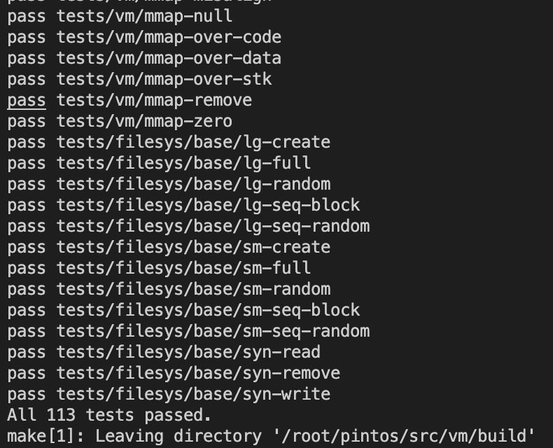

# Project 3 - Final Report (Team 28)

## Task 1 - Frame Table
### Improvement
 프로젝트 2까지의 구현으로는 user process 에서 새로운 page를 할당받는 경우에는
직접적으로 `palloc_get_page()` 를 통해서 호출했다. 하지만 해당 함수의 구현에서는
유저풀 내에서 더 할당할 페이지가 없는 경우에는 더 이상 작동하지 않게 되고, 오류가
발생하게 된다. 따라서 이를 해결하기 위해서 프레임 테이블을 도입하고자 했다. 프레임
테이블을 통해서 보다 큰 용량을 가진 프로그램을 유저 프로세스가 실행하더라도 
효과적으로 RAM을 관리할 수 있도록 돕는다. 또한, 이후에 설명할 스왑 테이블을 통해서도
더욱 더 큰 용량의 프로그램을 효과적으로 지원해줄 수 있게 된다. 이를 위해서
하단에 기재한 구조체와 함수들을 통해 기능들을 구현했다. 

### Newly Introduced Functions and Data Structures
#### `struct frame`
```C
/* Global frame list. */
struct list frames;

/* Lock for frame table. */
struct lock frames_lock;

/* List element Pointer for clock algorithm */
struct list_elem *hand;

/* A physical frame. */
struct frame
  {
    void *kaddr;
    struct page *page;
    bool accessed;
    struct list_elem elem;
  };
```
 RAM은 모든 프로세스 상관 없이 접근이 가능한 공유되는 자원이므로 전역적으로 
선언했으며, 전체 프레임을 저장하기 위한 `list frames` 를 선언하였다. 또한, 전역적으로 
관리되는 만큼 당연히 접근 시에 sync 가 중요하므로 `frames_lock` 을 함께 선언하여 lock을 
통해서 여러 프로세스의 동시 접근을 관리하고자 한다. 또한, clock 알고리즘의 보다 
정확한 구현을 위해 이전에 참고하고 있던 List elem을 저장하고 있는 변수인
`hand`를 선언하여 `hand` 부터 방문 여부를 확인하도록 구현하였다.

 또한, frame을 관리하기 위해서 필요한 정보를 담고 있는 struct frame 을 선언하였다.
해당 frame 에서는 실제 RAM 에 할당된 페이지의 시작 주소를 가르키기 위한 *kadd,
User Page를 저장하기 위한 `page pointer`, 이후 clock 알고리즘의 구현을 위한 
`accessed` (최근 사용되었는지 여부 체크) 그리고 전역적으로 관리되는 frame 리스트에
원소로 저장하기 위한 elem으로 선언하였다.

#### `frame_init ()`
```C
/* Initialize global frame table. */
void
frame_init (void)
{
  list_init (&frames);
  lock_init (&frames_lock);
}
```
 가장 먼저 frame을 초기화하기 위한 `frame_init()` 이다. 해당 함수에서는 핀토스가 
부팅되는 과정에서 호출되어야 하며, 다른 user process 들이 frame 할당을 시작하기 전에
호출되어 리스트와 락을 초기화해준다. 실제 호출은 init.c 의 `main()` 에서 호출된다.

#### `frame_allocate ()`
```C
/* Allocates a frame from user pool associated with PAGE, evicting one if 
   needed. New frame will be filled with zeros. */
void *
frame_allocate (struct page *page)
{
  ASSERT (page != NULL);

  struct frame *frame;
  void *kaddr = palloc_get_page (PAL_USER | PAL_ZERO); 

  /* Luckily, there's room for a new frame. Set basic informations and 
     register it to the frame table. */
  if (kaddr != NULL) 
    {
      frame = (struct frame *) malloc (sizeof (struct frame));
      frame->accessed = false;
      frame->page = page;
      frame->kaddr = kaddr;

      lock_acquire (&frames_lock);
      list_push_back (&frames, &frame->elem);
      lock_release (&frames_lock);

      return kaddr;
    }
  ...
}
```

 다음으로 구현한 함수는 새로운 프레임을 할당하는 함수이다. 입력으로는 user page의 주소를 
입력받아 user pool 에서 남아있는 공간을 할당하여 새로운 프레임을 생성하게 된다.
함수의 구현이 길어져 두 부분으로 나눠서 소개하고자 한다. 첫 부분은 새로운 페이지를 할당하는 것이다.
`PAL_USER | PAL_ZERO` 를 통해서 user pool 내에서 페이지를 할당하며, 0으로 초기화한다.
여기서 확인해야 할 부분이 바로 남은 영역이 있는지 여부이다. 만약 유저풀에서 남아있는 메모리가
존재한다면 할당이 되었으므로 새로운 frame 을 선언하고, `frames` 에 추가해주게 된다.
만약 남아있지 않은 경우는 밑에서 소개하고자 한다.

```C
void *
frame_allocate (struct page *page)
{
  ...

  /* Initial attempt to allocate a frame has failed. Find a frame to be evicted
     by clock algorithm. */
  struct page *p;
  struct list_elem *e;

  /* Copies accessed bits from page table entries. */
  lock_acquire (&frames_lock);
  for (e = list_begin (&frames); e != list_end (&frames); e = list_next (e))
    {
      frame = list_entry (e, struct frame, elem);
      p = frame->page;

      frame->accessed = page_is_accessed (p);
    }

  /* Find the frame to be evicted by clock algorithm. */
  e = hand;
  while (true)
    {
      frame = list_entry (e, struct frame, elem);

      if (e == list_rbegin (&frames))
        e = list_begin (&frames);
      else
        e = list_next (e);

      if (frame->accessed)
        frame->accessed = false;
      else
        break;
    }
  hand = e;
  list_remove (&frame->elem);
  lock_release (&frames_lock);

  page_swap_out (frame->page);
  palloc_free_page (frame->kaddr);

  /* At this point, there's at least one free frame. Reset frame 
     informations. */
  frame->kaddr = palloc_get_page (PAL_USER | PAL_ZERO);
  frame->page = page;
  frame->accessed = false;

  lock_acquire (&frames_lock);
  list_push_back (&frames, &frame->elem);
  lock_release (&frames_lock);

  return frame->kaddr;
}
```
 만약 유저풀에 메모리가 남아있지 않다면, 기존에 사용되고 있는 메모리 영역 중에서 
사용되지 않았거나, 최근까지도 사용되지 않았던 데이터를 swap disk 상으로 옮기고, 
RAM 을 비워줘야 새로운 frame 을 할당할 수 있게 된다. 이를 위해서 먼저
현재 프로세스의 페이지 디렉토리가 가지고 있는 access 정보로 업데이트 해줘야 한다.
대부분 frame 에 있는 `accessed` 를 통해서 기록이 될 수 있지만, 혹시 기존에 
user process에서 해당 주소를 호출했던 기록으로 최신화해주기 위해서 for 를 수행한다.

 이후에는 clock 알고리즘에 따라서 방출될 프레임을 선정하는 단계이다. 리스트를 순회하며
`accessed` bit 를 확인하고 만약에 사용되었다면 false 로 바꿔주는 방식으로 LRU를
모방하여 가장 최근까지 사용되지 않았던 프레임을 선택하고, 제거하게 된다. 제거하는 것이
지운다는 것이 아니라 정확히는 swap disk 상에 데이터를 옮겨주고, 대신에 RAM 은 사용할
수 있도록 하는 것이므로, `page_swap_out ()` 을 통해 user page의 데이터를 
옮겨준다. 또한, 이 때 swap table 에 업데이트가 동반되며, 해당 함수의 구현은 
하단에서 자세히 소개하고자 한다. 이렇게 최소 한 개의 프레임이 비워져 있으므로, 
새로운 프레임을 할당하고, 이 프레임을 리스트에 등록하게 되며 새로운 프레임을 할당하게 된다.

```C
/* userprog/process.c */
setup_stack ()
{
  /* original - project #2 */
  kapge = palloc_get_page (PAL_USER | PAL_ZERO);

  /* modified - project #3 */
  kaddr = frame_allocate (upage);
}

```

 이렇게 선언된 `frame_allocate ()` 함수는 Lazy loading과도 함께 고려하여, 
실제 해당 주소가 필요한 경우에만 호출된다. 따라서 직접적으로 호출되는 부분을 살펴본다면
기존 구현에서는 process.c 의 `setup_stack ()` 내에서 실행될 user process의
실행 파일을 읽어와서 저장하게 되는 부분에서 작동되며, 위와 같이 대체되어, 간접적으로 
frame table을 통해 RAM 에서 page를 할당하게 된다. 이외에도 `page_load()` 와
`page_swap_in ()` 등 직접적으로 해당 주소에 쓰거나 읽기가 실행되는 부분에서 
호출되어 새로운 프레임을 할당하게 된다.

#### `frame_free ()`
```C
/* Frees a physical frame associated with KADDR. If the frame for KADDR is
   not registered into the frame table, does nothing. */
void
frame_free (void *kaddr)
{
  struct list_elem *e;
  struct frame *frame = NULL;

  lock_acquire (&frames_lock);
  for (e = list_begin (&frames); e != list_end (&frames); e = list_next (e))
    {
      frame = list_entry (e, struct frame, elem);

      if (frame->kaddr == kaddr)
        break;
    }

  if (frame == NULL || frame->kaddr != kaddr)
    {
      lock_release (&frames_lock);
      return;
    }
  
  list_remove (&frame->elem);
  lock_release (&frames_lock);

  palloc_free_page (frame->kaddr);
  free (frame);
}
```

 상대적으로 간단한 함수이다. 기존에 할당된 프레임을 해제하는 함수로, kernel 
에 할당된 프레임의 주소를 입력받아 그 주소를 바탕으로 프레임 테이블에 저장되어 있는 
프레임을 삭제해주고, 실제 유저 풀에 할당된 페이지 또한 해제해주게 된다. 
위에서 구현된 free와 allocate 모두 `frames_lock` 을 통해서 
공유자원인 frames에 접근을 통제하게 된다. 실제 함수가 호출되는 것은 프로세스가 종료될 떄
실행되는 함수들인 `page_desroty()`, `page_unload()` 등 에서 호출되는데, 
중복해서 호출되더라도 frame == NULL 로 핸들링 되므로 오류가 없이 프레임 할당을 
해제할 수 있게 작동된다.

### Differences with Design Reports
 디자인 레포트에서는 이 부분에서 조금 더 많은 역할을 담아야 할 것이라고 
생각했다. 예를 들어 process 를 저장하여 process 내에 저장되어 있는
페이지 디렉토리 업데이트를 이 함수 내부에서 진행을 해줘야 한다고 생각했는데,
실제로 구현하는 과정에서는 supplement page table 과 더불어 봤을 때
호출하는 함수에서 구현하는 것이 조금 더 역할에 충실한 것이라 생각되어 
분할하게 되었다.

### Things We Have Learned & Limitations
 디자인 레포트를 작성하면서도 고민을 해봤지만, 핀토스에서 어떻게 메모리를
할당하고, 할당된 메모리를 사용하는지에 대해서 고민해보게 되었다. 
유저 풀에서 할당되는 방식과 더불어 유저풀에서 할당되었을 때 어떻게 
이를 관리해 줄 것인지에 대한 고민을 거듭하게 되었다. 또한, 다른 프로젝트3
의 구현과 함께하였을 때 `setup_stack()` 에서는 직접적으로 할당하지 않는다면,
애초에 유저 프로세스가 실행 자체가 되지 않으므로 이를 위해서도 직접 호출하여
할당하는 방식으로 구현을 마무리할 수 있었다.

## Task 2 - Lazy Loading

### Improvement
기존 Pintos의 구현에서는 프로세스를 시작할 때, 실행 파일 전체를 메모리에 적재한
후 해당 내용을 참조하여 프로세스를 시작하도록 되어 있었다. Project 3에서는 
이러한 구현을 수정하여, 프로세스를 시작할 때 디스크에 존재하는 실행 파일의 내용
전체를 메모리에 적재하는 것이 아닌, 실행 파일의 참조만을 보조 페이지 테이블
(supplemental page table)에 적재하여 실행 파일의 해당 부분이 실제 필요한 
경우에만 메모리에 적재하여야 하며, 이러한 프로세스 실행 방식을 게으른 적재(lazy 
loading)라 칭한다.

### Newly Introduced Functions and Data Structures
앞서 설명한 바와 같이, 기존 구현에서는 실행 파일 전체를 메모리에 적재하도록
구현되어 있었다. 이를 더 자세히 살펴보기 위해, `userprog/process.c`의 
`load_segment()`를 살펴보자.

```C
/* From previous version of userprog/process.c. */
static bool
load_segment (struct file *file, off_t ofs, uint8_t *upage,
              uint32_t read_bytes, uint32_t zero_bytes, bool writable) 
{
  ...
  while (read_bytes > 0 || zero_bytes > 0) 
    {
      ...
      /* Load this page. */
      if (file_read (file, kpage, page_read_bytes) != (int) page_read_bytes)
        {
          palloc_free_page (kpage);
          return false; 
        }
      memset (kpage + page_read_bytes, 0, page_zero_bytes);

      /* Add the page to the process's address space. */
      if (!install_page (upage, kpage, writable)) 
        {
          palloc_free_page (kpage);
          return false; 
        }
      ...
    }
  return true;
}
```
`load_segment()`는 `load()`에서 호출되어, 디스크에 존재하는 실행 파일에서 하나의
세그먼트를 적재하는 함수이다. 기존에 구현되었던 `load_segment()` 함수에서는, 
`file_read()` 함수 호출을 통해 실제로 실행 파일을 할당된 페이지에 적재한다.
게으른 적재를 구현하기 위해 수정한 `load_segment()` 함수의 정의는 다음과 같다.

```C
/* From userprog/process.c. */
static bool
load_segment (struct file *file, off_t ofs, uint8_t *uaddr,
              uint32_t read_bytes, uint32_t zero_bytes, bool writable) 
{
  ...
  while (read_bytes > 0 || zero_bytes > 0) 
    {
      /* Calculate how to fill this page.
         We will read PAGE_READ_BYTES bytes from FILE
         and zero the final PAGE_ZERO_BYTES bytes. */
      size_t page_read_bytes = read_bytes < PGSIZE ? read_bytes : PGSIZE;
      size_t page_zero_bytes = PGSIZE - page_read_bytes;

      /* Make a page to be inserted to the page record. */
      struct page *upage = 
        page_from_file (uaddr, writable, file, ofs, page_read_bytes);

      if (upage == NULL)
        return false;

      /* Register this page onto current process's page record. */
      pagerec_set_page (this->pagerec, upage);

      /* Advance. */
      read_bytes -= page_read_bytes;
      zero_bytes -= page_zero_bytes;
      uaddr += PGSIZE;
      ofs += page_read_bytes;
    }
  ...
}
```
새로이 변경된 `load_segment()` 함수의 구현에서는, 실제로 `file_read()` 함수 
호출을 통해 해당 세그먼트를 물리적 메모리에 적재하지 않고, 해당 세그먼트에
속해있는 페이지만을 `pagerec_set_page()` 함수 호출을 통해 새롭게 만들어진 
프로세스의 보조 페이지 테이블, 혹은 페이지 레코드에 저장한다. 하지만, 해당 
페이지 레코드 원소(page record entry; or, supplemental page table entry)는 실제 
메모리에 적재된 것이 아니며, 페이지 디렉터리에 등록되지도 않았기 때문에 실제
사용자 프로세스에서 실행 영역의 해당 부분에 접근하려 하면 페이지 폴트가 
발생한다. 

`page_from_file()`은 현재 파일에 존재하는 페이지를 나타내기 위한 `struct page`의
생성자이다. `struct page`와 그와 관련된 함수들에 관해서는 이후 단락에서 
설명한다.

페이지 폴트 핸들러에서는 현재 프로세스의 페이지 레코드 원소를 찾아 실행 파일의
해당 페이지를 실제 물리적 메모리에 적재한다. 페이지 레코드 자료구조와 페이지
레코드에 저장되는 `struct page`에 대해서는 이후 Supplemental Page Table 단락에서 
자세히 설명할 것이다. 이 단락에서는 먼저 실제로 해당 페이지를 메모리에 적재하는 
페이지 폴트 핸들러의 관련된 부분에 대해 살펴보자.

```C
/* From userprog/exception.c. */
static void
page_fault (struct intr_frame *f) 
{
  ...
  struct page *upage = pagerec_get_page (this->pagerec, uaddr);
  ... 
  /* Do sanity checking, load page, exit the user process if it's faulty. */
  if (not_present)
    {
      if (upage == NULL || upage->state == PAGE_PRESENT)
        process_exit (-1);

      if (upage->state == PAGE_UNLOADED)
        page_load (upage);
      else if (upage->state == PAGE_SWAPPED)
        page_swap_in (upage);
        
      return;
    }
  ...
}
```
페이지 폴트 핸들러에서는 만약 사용자 프로세스 혹은 커널이 페이지 디렉터리에 
존재하지 않는 페이지에 접근하여 페이지 폴트가 발생한 경우, 먼저 현재 프로세스의
페이지 레코드에서 해당하는 페이지를 찾는다. 만약 현재 프로세스의 맥락 내에서
해당하는 페이지가 존재하지 않거나, 이미 존재하는 페이지에 대해 페이지 폴트가
발생한 경우 사용자 프로세스를 종료시킨다.

`pagerec_get_page()`는 인자로 넘어온 페이지 레코드에서 사용자 가상 주소에 
해당하는 페이지를 찾는 함수이다. 해당 함수에 대해서는 이후 단락에서 설명한다.

만약 해당하는 페이지를 찾은 경우, `page_load()` 혹은 `page_swap_in()` 함수를 
호출하여 해당 페이지를 물리적 메모리에 적재한다. 이 중 게으른 적재의 상황에서
주목하여야 할 부분은 현재 페이지의 상태가 `PAGE_UNLOADED`여서 `page_load()` 
함수가 호출되는 부분인데, 게으른 적재를 구현하기 위해 페이지 레코드에 등록된
실행 파일들의 상태는 `page_from_file()`에서 기본적으로 `PAGE_UNLOADED`로 
설정되기 때문이다. 

`page_load()`에서 실제로 인자로 넘겨진 `struct page`를 메모리에 적재하는 부분은
다음과 같다.

```C
/* From vm/page.c. */
/* Loads PAGE into a physical frame. PAGE must be in the unloaded state and
   must not be a null pointer. Returns newly allocated kernel address if it 
   succeed, a null pointer if failed. */
void *
page_load (struct page *page)
{
  ASSERT (page != NULL);
  ASSERT (page->state == PAGE_UNLOADED);

  uint8_t *kpage = frame_allocate (page);

  if (kpage == NULL)
    return NULL;

  lock_acquire (&filesys_lock);
  file_read_at (page->file, kpage, page->size, page->offset);
  lock_release (&filesys_lock);

  page->state = PAGE_PRESENT;
  pagedir_set_page (page->pagedir, page->uaddr, kpage, page->writable);

  return kpage;
}
```
`page_load()`는 해당 페이지가 실제로 파일에 존재할 때, 해당 페이지의 상응하는
파일의 일부분을 실제 물리적 프레임으로 적재하는 함수이다. 이를 위해서 
`page_load()`는 `frame_allocate()`를 호출하여 해당 페이지가 적재될 물리적 
프레임을 할당받는다. 이후, `file_read_at()` 호출을 통해 페이지에 상응하는 파일의
일부분을 할당받은 프레임에 적재한다. 마지막으로, 페이지가 속하는 프로세스의 
페이지 디렉터리에 해당 페이지를 등록하여 이후 해당 페이지에 대한 접근이 
정상적으로 이루어질 수 있게 하고, 페이지의 상태를 `PAGE_PRESENT`로 변경한다.

### Differences with Design Reports
이전의 설계 보고서에서 서술한 `load_segment()` 함수의 의사 코드에서는 Pintos에서
제공하는 `struct file`의 인터페이스 함수를 통해 해당 실행 파일을 읽어들이는 것이
아닌, 실제 파일 시스템 블럭 장치의 섹터 번호를 통해 해당 실행 파일을 
읽어들이도록 서술되어 있었다. 

이러한 구현의 문제점으로는 먼저 Pintos에서 이미 제공하는 `struct file`과 
`struct inode`의 인터페이스 함수들의 구현을 변경하거나 새로운 함수를 추가하지 
않는 이상 파일을 읽어들이기 위한 블럭 장치의 섹터 번호를 알아낼 방법이 없다는 
점이 존재한다. 만약 `struct inode`에 관련된 함수를 수정하여 해당 파일에 관련된 
섹터 번호를 알아낸다고 하더라도, 이러한 섹터 번호를 통해 `block_read()`를 직접
호출하여 해당 파일을 읽는 행위는 Pintos에서 `struct file`을 통해 제공하는 
추상화와 캡슐화를 무시하는 위험한 행위이다. 또한, 파일을 읽어들일 시작 바이트 
번호, 또는 오프셋은 페이지 단위로 정렬(page-aligned)되어 있지 않으므로 버퍼에
각 섹터를 읽어들여 이를 페이지 단위로 정렬하여 실제 물리적 프레임에 쓰는 작업을
`page_load()`에서 구현하여야 하는데, 이러한 작업은 `file_read_at()` 혹은 
`inode_read_at()`에 이미 구현되어 있으므로 굳이 그러할 필요가 없다.

따라서, 새로운 구현에서는 스왑 장치와 파일 시스템 장치 모두에서 섹터 번호를 통해
읽어들인다는 기존의 구현을 버리고, 스왑 장치에 존재하는 페이지에 대해서는 섹터
번호로, 파일 시스템 장치에 존재하는 페이지에 대해서는 파일을 통해 읽어들이도록
구현을 변경하였다. 처음에 위에서 설명한 구현을 채택한 이유는 스왑 장치와 파일
시스템 장치 모두 섹터 번호로 읽어들인다면 `struct page`의 원소의 개수, 또는 
크기가 줄어들고 구현의 일관성을 달성할 수 있다는 이유였지만, 이러한 구현의 
일관성이나 몇 바이트의 용량보다 위에서 설명한 단점이 더 크다고 판단하여 구현
방식을 변경하였다.

### Limitations
현재 구현에서는 두 프로세스가 같은 실행 파일을 참조하더라도 해당 실행 파일에
대한 실제 물리적 프레임에의 사본을 두 개 만들고 있다. 허나, 실행 파일은 
기본적으로 쓰기가 금지되어 있으므로 두 프로세스가 같은 실행 파일을 참조한다면
새로운 사본 혹은 페이지를 만드는 것이 아닌 같은 페이지를 공유하도록 할 수 있을
것이다. 

따라서, 프로세스의 초기 실행 과정에서 이러한 공유 가능 여부를 체크하고
만약 현재 해당 실행 파일을 실행하고 있는 다른 프로세스가 존재한다면 새로운
페이지를 만들지 않고 해당 실행 파일 페이지를 참조하도록 한다면 더 좋은 성능을
달성할 수 있을 것이다.

## Task 3 - Supplemental Page Table

### Improvement
기존의 Pintos에서는 사용자 프로세스에 필요한 데이터를 모두 실제 물리적 메모리에
적재하였기 때문에, 페이지 폴트는 사용자 프로세스 혹은 커널의 버그에 의해서만 
발생하였다. 하지만, 게으른 적재와 파일 메모리 대응, 그리고 페이징을 구현한
이후에는 페이지 폴트가 더 이상 버그에 의해서만 발생하지 않고, 실제 유효한 메모리
접근에 의해서도 발생할 수 있으며, 페이지 폴트 핸들러는 이러한 유효한 메모리
접근에 의한 페이지 폴트를 적절하게 처리하여야 한다.

이때, 페이지 폴트 핸들러가 해당 메모리 접근이 유효한지, 그리고 만약 메모리 
접근이 유효하다면 해당 페이지를 어디어 가져와야 하는지 등의 정보를 알아내기 위해
Pintos 문서에서는 보조 페이지 테이블이라는 자료구조를 제시하고 있다. 즉, 페이지
폴트 핸들러는 페이지 폴트 발생시 보조 페이지 테이블을 참조하여 페이지 폴트를
처리할 방식을 결정하게 된다.

아래의 단락들을 읽기 전에, 한 가지 용어에 대한 정의를 하자면 이후 단락에서 
'페이지 레코드' 혹은 `struct pagerec`은 Pintos에서 제시하는 보조 페이지 테이블을 
가리킨다. 즉, 이후 단락들에서 페이지 레코드라 칭하는 대상들은 모두 어떤 
프로세스에 속한 보조 페이지 테이블을 가리키는 용어라 생각하면 된다. 이러한 
이름은 보조 페이지 테이블이 x86 아키텍처의 페이지 디렉터리, 혹은 더 일반적인 
용어로는 페이지 테이블과 비슷한 역할을 하기 때문에, 영단어 'directory'의 유의어 
중 하나로 'record'를 택하여 지었다.

### Newly Introduced Functions and Data Structures
먼저, 페이지 레코드에 속하는 하나의 페이지를 나타내는 자료구조인 `struct page`의
정의부터 살펴보자.

```C
/* From vm/page.h. */
/* A virtual page. */
struct page 
  {
    enum page_state state;     /* State of this page. */
    void *uaddr;               /* User virtual address of this page. */
    uint32_t *pagedir;         /* Page directory where this page lies in. */
    bool writable;             /* Is this page writable? */
    block_sector_t sector;     /* The sector number of underlying swap block. */
    struct file *file;         /* Underlying file. */
    off_t offset;              /* Offset from underlying file. */
    off_t size;                /* Bytes to be loaded from underlying file. */
    struct hash_elem elem;     /* Hash element. */
  };
```
`struct page`는 하나의 사용자 가상 페이지를 나타내기 위한 구조체이다. 
`struct page`는 먼저 해당 페이지의 상태를 나타내는 `state`를 멤버로 가지고 있다.
`enum page_state`는 `PAGE_PRESENT`, `PAGE_SWAPPED`, `PAGE_UNLOADED`의 세 가지
값을 가질 수 있으며, 각각 현재 메모리에 존재하는 상태, 스왑 블럭 장치에 쫓겨난
(evicted) 상태, 파일 시스템 블럭 장치에 존재하나 아직 물리적 프레임에는 적재되지
않은 상태를 나타낸다.

`uaddr`는 해당 페이지가 시작하는 가상 주소를 나타내는 멤버이다. `pagedir`는 해당
페이지가 속해야 할 페이지 디렉터리를 가리키는 포인터이다. 가상 주소는 가상 주소
혼자서는 의미가 없고 반드시 상응하는 페이지 디렉터리가 존재하여야 의미가 생기며,
실제로 어떤 페이지가 스왑 장치로 쫓겨날 때에는 페이지 디렉터리에서 해당 페이지에
상응하는 페이지 디렉터리 원소를 찾아 이의 `not_present` 비트를 0으로 설정하는
과정이 필요하므로 이렇게 구현하였다.

`writable`은 해당 페이지가 쓰기 가능한지를 나타내는 플래그이다. `sector`는 스왑
장치로 쫓겨난 페이지가 스왑 블럭 장치 내에서 존재하는 섹터 번호를 나타내는
멤버이다. `file`은 아직 파일에서 적재되지 않은 페이지가 존재하는 파일을 가리키는
포인터이며, `offset`는 `file` 내에서의 시작 오프셋, `size`는 `offset`부터 
시작하여 읽어들어야 할 바이트의 수를 나타낸다.

마지막으로, 해시 테이블로 구현되어 있는 페이지 레코드의 원소로 `struct page`를
추가하기 위해 쓰이는 `elem`을 원소로 가지고 있다.

```C
/* From vm/page.c. */
/* A page record. */
struct pagerec 
  {
    struct hash records;
  };
```
이러한 페이지들은 페이지 레코드라 칭하는 자료구조에 저장되며, 페이지 레코드는
내부적으로 해시 테이블로 구현되어 있다. `struct pagerec`은 `vm/page.c`에 
정의되고 `vm/page.h`에는 선언만이 노출되어 있어 `vm/page.c` 외부에서는 
`struct pagerec`을 인자로 받는 인터페이스 함수만을 이용하게 된다.

```C
/* From userprog/process.h. */
/* An user process. */
struct process
  {
    ...
    struct pagerec *pagerec;      /* Page records. */
    uint8_t *esp                  /* Saved user stack pointer. */
    ...
  };
```
새로운 `struct process`는 이제 페이지 폴트 핸들러에서 사용할 페이지 레코드를
멤버로 가지고 있다. 이때, 프로세스는 독립된 주소 공간을 가지고 있으므로 페이지
레코드에 대한 포인터는 `struct process`내에 저장되고, 페이지 레코드는 기본적으로 
해당 페이지 레코드가 속한 프로세스의 맥락 내에서 수정된다.

또한, 페이지 폴트 핸들러에서 스택 확장의 상황을 확인하기 위해 현재 프로세스의
ESP 레지스터를 저장하기 위한 `esp` 멤버를 추가하였다.

```C
/* From vm/page.c. */
/* Creates page records. Returns a null pointer if it failed to allocate 
   memory.*/
struct pagerec *
pagerec_create (void)
{
  struct pagerec *rec = (struct pagerec *) malloc (sizeof (struct pagerec));

  if (rec == NULL)
    return NULL;

  hash_init (&rec->records, page_hash, page_less_func, NULL);
  return rec;
}
```
`pagerec_create()`는 새로운 페이지 레코드를 생성하는 함수로, 프로세스의 초기화
과정, 더 자세히는 `make_process()` 과정 중 호출되어 새로운 프로세스에 대한
페이지 레코드를 만드는 데 쓰인다. 이때, 페이지 레코드 내부 해시 테이블에 대한
해시 함수와 해시 비교 함수는 `page_hash()`와 `page_less_func()`가 쓰이는데, 
둘 모두 `struct page`의 `uaddr`를 참조하여 이에 대한 해시 값을 계산하거나 비교를
수행한다.

```C
/* From vm/page.c. */
/* Inserts PAGE into REC. If such PAGE already exists on REC, destroy it and
   insert new one. */
void
pagerec_set_page (struct pagerec *rec, struct page *page)
{
  ASSERT (rec != NULL);
  ASSERT (page != NULL);

  struct hash_elem *e;

  if ((e = hash_replace (&rec->records, &page->elem)) != NULL)
    {
      struct page *old = hash_entry (e, struct page, elem);
      page_destroy (old);
    }
}
```
`pagerec_set_page()`는 인자 `rec`에 `page`를 등록하는 함수이다. 만약 같은 사용자
가상 주소에 대한 페이지가 이미 `rec`에 존재한다면, 이미 존재하는 원소를 버리고
새로운 페이지를 `rec`에 등록한다.

```C
/* From vm/page.c. */
/* Retrieves page to which UADDR belongs in REC. Returns a null pointer
   if there's no page with UADDR in the given REC. */
struct page *
pagerec_get_page (struct pagerec *rec, const void *uaddr)
{
  ASSERT (rec != NULL);

  struct page p = {.uaddr = pg_round_down (uaddr)};
  struct hash_elem *e = hash_find (&rec->records, &p.elem);

  return e == NULL ? NULL : hash_entry (e, struct page, elem);
}
```
`pagerec_get_page()`는 인자 `rec`에서 사용자 가상 주소 `uaddr`를 가지는 페이지를
찾는 함수이다. 만약 `uaddr`을 원소로 가지는 페이지가 `rec`에 존재하지 않으면
널 포인터를 반환하며, 그러한 페이지가 존재한다면 해당 페이지에 대한 포인터를
반환한다.

```C
/* Clears mapping associated with PAGE in REC. Does nothing when there's no 
   such mapping. */
void
pagerec_clear_page (struct pagerec *rec, struct page *page)
{
  ASSERT (rec != NULL);

  struct hash_elem *e = hash_find (&rec->records, &page->elem);
  
  if (e != NULL)
    hash_delete (&rec->records, e);
}
```
`pagerec_clear_page()`는 `rec`에서 `page`를 지우는 함수이다. 

```C
/* From vm/page.c. */
/* Makes a new page that alreay lies in the memory, with address of UADDR and
   WRITABLE flag. Since this assumes the new page is already in the physical
   memory, the caller must allocate a frame for this page right after calling 
   it.
   
   The page directory of new page will be automatically set to the page 
   directory of current process.    

   Returns a null pointer if it failed to allocate memory. UADDR must be page
   aligned. */
struct page *
page_from_memory (void *uaddr, bool writable)
{
  struct page *page = (struct page *) malloc (sizeof (struct page));
  struct process *this = thread_current ()->process;

  ASSERT (this != NULL);
  ASSERT (pg_ofs (uaddr) == 0);

  if (page == NULL)
    return NULL;

  page->state = PAGE_PRESENT;
  page->uaddr = uaddr;
  page->pagedir = this->pagedir;
  page->writable = writable;
  page->sector = 0;
  page->file = NULL;
  page->offset = 0;
  page->size = 0;

  return page;
}
```
```C
/* From vm/page.c. */
/* Makes a new page from a file, which will demand paged from FILE, with 
   WRITABLE flag and SIZE, OFFSET within the file.

   The page directory of the page will be automatically set to current
   process's page directory.    

   Returns a null pointer if it failed to allocate memory. UADDR must be page
   aligned. FILE must not be a null pointer and OFFSET + SIZE must be less than 
   the length of FILE. SIZE must be less than or equal to PGSIZE. */ 
struct page *
page_from_file (void *uaddr, bool writable, struct file *file, 
                off_t offset, size_t size)
{
  struct page *page = (struct page *) malloc (sizeof (struct page));
  struct process *this = thread_current ()->process;

  ASSERT (this != NULL);
  ASSERT (pg_ofs (uaddr) == 0);
  ASSERT (file != NULL);
  ASSERT (file_length (file) >= offset + (off_t) size);
  ASSERT (size <= PGSIZE);

  if (page == NULL)
    return NULL;

  page->state = PAGE_UNLOADED;
  page->uaddr = uaddr;
  page->pagedir = this->pagedir;
  page->writable = writable;
  page->sector = 0;
  page->file = file;
  page->offset = offset;
  page->size = size;

  return page;
}
```
`page_from_memory()`와 `page_from_file()`은 새로운 페이지를 만드는 두 가지 
상황에 대응하기 위한 `struct page`의 생성자이다.

`page_from_memory()`는 사용자 가상 주소 `uaddr`과 해당 페이지가 쓰기 가능한지를
나타내는 플래그 `writable`을 받아 새로운 페이지를 생성하는 `struct page`의
생성자이다. 이때, 해당 페이지는 실제 물리적 프레임에 이미 적재되어 있을 것을 
가정하므로 페이지의 상태는 `PAGE_PRESENT`로 설정되며, `pagedir`는 현재 
프로세스의 페이지 디렉터리로 설정된다. `sector`, `file`, `offset`, `size` 등 
나머지 멤버 변수들은 해당하는 스왑 장치 내의 공간이 존재하지 않으므로 0 혹은 
그에 상응하는 초기값으로 초기화된다.

`page_from_file()`은 파일 시스템 장치 내에 존재하는 파일에 해당하는 페이지를
만들기 위한 `struct page`의 생성자이다. 사용자 가상 주소 `uaddr`과 `writable`
플래그, 파일 포인터 `file`, 파일 내의 오프셋 `offset`과 파일에서 읽어들일 크기인
`size`를 받아 새로운 `struct page`를 생성한다. 새로운 페이지의 상태는 아직
메모리에 적재되지 않은 것을 가정하므로 `PAGE_UNLOADED`로 설정된다.

```C
/* From vm/page.c. */
/* Destroys PAGE, mark the page as not present in its associated page 
   directory, deleting it from current process's page record. This also evicts
   physical page frame associated with it, if such exists. 
   
   After this, accessing on PAGE will cause page fault, and the kernel won't 
   recover from it. This does NOT close a opened file. */
void
page_destroy (struct page *page)
{
  struct process *this = thread_current ()->process;

  ASSERT (page != NULL);
  ASSERT (this != NULL);

  void *kaddr;
  if ((kaddr = pagedir_get_page (page->pagedir, page->uaddr)) != NULL)
    frame_free (kaddr);

  pagedir_clear_page (page->pagedir, page->uaddr);
  pagerec_clear_page (this->pagerec, page);
  free (page);
}
```
`struct page`의 소멸자이다. `page`를 받아 상응하는 물리적 프레임을 할당 
해제하고, 해당 페이지의 페이지 디렉터리와 현재 프로세스의 페이지 레코드에서
해당 페이지를 삭제한다. 마지막으로 `page` 자신을 할당 해제한다.

```C
/* From vm/page.c. */
/* Fetchs PAGE from the swap device. The state of the page must be swapped out 
   state. This function adds mapping from PAGE's user address to newly 
   allocated frame to associated page directory. Returns newly allocated kernel 
   address if it succeed, a null pointer if failed. */
void *
page_swap_in (struct page *page)
{
  ASSERT (page != NULL);
  ASSERT (page->state == PAGE_SWAPPED);

  struct block *block = block_get_role (BLOCK_SWAP);
  uint8_t *kpage = (uint8_t *) frame_allocate (page);
  uint8_t *kaddr = kpage;

  if (kaddr == NULL)
    return NULL;

  /* Fetch the page from the block device. */
  for (block_sector_t sector = page->sector; 
       sector < page->sector + PGSIZE / BLOCK_SECTOR_SIZE;
       sector++)
    {
      block_read (block, sector, kaddr);
      kaddr += BLOCK_SECTOR_SIZE;
    }

  /* Fetched a frame for the page. Change state, free the swap slot, and make a 
     mapping in page directory. */
  page->state = PAGE_PRESENT;
  swap_free (page->sector);
  pagedir_set_page (page->pagedir, page->uaddr, kpage, page->writable);

  return kaddr;
}
```
스왑 장치로 쫓겨난 `page`를 실제 물리적 프레임에 다시 읽어들이는 함수이다. 
먼저 새로운 물리적 프레임을 `frame_allocate()` 함수를 호출하여 할당받고, 
할당받은 물리적 프레임에 스왑 블럭 장치의 `page->sector`번째 섹터부터 읽어들여
쓴다. 함수 호출 이후에는 스왑 슬롯을 할당 해제하고, 페이지의 상태를 
`PAGE_PRESENT`로 변경하며, 해당 페이지가 속해야 하는 페이지 디렉터리에 페이지의
사용자 가상 주소로부터 물리적 프레임으로의 대응을 등록한다.

```C
/* From vm/page.c. */
/* Swaps PAGE out from the memory to the swap device. It evicts PAGE from the
   page directory associated with it. PAGE must be in the present state and 
   must not be a null pointer. */
void
page_swap_out (struct page *page)
{
  ASSERT (page != NULL);
  ASSERT (page->state == PAGE_PRESENT);

  uint8_t *kpage = pagedir_get_page (page->pagedir, page->uaddr);
  uint8_t *kaddr = kpage;

  struct block *block = block_get_role (BLOCK_SWAP);
  block_sector_t slot = swap_allocate ();

  for (block_sector_t sector = slot; 
       sector < slot + PGSIZE / BLOCK_SECTOR_SIZE; 
       sector++)
    {
      block_write (block, sector, kaddr);
      kaddr += BLOCK_SECTOR_SIZE;
    }

  page->state = PAGE_SWAPPED;
  page->sector = slot;
  pagedir_clear_page (page->pagedir, page->uaddr);
  frame_free (kpage);
}
```
`page`를 스왑 장치로 다시 쫓아내는 함수이다. `swap_allocate()` 호출을 통해 
새로운 스왑 슬롯을 할당받고, 할당받은 스왑 슬롯에 해당 페이지의 내용을 쓴다.
이후 페이지의 상태를 현재 스왑 블럭 장치에 존재함을 나타내는 `PAGE_SWAPPED`로
변경하고, 이후 페이지를 다시 읽어들일 섹터 번호를 새로이 할당받은 스왑 슬롯의
섹터 번호로 설정하며, 페이지 디렉터리에서 해당 페이지에 대한 대응을 지운다.
마지막으로, 해당 페이지가 존재하였던 물리적 프레임을 할당 해제한다.

```C
/* From vm/page.c. */
/* Loads PAGE into a physical frame. PAGE must be in the unloaded state and
   must not be a null pointer. Returns newly allocated kernel address if it 
   succeed, a null pointer if failed. */
void *
page_load (struct page *page)
{
  ASSERT (page != NULL);
  ASSERT (page->state == PAGE_UNLOADED);

  uint8_t *kpage = frame_allocate (page);

  if (kpage == NULL)
    return NULL;

  lock_acquire (&filesys_lock);
  file_read_at (page->file, kpage, page->size, page->offset);
  lock_release (&filesys_lock);

  page->state = PAGE_PRESENT;
  pagedir_set_page (page->pagedir, page->uaddr, kpage, page->writable);

  return kpage;
}
```
현재 파일 시스템 블럭 장치에 존재하는 `page`를 물리적 프레임으로 읽어들이는 
함수이다. `page_swap_in()`과 거의 비슷한 동작을 하나, 읽어들이는 위치가 스왑
블럭 장치가 아닌 파일이라는 차이점이 있다.

```C
/* From vm/page.c. */
/* Unloads, or writes back PAGE into the underlying file. It evicts PAGE from 
   the page directory associated with it. PAGE must be in the present state and 
   must not be a null pointer, and must have file associated with it. */
void
page_unload (struct page *page)
{
  ASSERT (page != NULL);
  ASSERT (page->state == PAGE_PRESENT);
  ASSERT (page->file != NULL);

  void *buffer = palloc_get_page (0);
  uint8_t *kpage = pagedir_get_page (page->pagedir, page->uaddr);
  memcpy (buffer, kpage, page->size);
  
  if (page->writable && page_is_dirty (page))
    {
      lock_acquire (&filesys_lock);
      file_write_at (page->file, buffer, page->size, page->offset);
      lock_release (&filesys_lock);
    }

  palloc_free_page (buffer);
  page->state = PAGE_UNLOADED;
  pagedir_clear_page (page->pagedir, page->uaddr);
  frame_free (kpage);
}
```
`page`를 물리적 프레임에서 할당 해제하고 다시 파일로 내쫓는 함수이다. 만약, 
`page`가 쓰기 가능한 페이지이고 수정되었다면 해당 페이지의 내용을 다시 파일에
되쓴다. 내부적으로 커널 영역에 새로운 버퍼를 생성하여 해당 버퍼에 페이지를
복사한 후 이를 파일에 쓰는데, 이는 파일 쓰기 작업 중 발생하는 페이지 폴트를
방지하기 위함이다.

```C
/* From vm/page.c. */
/* Destroys a single page associated with E. Used to destroy all pages in a 
   page record. */
static void
free_page (struct hash_elem *e, void *aux UNUSED)
{
  struct page *p = hash_entry (e, struct page, elem);

  if (p->state == PAGE_PRESENT && p->file != NULL)
    page_unload (p);

  page_destroy (p);
}
```
페이지 레코드의 한 원소를 할당 해제하는 함수이다. 만약 해당 페이지가 현재 
메모리 상에 존재하고, 해당 페이지에 대응되는 파일이 존재하는 경우에는 
`page_unload()`를 호출하여 해당 페이지를 파일에 되쓰기 위해 시도한다. 이후에는
`page_destroy()`를 호출하여 해당 페이지와 관련된 프레임을 메모리에서 할당 
해제한다.

```C
static void
page_fault (struct intr_frame *f) 
{
  ...
  void *uaddr = pg_round_down (fault_addr);  
  struct process *this = thread_current ()->process; 
  struct page *upage = pagerec_get_page (this->pagerec, uaddr);

  /* Save stack pointer on the initial transition to kernel mode. */
  if (is_user_vaddr (f->esp))
    this->esp = f->esp;
  
  /* Extend stack when stack growth is needed. */
  if (upage == NULL
      && fault_addr >= USER_STACK_BOUNDARY 
      && this->esp - fault_addr <= 32 
      && is_user_vaddr (fault_addr))
    {
      struct page *st = page_from_memory (uaddr, true);
      pagerec_set_page (this->pagerec, st);
      pagedir_set_page (this->pagedir, uaddr, frame_allocate (st), true);
      
      return;
    }
  
  /* Do sanity checking, load page, exit the user process if it's faulty. */
  if (not_present)
    {
      if (upage == NULL || upage->state == PAGE_PRESENT)
        process_exit (-1);

      if (upage->state == PAGE_UNLOADED)
        page_load (upage);
      else if (upage->state == PAGE_SWAPPED)
        page_swap_in (upage);
        
      return;
    }

  if (is_user_vaddr (fault_addr))
    process_exit (-1);

  
  printf ("Page fault at %p: %s error %s page in %s context.\n",
          fault_addr,
          not_present ? "not present" : "rights violation",
          write ? "writing" : "reading",
          user ? "user" : "kernel");
  kill (f);
}
```
이러한 페이지 레코드의 구현에 맞추어 새롭게 구현한 페이지 폴트 핸들러는 다음과
같다. 새로운 페이지 폴트 핸들러에서는 먼저 프로세스의 페이지 레코드에서 페이지
폴트가 발생한 주소가 속한 페이지를 찾는다. 이후, 현재 프로세스에 사용자 스택 
포인터를 저장하며, 스택 확장 상황인지를 판단해 만약 필요한 경우 스택을 
확장해준다. 스택 확장에 대한 설명은 이후 단락에서 더 자세히 한다.

이후로는, 만약 페이지 레코드에 해당 페이지가 존재한다면 페이지 레코드의 내용과
앞에서 설명한 `struct page`에 대한 함수를 이용해 페이지를 파일에서 읽어들이거나
스왑 블럭 장치에서 읽어들인다. 만약 페이지 레코드에 해당 페이지가 존재하지 
않거나, 만약 페이지 폴트가 커널 영역에서 발생한 사용자 가상 주소에 대한 페이지에
대한 페이지 폴트라면 현재 실행되고 있는 프로세스를 종료한다.

### Differences with Design Reports
앞서 설명한 바와 같이, 기존의 보조 페이지 테이블 원소는 내부 블럭 장치의 섹터
번호만을 원소로 가지고, 이를 통해 블럭을 읽거나 쓰는 작업을 하도록 구현하기로
계획되었다. 하지만, 앞서 설명한 문제점으로 인해 새로운 `struct page`는
섹터 번호는 스왑 블럭 장치에 쓰거나 읽을때만 사용하고, 파일 시스템 블럭 장치에
대해서는 Pintos에서 제공하는 파일 인터페이스 함수를 이용해 읽거나 쓰는 방식으로
구현하였다.

또한, 기존의 보조 페이지 테이블 원소는 해당 페이지가 만약 파일 메모리 대응에
속한 페이지일 경우 파일 메모리 대응을 삭제할 때 참조하기 위한 용도로 `mapid`
멤버를 가지고 있었지만, 새로운 `struct page`와 파일 메모리 대응의 구현은 파일 
메모리 대응을 다른 구조체와 리스트를 이용해 관리하므로 `mapid` 멤버를 가지고 
있지 않다. 파일 메모리 대응의 자세한 구현에 대해서는 관련된 단락에서 다룬다.

마지막으로, 새로운 `struct page`는 페이지의 상태를 `PAGE_PRESENT`, 
`PAGE_SWAPPED`, `PAGE_UNLOADED`의 세 가지로 한정하고 이를 저장하기 위한 멤버를
가지고 있다.

### Limitations
위에서 언급한 프로세스 간 실행 파일 페이지 공유에 대해, 현재의 구현은 페이지 
레코드가 프로세스에 국한된 자료구조여서 실행 파일을 공유하기 힘들며, 프로세스
종료 시 실행 파일을 닫아버리기 때문에 코드 세그먼트에 대한 페이지 공유를 
구현하기 힘들다는 단점이 있다.

이를 위해서, 실행 파일에 대한 포인터를 기존의 `opened` 리스트와는 다른 멤버로
저장하고, 새로운 프로세스 시작 시 실행하고자 하는 파일이 현재 열려있는지를 
확인한 후, 해당 파일에 대한 페이지를 찾아 새로운 프로세스의 페이지 레코드에 
추가하도록 할 수 있을 것이다.

## Task 4 - Stack Growth
### Improvement
 기존 프로젝트2 에서는 page fault 가 발생하게 된다면 단순히 프로세스를
종료하게 되었다. 즉, 유저 프로세스 상에서 할당되지 않은 영역에 접근을 
시도하기만 해도 종료되었던 반면, 프로젝트 3에서 요구했던 것은 유저 프로세스가
유저 스택 포인터와 비교하여 4 byte ~ 32 byte 까지 더 큰 경우에는
stack 을 키워주도록 권고하고 있다. push, pusha 과 같은 명령어가 실행된다면
실제 user stack 을 키워줘야 하는 것이다. 하지만 여기서 유념할 부분은
사용하고자 하는 영역의 주소가 정말 위에서 말한 경우에서만 해당되는지 잘 확인하여
이를 통해서 stack growth 를 구현하였다.

### Newly Introduced Functions and Data Structures
```C
/* userprog/exception.c */
/* Limitation of user stack. */
#define USER_STACK_BOUNDARY ((uint8_t *) PHYS_BASE - 8 * 1024 * 1024)

static void
page_fault (struct intr_frame *f) 
{
  ...

  not_present = (f->error_code & PF_P) == 0;
  write = (f->error_code & PF_W) != 0;
  user = (f->error_code & PF_U) != 0;

  void *uaddr = pg_round_down (fault_addr);  
  struct process *this = thread_current ()->process; 
  struct page *upage = pagerec_get_page (this->pagerec, uaddr);

  /* Save stack pointer on the initial transition to kernel mode. */
  if (is_user_vaddr (f->esp))
    this->esp = f->esp;
  
  /* Extend stack when stack growth is needed. */
  if (upage == NULL
      && fault_addr >= USER_STACK_BOUNDARY 
      && this->esp - fault_addr <= 32 
      && is_user_vaddr (fault_addr))
    {
      struct page *st = page_from_memory (uaddr, true);
      pagerec_set_page (this->pagerec, st);
      pagedir_set_page (this->pagedir, uaddr, frame_allocate (st), true);
      
      return;
    }
  
  ...
}
```
 사실 이미 `page_fault()` 함수 자체는 굉장히 자주 등장했고, 등장할 예정이기에
일부분만 발췌해서 소개하고자 한다. 결국 stack growth 상황에서는 항상 인터럽트가
발생하여 `page_fault()` 가 실행되어야 한다. 따라서 `page_fault()` 내에서는 
if else 를 통해서 여러 상황 (lazy loading, stack growth 등)을 구별하고
이를 토대로 처리하게 된다. stack growth 가 실행되는 상황은 다음과 같다.
우선 `pagerec_get_page()` 를 통해서 supplement page table을 확인하고
기존에 할당되지 않았는지 확인하게 된다. 이외에도 핀토스 문서에서 제시했던 8 MB의 
크기 제한과 최대 32 bytes 까지의 제한, 그리고 user address 인지를 확인하여 
전부 만족하는 경우에만 스택을 키우게 된다.

 여기서 중요한 부분이 있는데, 인터럽트 프레임에 저장되어 있는 esp가 유저 프로세스의
esp와 동일한지가 미지수일 수 있다. 만약 `page_fault ()` 실행 중 `page_fault`가
다시 발생한다던가 하는 경우에는 f의 esp는 커널 스텍을 지칭하고 있게 된다. 따라서 
이를 위해서는 process의 esp 를 따로 백업해주는 과정이 필요한데 `f->esp`가
유저 스텍인 경우에는 `this->esp` 에 저장하는 방식으로 페이지 폴트가 발생하게 되면
항상 업데이트해주게 된다. 따라서 이후에 커널 모드에서 페이지 폴트가 재발생한 경우에도
`this->esp` 를 참조하게 된다면, 유저 스텍의 주소를 불러올 수 있다.

 이제 자세한 실행은 `page_frome_memory()` 를 통해 새로운 구조체 page를 할당하고,
이를 현재 process 상에 기록해주게 된다. 보다 자세히는 struct pagerec을 통해
저장하고, 해당 해시 테이블에 page를 등록하게 된다. 다음으로 생각해보면, 이 경우에는
바로 사용해야 하는 페이지가 필요하다. 즉, stack 에서 즉시 프레임을 필요로 하므로,
`frame_allocate()` 와 `paggedir_set_page()` 를 바로 호출하여 유저풀에서
페이지를 할당하고, 프레임을 할당하고 즉시 stack에 write가 가능하도록 구현했다.
마지막으로 당연히 유저 스텍이므로 쓰기가 가능해야 하므로, `writable`을 true로 구현했다.
 
### Differences with Design Reports
 디자인 레포트 상에서는 esp를 백업해주기 위해서 다양한 것들을 고민했었다. 
정확히는 `syscall_handler()` 를 통해 항상 user -> kernel 모드로 변경이
이뤄지기 때문에, 이 함수가 호출될 때마다 업데이트해주도록 디자인을 했었지만
실질적으로 페이지 폴트가 발생한 경우 외에는 `f->esp` 를 사용한다고 해서 오류나
문제가 발생한 경우가 없다는 것을 알게 되었고, 따라서 페이지 폴트 함수 내에서
업데이트를 해주고, 이후 실행하는 방식으로 esp 를 백업해주게 되었다.

### Limitations
 보다 더 많은 체크가 필요할 수도 있겠다는 생각을 하기도 했다. 현재 테스트 케이스
상에서는 모든 테스트를 만족하지만 상황에 따라 `fault_address`를 보다
명확하게 확인해야 페이지 폴트를 정확하게 핸들링할 수 있을 것이라는 생각이 든다. 
스택이 커져야 하는 상황이지만, 저 if 문을 통과하지 못했던 경우와
스택이 커져야 하는 상황이지만, if 문을 통과하는 경우 등 반례를 찾지는 못했지만,
일부 상황에서 혹은 실행 환경에 따라 문제 발생의 여지가 있다고 생각된다.

## Task 5 - File Memory Mapping

### Improvement
현대 운영체제에서는 파일을 조작하기 위한 시스템 호출을 이용하여 파일을 
명시적으로 메모리에 적재하는 방식 이외에도, 파일을 가상 메모리 주소에 대응시켜
한 번에 파일을 읽어들이지 않고 페이지 단위로 게으르게(lazily) 읽어들이는 방법을
대응한다. 이는 큰 파일을 읽을 때 한 번에 파일을 읽어들이지 않으므로 특히 
효율적이며, 프로세스 간에 자원을 공유할 수 있는 방법을 제공한다. 이러한 파일과
메모리 영역 상의 대응을 파일 메모리 대응이라 칭하며, Unix-like 운영체제에서는
일반적으로 `mmap()`과 `munmap()` 시스템 호출을 이용해 이러한 파일 메모리 대응을
생성하고 삭제하는 방법을 제공한다.

이전까지의 Pintos 구현은 `mmap()`과 `munmap()`이 구현되지 않아 사용자가 파일을
읽어들이고 수정하기 위해서는 명시적으로 `read()`, `write()` 시스템 호출을 
이용해야 했으나, 새로운 구현에서는 `mmap()`, `munmap()` 시스템 호출에 대한 
구현을 추가해 위에서 설명한 파일 메모리 대응을 만들고 제거할 방법을 제공한다.

### Newly Introduced Functions and Data Structures
```C
/* From userprog/syscall.h. */
/* A file-memory mapping. */
struct mapping
  {
    uint8_t *uaddr;          /* Starting user address. */
    int pages;               /* The number of pages belong to this mapping. */
    mapid_t mapid;           /* Mapping identifier. */
    struct file *file;       /* File for this mapping. */
    struct list_elem elem;   /* List element. */
  };
```
`struct mapping`은 하나의 파일 메모리 대응을 나타내기 위한 구조체이다. 해당
구조체는 파일 메모리 대응에 속하는 페이지를 나타내는 것이 아닌, 하나의 파일
메모리 대응 전체를 나타낸다는 것에 주목하자.

이러한 대응을 나타내기 위해, `struct mapping`은 먼저 대응의 시작 주소를 나타내는
`uaddr`, 대응에 속한 페이지의 개수를 나타내는 `pages`, 대응의 식별자(map 
identifier)를 나타내는 `mapid`, 대응되는 파일을 나타내는 `file`, 현재 프로세스의
파일 메모리 대응 리스트에 추가되기 위한 `elem`을 멤버로 가지고 있다. 

```C
/* From userprog/syscall.c. */
/* System call handler for mmap(). */
static uint32_t
mmap (void *esp)
{
  int fd = (int) dereference (esp, 1, WORD_SIZE);
  uint8_t *addr = (uint8_t *) dereference (esp, 2, WORD_SIZE);

  struct file *file = retrieve_fp (fd);
  struct process *this = thread_current ()->process;

  ASSERT (this != NULL);

  if (!is_mapping_valid (addr, file))
    return MAP_FAILED;

  file = file_reopen (file);

  struct mapping *mapping = (struct mapping *) malloc (sizeof (struct mapping));

  mapping->uaddr = addr;
  mapping->file = file;
  mapping->mapid = allocate_mapid ();
  mapping->pages = file_length (file) / PGSIZE + 1;

  for (off_t offset = 0; offset < file_length (file); offset += PGSIZE)
    {
      size_t size = file_length (file) - offset >= PGSIZE 
                    ? PGSIZE 
                    : file_length (file) - offset;

      struct page *page = 
        page_from_file (addr + offset, true, file, offset, size);
      pagerec_set_page (this->pagerec, page);
    }
  
  list_push_back (&this->mappings, &mapping->elem);
  return mapping->mapid;
}
```
`userprog/syscall.c`의 `mmap()`은 시스템 호출 `mmap()`을 실제로 처리하는 시스템
호출 핸들러이다. 해당 함수에서는 먼저 인자로 넘어온 `fd`가 실제로 유효한 파일
설명자인지, `addr`가 페이지 단위로 정렬되어있는지, 파일의 길이가 0인지, `addr`이
널 포인터가 아닌지, 만약 해당 파일 메모리 대응이 다른 대응이나 이미 존재하는
스택 영역 등과 겹치지 않는지를 확인하는 함수인 `is_mapping_valid()`를 호출하여
해당 `mmap()` 호출이 유효한지를 검증한다. 또한, `allocate_mapid()` 함수를 
호출하여 새로운 대응에 대한 고유한 대응 식별자를 생성한다.

이후에는, `file_reopen()`을 호출하여 해당 파일에 대한 새로운 참조를 생성하며,
`struct mapping` 객체를 생성하여 새로운 대응을 만들고, 이러한 대응에 속하는
페이지를 새로 만들어 현재 프로세스의 페이지 레코드에 등록한다. 마지막으로, 
새로운 대응을 현재 프로세스의 대응 목록의 끝에 추가하여 이후 대응을 삭제할 때
참조할 수 있도록 한다.

```C
/* From userprog/syscall.c. */
/* System call handler for munmap(). */
static void
munmap (void *esp)
{
  mapid_t mapid = (mapid_t) dereference (esp, 1, WORD_SIZE);

  struct mapping *mapping = NULL;
  struct process *this = thread_current ()->process;

  for (struct list_elem *e = list_begin (&this->mappings); 
       e != list_end (&this->mappings);
       e = list_next (e))
    {
      mapping = list_entry (e, struct mapping, elem);

      if (mapping->mapid == mapid)
        break;
    }

  if (mapping == NULL || mapping->mapid != mapid)
    return;

  for (int offset = 0; offset < mapping->pages * PGSIZE; offset += PGSIZE)
    {
      struct page *page = 
        pagerec_get_page (this->pagerec, mapping->uaddr + offset);
      
      if (page->state == PAGE_SWAPPED)
        page_swap_in (page);

      if (page->state == PAGE_PRESENT)
        page_unload (page);

      pagerec_clear_page (this->pagerec, page);
    }
  
  file_close (mapping->file);
  list_remove (&mapping->elem);
  free (mapping);
}
```
`userprog/syscall.c`의 `munmap()`은 시스템 호출 `munmap()`에 대한 시스템 호출
핸들러이다. `munmap()`은 먼저, 현재 프로세스의 대응 리스트를 순회하면서 
`mapid`에 상응하는 현재 프로세스의 대응 리스트의 원소를 찾는다. 만약 그러한
대응이 존재하지 않는다면, 아무것도 하지 않고 함수를 종료한다.

만약 그러한 대응을 찾았다면, 대응에 속한 모든 페이지에 대해 해당하는 페이지의
상태를 검사하고, 만약 상태가 현재 스왑 블럭 장치로 쫓겨난 상태라면 
`page_swap_in()`을 호출해 먼저 해당 페이지를 실제 물리적 프레임 상에 적재한다.
이후에는, 만약 페이지가 원래 `PAGE_PRESENT` 상태였거나 방금 전의 
`page_swap_in()` 호출에서 `PAGE_PRESENT`로 바뀌었다면 해당 페이지를 다시 
메모리로 되쓰려 시도한다. 또한, 해당 페이지를 현재 프로세스의 페이지 레코드에서
제거하여 이후에 대응되었던 메모리 영역에 대한 접근이 불가능하게 한다. 이때, 
페이지 디렉터리에서 해당 페이지에 대한 대응을 제거하는 작업은 
`page_unload()`에서 담당한다.

마지막으로, 대응을 위해 열었던 파일을 닫고, 대응 목록에서 대응을 삭제하며, 
대응 자체를 나타내는 `struct mapping`을 할당 해제한다.

```C
/* From userprog/syscall.c. */
static void
syscall_handler (struct intr_frame *f) 
{
  int syscall_number = (int) dereference (f->esp, 0, WORD_SIZE);

  switch (syscall_number) 
    {
      ...
    case SYS_MMAP: f->eax = mmap (f->esp); break;
    case SYS_MUNMAP: munmap (f->esp); break;
    }
}
```
이러한 새롭게 구현된 시스템 호출 핸들러는 `syscall_handler()`에서 정상적으로
해당 함수를 호출할 수 있도록 추가되었다.

### Differences with Design Reports
기존에는 대응 전체를 저장하는, 파일 메모리 대응 테이블에 해당하는 자료구조를 
만들지 않고 `munmap()` 호출시 현재 프로세스의 페이지 레코드 전체를 순회하여 
대응에 속하는 페이지를 찾는 방식으로 구현하려 하였다. 하지만, 이러한 구현은 
`munmap()` 시스템 호출마다 프로세스의 모든 페이지를 순회하며 `mapid`가 같은
페이지가 존재하는지를 확인해야 하며, 페이지의 개수는 무조건 대응의 개수보다 많아
비효율적이라는 단점이 있었다.

따라서, 새로운 구현에서는 대응을 저장하는 대응 리스트를 각 프로세스마다 가지고 
있고, `mmap()` 시스템 호출에서는 해당 리스트에 새로운 원소를 추가하고 `munmap()`
시스템 호출에서는 해당 리스트에서 `mapid`에 상응하는 원소를 제거하는 식으로
구현하였다.

### Limitations
현재 파일 메모리 대응을 저장하는 자료구조는 리스트 형태로, 구현은 간단하지만
`mapid`에 대응되는 실제 `struct mapping`을 찾기까지 대응의 개수에 비례하는 
시간이 걸린다는 단점이 있다. 또한, 현재의 `allocate_mapid()` 구현은 다음에
할당할 대응 식별자를 하나씩 올리는 식으로 구현되어 있어 만약 대응의 개수가 
많아진다면 대응 식별자를 할당하기 힘들어진다는 단점이 있다. 따라서, 대응 
테이블을 해시 테이블이나 배열 등 다른 자료구조로 변경하여 무작위 접근을
효율적으로 하고, `munmap()`이 호출된 대응의 대응 식별자는 할당 해제하여 해당
대응 식별자를 다음 대응에서 사용할 수 있도록 하는 것이 효율적일 것이다.

## Task 6 - Swap Table
 스왑 테이블은 매우 간단히 스왑 디스크를 관리해주기 위한 도구이다.
당연하게도 스왑 테이블은 전역적으로 관리해야 하므로, 이를 고려하여 
스왑 테이블을 구현하였다.

### Improvement
 기존 프로젝트 2 까지는 아예 스왑 테이블 자체가 존재하지 않았다.
스왑 디스크를 사용하지 않았으며, 스왑 디스크를 활용하여 메모리를
확장하여 사용하지 못했다. 따라서 이번에 구현한 스왑 테이블을 통해서 
프레임(페이지)이 사용되지 않아 비워지는 경우 스왑 디스크에 저장하고
이를 스왑 테이블에 기록하여 비어있는 스왑 디스크 영역을 관리하도록 구현하였다.
이를 통해 효과적으로 스왑 디스크를 사용할 수 있다.

### Newly Introduced Functions and Data Structures
#### `struct swap_table`
```C
/* Global swap table. */
struct bitmap *swap_table;

/* Lock used for swap table. */
struct lock swap_table_lock;
```
 우선 스왑 테이블은 공식 문서에 따라서 bitmap 으로 구현하였다. 스왑 디스크를
페이지 크기 단위로 나눠 각 슬롯이 이용되고 있는지 여부만 저장하면 되므로,
비트맵이 가장 효과적인 데이터 타입이라고 생각했다. 또한, 전역적으로 설정되어 
있는 구조체이므로 sync를 위해서는 lock 을 통해서 마찬가지로 관리해주게 된다.

#### `swap_init()`
```C
/* vm/swap.c */
/* Initializes swap table. */
void
swap_init (void)
{
  block_sector_t sectors = block_size (block_get_role (BLOCK_SWAP));
  size_t slots = sectors * BLOCK_SECTOR_SIZE / PGSIZE;

  if ((swap_table = bitmap_create (slots)) == NULL)
    PANIC ("Failed to allocate swap table.");

  lock_init (&swap_table_lock);
}
```
 스왑 테이블을 초기화해주기 위한 함수이다. 전역적으로 관리되므로 프레임 테이블과 마찬가지로
init.c 의 `main()` 에서 함께 호출해주며, 초기화 시에는 `BLOCK_SWAP`으로 등록되어 있는
모든 섹터 수를 들고와서 한 페이지를 이루기 위한 섹터의 크기 (현재 핀토스 상에서는 8개)를
바탕으로 slots 을 계산한다. 이후 슬롯의 개수만큼 스왑 테이블을 선언하게 된다.

#### `swap_allocate()`
```C
/* vm/swap.c */
/* Allocates a swap slot by scanning swap table. If there's no swap slot 
   available, panic the kernel since there's no way to return error code.
   (block_sector_t is unsigned, hence it's not able to set the return value to 
   -1.) */
block_sector_t
swap_allocate (void)
{
  lock_acquire (&swap_table_lock);
  size_t free_slot = bitmap_scan_and_flip (swap_table, 0, 1, false);
  lock_release (&swap_table_lock);

  if (free_slot == BITMAP_ERROR)
    PANIC ("Failed to allocate swap slot.");
  
  return free_slot * PGSIZE / BLOCK_SECTOR_SIZE;
}
```
 스왑 디스크에 프레임이 swap out 되어 저장되는 경우에 호출되는 함수로, 비어있는
스왑 슬롯을 계산하여 반환하게 되는 방식으로 구현했다. 마찬가지로 전역적으로 선언되어 있으므로
Lock 을 통해서 관리해준다. 


```C
/* vm/swap.c */
/* Swaps PAGE out from the memory to the swap device. It evicts PAGE from the
   page directory associated with it. PAGE must be in the present state and 
   must not be a null pointer. */
void
page_swap_out (struct page *page)
{
  ASSERT (page != NULL);
  ASSERT (page->state == PAGE_PRESENT);

  uint8_t *kpage = pagedir_get_page (page->pagedir, page->uaddr);
  uint8_t *kaddr = kpage;

  struct block *block = block_get_role (BLOCK_SWAP);
  block_sector_t slot = swap_allocate ();

  for (block_sector_t sector = slot; 
       sector < slot + PGSIZE / BLOCK_SECTOR_SIZE; 
       sector++)
    {
      block_write (block, sector, kaddr);
      kaddr += BLOCK_SECTOR_SIZE;
    }

  page->state = PAGE_SWAPPED;
  page->sector = slot;
  pagedir_clear_page (page->pagedir, page->uaddr);
  frame_free (kpage);
}
```

 실제 함수의 호출은 `page_swap_out()` 에서 호출된다. swap out 과정에서는 
입력된 페이지를 바탕으로 실제 커널에 저장된 페이지의 주소를 찾아서 그 주소에 있는
데이터를 swap disk 로 옮겨서 저장하는 과정을 수행하게 되어야 한다. 
실질적으로 swap out 의 작동 자체는 `page_swap_out()` 에서 수행되는데,
swap disk 의 block 을 입력받아서, 위에서 구현된 `swap_allocate()` 를 통해
swap out 을 수행할 slot 을 확인하게 된다. 이를 토대로 block에 써서
page의 내용을 기록하게 되고, 페이지의 현재 상태와 섹터를 기록하게 된다. 

#### `swap_free()`
```C
/* vm/swap.c */
/* Frees SLOT from swap table. SLOT should not be page aligned, but this
   function automatically truncates it into the nearest slot boundary, freeing
   all contents in the swap slot. */
void
swap_free (block_sector_t slot_)
{
  size_t slot = slot_ * BLOCK_SECTOR_SIZE / PGSIZE;

  bitmap_reset (swap_table, slot);
}
```
 swap free 함수의 경우에는 swap slot 을 할당 해제해주는 함수로, `bitmap_reset()`을
통해 입력받은 slot의 bit를 false로 설정하게 된다. `swap_allocate()`와 `swap_free()`는
모두 인터페이스에 가까운 함수로 구현하고, 실제 swap in 이 수행되는 과정은 밑의 함수를 통해
구현했다. `bitmap_reset()` 함수 자체가 atomic 하게 작동되므로 따로 lock 을 통해서 
관리하지 않았다.

```C
/* vm/page.c */
/* Fetchs PAGE from the swap device. The state of the page must be swapped out 
   state. This function adds mapping from PAGE's user address to newly 
   allocated frame to associated page directory. Returns newly allocated kernel 
   address if it succeed, a null pointer if failed. */
void *
page_swap_in (struct page *page)
{
  ASSERT (page != NULL);
  ASSERT (page->state == PAGE_SWAPPED);

  struct block *block = block_get_role (BLOCK_SWAP);
  uint8_t *kpage = (uint8_t *) frame_allocate (page);
  uint8_t *kaddr = kpage;

  if (kaddr == NULL)
    return NULL;

  /* Fetch the page from the block device. */
  for (block_sector_t sector = page->sector; 
       sector < page->sector + PGSIZE / BLOCK_SECTOR_SIZE;
       sector++)
    {
      block_read (block, sector, kaddr);
      kaddr += BLOCK_SECTOR_SIZE;
    }

  /* Fetched a frame for the page. Change state, free the swap slot, and make a 
     mapping in page directory. */
  page->state = PAGE_PRESENT;
  swap_free (page->sector);
  pagedir_set_page (page->pagedir, page->uaddr, kpage, page->writable);

  return kaddr;
}
```
 이 함수가 바로 실제 swap in 을 수행하는 함수로 위에서 일부 소개했지만, 다시 불러올 페이지를
입력으로 받아서 page에 저장되어 있는 block sector를 통해서 블록을 읽어와서 실제 프레임을
다시 할당받아 그 프레임에 저장하게 된다. 이 때 함수의 실행 이후 swap out이 된 sector를
사용이 가능하도록 표기하기 위해서 `swap_free()` 를 통해서 sector를 free 해준다.

### Differences with Design Reports
 디자인 레포트를 작성할 때만 해도, swap table과 관련된 모든 함수는 swap.c 내에서 작성하고자 했다.
즉, `swap_free()`, `swap_allocate()` 와 같은 함수를 통해서 실행하는 것이 아닌, 
스왑 테이블의 관리화 실행을 모두 swap.c 내에서 하려고 했지만, 실제 구현되는 과정에서 
`struct page`를 기반으로 작동되므로 보다 이상적으로는 `swap_out()`, `swap_in()` 모두
page.c 에서 구현하여 page를 통해서 swap_in과 out을 실행하도록 구현을 수정하게 되었다.
하지만 실제 작동되는 과정 자체는 디자인 레포트와 동일하다고 볼 수 있다.

### Limitations
 위에서 바뀐 방식이 과연 모든 케이스를 핸들링할 때 유용한지에 대해서는 재고할 필요성이 있다.
즉, 임의의 상황 발생으로 인해 `page_swap_in()`과 `page_swap_out()` 각각 실행 중에
다시 실행되게 된다면, 같은 sector로 읽어오거나 쓰는 등이 동시에 반복될 가능성이 존재한다.
따라서 이를 위해서 `page_swap_in()` 과 `page_swap_out()` 자체에 lock을 부여하여
보호하는 방법을 적용한다면 현재보단 일부 안정된 구현이라 생각할 수 있지만, 
많은 lock 이 사용될 수록 퍼포먼스에는 심각한 제약이 있을 것이고, 실제 함수의 로직에서는
만약 동시에 같은 block을 읽으려 해도, `block_read()` 내부에서 보호되며, ASEERT를 통해
`PAGE_SWAPPED`를 확인하게 되므로 오류는 사전에 차단할 수 있게 구현하였다.

## Task 7 - On Process Termination
 프로젝트 3에서 선언되고 사용되는 구조체는 상당히 많다. frame table 부터 시작해서,
swap table, memory mapped 와 관련된 구조체까지 메모리 영역을 확장하여 사용하기
위해서 다양한 구조체를 선언하여 활용하게 되는데, 그만큼 종료 시에 더 확실하게 확인해야 한다.
즉, 특정 프로세스가 종료될 때 frame table이 잘 할당 해제가 되는지, swap table 에서
다시 불러와서 메모리에 작성하는지 등등 여러 확인할 부분이 남아있게 된다. 따라서 
각 부분에 집중하여 이 부분의 구현을 진행하였다.

### Improvement
```C
/* userprog/process.c - previous version*/
void 
process_exit (int status)
{
  ... 

  for (e = list_begin (&this->children); e != list_end (&this->children); )
    {
      child = list_entry (e, struct process, elem);
      next = list_remove (e);
      child->parent = NULL;

      if (child->status == PROCESS_DEAD)
        destroy_process (child);

      e = next;
    }

  intr_set_level (old_level);
  
  /* Close opened files. */
  for (e = list_begin (&this->opened); e != list_end (&this->opened); )
    {
      next = list_remove (e);
      fp = list_entry (e, struct file, elem);
      file_close (fp);
      e = next;
    }

  ...
}
```
 기존 `process_exit()` 의 구현을 살펴보자. 여기서는 크게 두 가지에 초점을 맞춰서 할당
해제가 이뤄진다. 첫 째로는 `this->children` 을 기다리면서 각 children 이 실행이
종료될 때까지 기다리는 것을 수행하게 된다. 다음으로는 opend 된 파일 포인터를 순회하며
파일 포인터를 닫아주게 되고, 이후 종료하게 된다. 따라서 이 구현만으로는 역시
여러 구현된 구조체들과 데이터를 해제할 수 없게 된다. 따라서 다음의 내용을 구현하였다.

### Newly Introduced Functions and Data Structures
#### free pages
```C
/* userprog/process.c */
void
process_exit(int status)
{
  ...

  /* Destroys page record. */
  if (this->pagerec != NULL)
    pagerec_destroy (this->pagerec);

  ...
}

/* vm/page.c */ 
/* Destroys page records, destroying all pages belong to it. */
void
pagerec_destroy (struct pagerec *rec)
{
  hash_destroy (&rec->records, free_page);
  free (rec);
}

/* Destroys a single page associated with E. Used to destroy all pages in a 
   page record. */
static void
free_page (struct hash_elem *e, void *aux UNUSED)
{
  struct page *p = hash_entry (e, struct page, elem);

  if (p->state == PAGE_PRESENT && p->file != NULL)
    page_unload (p);

  page_destroy (p);
}

/* Unloads, or writes back PAGE into the underlying file. It evicts PAGE from 
   the page directory associated with it. PAGE must be in the present state and 
   must not be a null pointer, and must have file associated with it. */
void
page_unload (struct page *page)
{
  ASSERT (page != NULL);
  ASSERT (page->state == PAGE_PRESENT);
  ASSERT (page->file != NULL);

  void *buffer = palloc_get_page (0);
  uint8_t *kpage = pagedir_get_page (page->pagedir, page->uaddr);
  memcpy (buffer, kpage, page->size);
  
  if (page->writable && page_is_dirty (page))
    {
      lock_acquire (&filesys_lock);
      file_write_at (page->file, buffer, page->size, page->offset);
      lock_release (&filesys_lock);
    }

  palloc_free_page (buffer);
  page->state = PAGE_UNLOADED;
  pagedir_clear_page (page->pagedir, page->uaddr);
  frame_free (kpage);
}

/* Destroys PAGE, mark the page as not present in its associated page 
   directory, deleting it from current process's page record. This also evicts
   physical page frame associated with it, if such exists. 
   
   After this, accessing on PAGE will cause page fault, and the kernel won't 
   recover from it. This does NOT close a opened file. */
void
page_destroy (struct page *page)
{
  struct process *this = thread_current ()->process;

  ASSERT (page != NULL);
  ASSERT (this != NULL);

  void *kaddr;
  if ((kaddr = pagedir_get_page (page->pagedir, page->uaddr)) != NULL)
    frame_free (kaddr);

  pagedir_clear_page (page->pagedir, page->uaddr);
  pagerec_clear_page (this->pagerec, page);
  free (page);
}
```
 우선 프로세스가 종료될 때 어떻게 struct page를 해제하는지 확인해보도록 하자.
당연히 프로세스가 종료되는 `process_exit()` 을 통해 시작되며, `pagerec_destory()`
를 호출하게 된다. `pagerec_destory()` 는 process에 기록되어 있는 page들을 해제하도록 
각 page에 대해서 `free_page()` 를 호출하게 된다.

 `free_page()` 내에서는 해쉬의 원소들에 대해서 각각 실행된다. free_page 내에서는 두 가지
함수를 실행하게 되는데, 첫 번째로 실행되는 함수는 바로 `page_unload()` 를 통해서는
만약 dirty bit 인 경우에 file 로 다시 업데이트를 해줘야 한다. 이 경우 제일 중요한 부분이
바로 buffer를 활용하는 부분인데, 만약 buffer를 사용하지 않고, 직접적으로 옮겨주는 경우에
페이지 폴트가 발생하게 된다면 돌이킬 수 없는 문제가 야기된다. 따라서 버퍼를 통해 kpage의 
내용물들을 옮겨오고, 이걸 다시 file 에 써주는 방식으로 구현하게 된다.

 이렇게 swap in 까지 마친 이후 `page_desroty()` 가 실행되며 pagedir에 저장된 매핑과,
`pagerec_clear_page`를 통해 현재 process에 저장된 page를 삭제하고, page를 지우게 된다.
이 함수들이 hash 에 원소에 대해 반복되며 모든 원소를 지워나가면서 작동되며 page를 지워주게 된다.

 결국 이 함수의 실행 과정에서 frame table에 저장된 frame 을 지우고, 마찬가지로
pagedir 에서 현재 종료되는 프로세스와 연관이 되어있는 페이지를 지워주게 된다. 이외에도
`pagerec_clear_page`를 통해서 page를 hash table 에서 지워주는 역할을 수행하게 된다. 따라서
마지막으로 남은 것은 바로 file-memory mapping 과 관련된 부분이다.

#### free file-memory mapping
```C
/* userprog/process.c */
void 
process_exit (int status)
{
  ...
  /* Free file-memory mappings. */
  for (e = list_begin (&this->mappings); e != list_end (&this->mappings); )
    {
      next = list_remove (e);
      mapping = list_entry (e, struct mapping, elem);
      free (mapping);
      e = next;
    }
  ...
}
```
 마지막으로 확인할 부분은 바로 FMM 이다. 각 프로세스에 저장되어 있는 mappings 리스트를
순회하며, 각 리스트에 저장되어 있는 mapping 원소들을 삭제해주게 된다. 이 때 각 mapping에
연결되어 저장되어 있는 file pointer는 이미 opend를 통해서 `file_close()` 가 실행되었으므로,
다시 반복해서 호출할 필요 없이 할당을 해제하며 프로세스를 종료하게 된다.

### Differences with Design Reports
 디자인 레포트에서는 조금 구체적이지 않게 작성했었다. 실제 해제하는 부분이 오히려
더 복잡한 부분이 많았고, 페이지 폴트 등 예기치 못한 오류가 발생하는 경우가 굉장히 많았다.
특히 `page_desroty()` 과정 중에서 직접적으로 `file_write_at()` 을 kpage로 호출하였으나,
이 때 이 과정 중에서 만약 kpage를 차례로 읽어가던 중 `page_fault()` 가 발생하는 경우가
생긴다면 `file_write_at()` 자체에서 lock 을 소유한 채로 `page_fault()` 가 다시 실행되는
참사가 발생하게 된다. 이를 고려하여 문제를 해결하기 위해 buffer를 추가로 선언하여 
중간에 buffer로 옮겨지는 과정에서 모든 이슈들이 먼저 해소되고, 이후에 `file_write_at()`을
통해서 보다 안정적으로 호출이 마무리되게 된다. 

### Limitations
 구현 상 아쉬운 부분은 `page_destory()` 와 `page_unload()` 부분의 모호성이다. 두 가지 함수가
실제 기능은 다른 기능을 담당하고 있으며 각각 모든 페이지를 삭제 / 특정 페이지를 unload 한다는
특성을 갖고는 있지만, `page_destory()` 내에서 특정 상태인 경우에 대해서만 핸들링한다면
중복해서 구현된 부분을 줄일 수 있을 것이라 생각된다. 이외에도 초기에는 mapping에 대해서도
`map()` 이 실행되었다는 것은 결국 `mumap()` 이 실행될 것이라는 것을 내재하고 있다고 생각하여,
따로 `process_exit()` 시에 지워주지 않았는데, 큰 문제가 발생하지는 않았었다. 이상적으로 
생각해본다면, mapping을 지워주는 것을 확인하는 부분은 필요하지만, `mumap()` 을 통해서
지워져야 한다고 생각이 들었다.


## Conclusion
 다음과 같이 나머지 모든 테스트에 대해서 성공적으로 작동하는 것을 확인할 수 있었다.
 

### Lessons from pintos
 이번 프로젝트 3 구현을 통해서는 처음에는 여러 데이터 구조체를 선언하는 부분에서 걱정이 많이 되었고,
생각보다 구조 자체는 관리하기에 문제가 없을 것이라 생각했지만, 보다 정확하게는 페이지 폴트를
핸들링하는 과정에서 어느 주소에서든지 페이지 폴트가 발생하더라도 페이지 폴트 함수 내에서도
발생이 가능하다는 점을 염두에 두지 못했다. 따라서 초반 구현 및 디자인에서는 파일을 관리하거나
읽고 쓰는 과정에 있어서 많은 고려를 하지 않았었는데, 구현 및 디버깅 과정에서 페이지 폴트가
정확히 어디서 익셉션 헨들러가 호출되면서 할당되는지 여부를 포함하여 다양한 사실들에 대해서
함께 알 수 있었다. 이외에도 file-memory mapping에서 따로 할당 해제를 하지 않았는데,
각 struct mapping은 약 16 bytes 정도 되는데, page-merge-mm 테스트에서는 실제
child 를 각각 실행하고 child 내에서 mmap()을 실행하지만 다시 munmap()을 호출하지 않는다.
따라서 이 때 생성되는 약 64 bytes 정도의 memory leak 가 발생하고 있었는데, 실제 테스트에서는
약 100번 당 1회 정도로 발생 빈도가 낮았지만 발생하는 점을 알 수 있었다. 따라서 이러한 매우
사소한 것만으로도 OS에서는 큰 차이가 발생할 수 있다는 것을 인지하게 되었다.